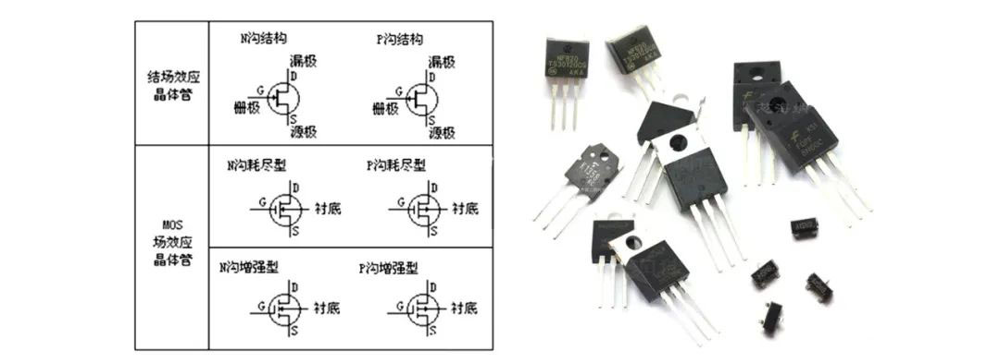

前言：集成电路(芯片)技术自1958年诞生以来，已有63年的发展历史。在今天的信息化社会中，芯片无疑是最重要的基础支撑。近年来，芯片核心技术已成为美国维护科技霸权，围堵打压他国的利器。人们都想知道，芯片技术是如何由开始的原始和不成熟，一步一步发展成为今天高科技皇冠上的技术明珠。本文将以照片和图示为主，以文字为辅，说说芯片技术60多年的发展史。由于篇幅所限，暂定分上、中、下三篇叙述。

## 上篇

要介绍芯片技术发展史，就要从半导体的发现和研究、电子管、晶体管和集成电路的发明说起。正是因为这些发现、研究和发明，电子技术及电子工业才得以诞生。从此，人类社会拉开了电子信息化的序幕。

### 1.半导体发现和研究(1833～1947年,持续114年)

1833年，英国科学家迈克尔.法拉第(Michael Faraday)在测试硫化银(Ag2S)特性时，发现硫化银的电阻随着温度的上升而降低的特异现象，被称为电阻效应，这是人类发现的半导体的第一个特征。

1839年，法国科学家埃德蒙.贝克雷尔(Edmond Becquerel)发现半导体和电解质接触形成的结，在光照下会产生一个电压，这就是后来人们熟知的光生伏特效应，简称光伏效应。这是人类发现的半导体的第二个特征。

1873年，英国的威洛比.史密斯(Willoughby Smith)发现硒(Se)晶体材料在光照下电导增加的光电导效应，这是人类发现的半导体的第三个特征。

1874年，德国物理学家费迪南德.布劳恩(Ferdinand Braun)观察到某些硫化物的电导与所加电场的方向有关。在它两端加一个正向电压，它是导通的；如果把电压极性反过来，它就不导电，这就是半导体的整流效应，这是人类发现的半导体的第四个特征。同年，出生在德国的英国物理学家亚瑟.舒斯特(Arthur Schuster)又发现了铜(Cu)与氧化铜(CuO)的整流效应。

    
    
<b>图1.发现半导体特性的四位科学家 (法拉第、贝克雷尔、史密斯、布劳恩)</b>

虽然半导体的这四个效应在1880年以前就先后被科学家发现，但半导体这个名词大概到了1911年才被科尼斯伯格(J.Konigsberger)和维斯(I.Weiss)首次使用。后来，关于半导体的整流理论、能带理论、势垒理论才在众多科学家的努力下逐步完成。

其后二十多年，世界上出现了一些半导体应用案例。例如，1907～1927年美国的物理学家研制成功了晶体整流器、硒整流器和氧化亚铜(Cu2O)整流器等。1931年，硒光伏电池研制成功。1932年，德国先后研制成功硫化铅(PbS)、硒化铅(PbSe)和碲化铅(PbTe)等半导体红外探测器等。

1947年，美国贝尔实验室全面总结了半导体材料的上述四个特性。从1880～1947年长达67年的时间里，由于半导体材料难以提纯到理想的程度，因此半导体材料研究和应用进程非常缓慢。此后，四价元素锗(Ge)和硅(Si)成为了科学家最为关注和大力研究的半导体材料。而在肖克莱(W.Shockley)发明锗晶体三极管的几年后，人们发现硅更加适合生产晶体管。此后，硅成为应用最广泛的半导体材料，并一直延续至今。这也是美国北加州成为硅工业中心后，被称为“硅谷”的原因。

半导体材料是导电性能介于导体和绝缘体之间的材料，它们的电阻比导体大得多，但又比绝缘体小得多。其电学性能可以人为加以改变。常见的半导体材料有硅(Si)、锗(Ge)、砷化镓(GaAs)、碳化硅(SiC)、氮化镓(GaN)等。

### 2.电子管的发明(1906年，距今115年)

1904年，英国物理学家约翰.安布罗斯.弗莱明(John Ambrose Fleming)发明了世界上第一个电子管，它是一个真空二极管，他获得了这项发明的专利。

    
    
<b>图2.弗莱明发明的真空二极管</b>

1906年，美国工程师李.德.福雷斯特(Lee de Forest)在弗莱明真空二极管的基础上又多加入了一个栅极，发明了另一种电子管，它是一个真空三极管，使得电子管在检波和整流功能之外，还具有了放大和震荡功能。福雷斯特于1908年2月18日拿到了这项发明的专利。

    
    
<b>图3.福雷斯特发明的真空三极管</b>

真空三极管被认为是电子工业诞生的起点。它的应用时期长达40多年。由于电子管具有体积大、耗电多、可靠性差的缺点，最终它被后来者晶体管所取代。

### 3.晶体管的发明(1947年，距今74年)

1947年，美国贝尔实验室的巴丁(J.Bardeen)、布拉顿(W. Brattain)、肖克莱(W.Shockley)三人发明了点触型晶体管，这是一个NPN锗(Ge)晶体管，他们三人因此项发明获得了1956年诺贝尔物理学奖。

    
    
<b>图4.晶体管发明三人组</b>

    
    
<b>图5.获得1956年诺贝尔物理学奖的三人组</b>

1950年，当蒂尔(G.K.Teal)和利特尔(J.B.Little)研究成功生长大单晶锗的工艺后，威廉姆.肖克莱(W.Shockley)于1950年4月制成第一个双极结型晶体管—PN结型晶体管,这种晶体管实际应用比点触型晶体管广泛得多。今天的晶体管，大部分仍是这种PN结型晶体管。所谓PN结就是P型半导体和N型半导体的结合之处，P型半导体多空穴。N型半导体多电子。

    
    
<b>图6.PN结型晶体管结构示意图(左)晶体管符号(右)</b>

1952年，实用的结场效应晶体管(JunctionField-Effect Transistor，JFET)被制造出来。结场效应晶体管(JFET)是一种用电场效应来控制电流的晶体管。到了1960年，有人提出用二氧化硅改善双极性晶体管的性能，就此金属-氧化物-半导体(Metal Oxid Semiconductor,MOS)场效应晶体管诞生。艾塔拉(M.Atalla)也被认为是MOS场效应晶体管(MOSFET)的发明人之一。

MOSFET宣告了在电子技术中的统治地位，并且支撑了当今信息社会的基石——大规模集成电路发展。实际上，场效应晶体管(FET)由朱利叶斯.利林费尔德(JuliusLilienfeld)于1925年和德国物理学家奥斯卡.海尔(Oskar Heil)于1934年分别发明出来，只是一直未能制造出实用的晶体管器件。

    
    
<b>图7.MOSFET的发明贡献者及发明年份</b>

    
    
<b>图8.场效应晶体管(FET)分类及实物图</b>

晶体管从双极型到MOS型，从分立式器件到集成在芯片之中，加上其所用不同的半导体材料，晶体管类型和品种繁多。晶体管主要起到小信号放大、功率放大、电流开关等作用，它是芯片中集成的数量最多的最基本的电路元器件。

    
    
<b>图9.各种晶体管的分类</b>

晶体管发明是微电子技术发展历程中第一个里程碑。晶体管的发明使人类步入了飞速发展的电子信息时代。到目前为止，它的应用已长达74年之久。

    
    
<b>图10.各种封装形式的分立式晶体管</b>

(未完待续) 

<a href="history_of_chip_technology_2.html" class="btn btn-primary">下一期</a>


