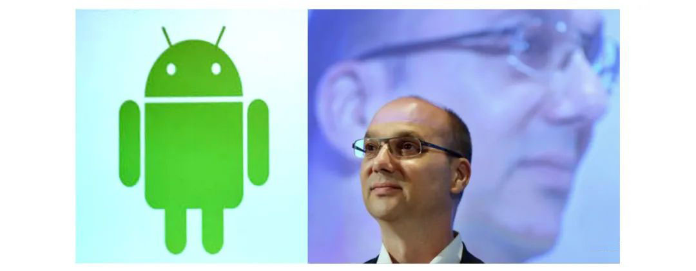
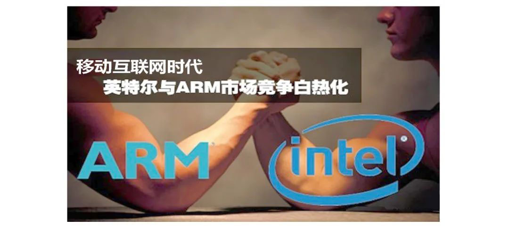
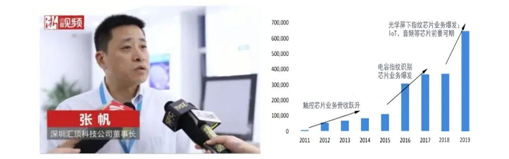
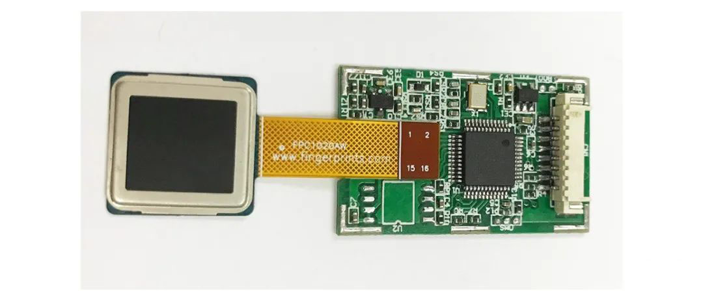

## 下篇

前言：中篇主要介绍了1970～2010年的40年间，芯片产业沿着摩尔定律的轨迹快速发展的情况。Intel公司是推动芯片技术发展的旗帜，x86系列CPU、奔腾系列CPU、酷睿系列CPU技术成为桌面计算机CPU芯片发展的里程碑，桌面互联网成为了拉动芯片技术进步和产业发展的主力。FinFET电路技术、3D芯片技术和多核心CPU技术为后来的移动终端芯片技术提供了强有力支撑。此文为下篇，主要介绍了1990年以后移动互联网成为推动芯片技术进步和产业发展动力的历史。

### 9.移动终端芯片成为驱动芯片产业的有生力量

**1971年，美国发明家塞缪尔.赫斯特(Samuel Hurst)发明了电阻式触控屏。**塞缪尔团队的十位伙伴申请了电阻式触控屏的专利，并合作创立了Elographnics公司。他们生产的首批25块触控屏成品被命名为E-100。1973年，Elographnics公司荣获当年的“百大科技产品”称号，之后，生意就开始滚滚而来[4]。

<div align="center">
    
    <p><b>图40.电阻式触控屏的发明人塞缪尔.赫斯特(来源：参考资料4)</b></p>
</div>

1991年，```ARM公司成立于英国剑桥，这是移动互联网时代的伟大公司。```ARM公司通过出售精简指令集计算机(RISC)微处理器(CPU)IP的授权，建立起一种全新的微处理器设计、生产和销售的商业模式。ARM公司用RISC CPU技术，支持全球许多著名的半导体企业、芯片设计公司、软件和OEM厂商开发自己的芯片和整机产品，培育了一个庞大的ARM CPU和SoC芯片家族。

<div align="center">
    
    <p><b>图41. ARM微处理器架构发展史(来源：参考资料1)</b></p>
</div>

<div align="center">
    
    <p><b>图42. ARM传统的、面向应用的和嵌入式的微处理器IP分类(来源：网络图片)</b></p>
</div>

```ARM公司及其商业模式促进了移动终端芯片产业发展。```芯片产业近三十年的发展史证明ARM独创的这种商业模式是成功的，它支持大批中、小、微纯芯片设计公司(Fabless)发展壮大，支撑芯片设计技术快速迭代升级和产业快速发展。ARM公司已由移动终端领域，逐步延伸到桌面PC、服务器领域，形成了对芯片巨人Intel公司龙头地位的挑战。2006年全球ARM芯片出货量约为20亿片，2010年ARM合作伙伴的基于ARM技术的芯片出货量超过了60亿片。目前ARM的授权用户超过1200家。

**1993年，美国IBM推出全球第一款触屏手机——IBM Simon。**它被公认为世界上第一部触屏智能手机，一个单色的笔触式触屏智能手机。它集手提电话、个人数码助理、传呼机、传真机、日历、行程表、世界时钟、计算器、记事本、电子邮件、游戏等功能于一身，这在当时造成了不小的轰动。1994年全面上市时的价格为899美元，在美国有近200个城市有售。2003年，美国摩托罗拉公司也生产了公司第一款触屏手机。

<div align="center">
    
    <p><b>图43. IBM Simon 触屏智能手机(来源：参考资料4)</b></p>
</div>

**1998年，美国AuthenTec公司成立，它是苹果智能手机创新功能的支持者。**AuthenTec是全球感应性指纹识别传感器最大供应商，其指纹识别组件很多年前就被嵌入了Windows笔记本，它也是苹果iPhone手机上的Touch ID的缔造者。2012年AuthenTec被苹果公司收购，其指纹识别芯片产品全部用于苹果智能手机和平板电脑。

<div align="center">
    
    <p><b>图44. AuthenTec与iPhone手机Touch ID (来源：网络图片)</b></p>
</div>

**1999年，美国摩托罗拉公司推出第一部智能手机A6188。**它是一部触控屏手机、第一部可中文手写识别输入的智能手机。

<div align="center">
    
    <p><b>图45.摩托罗拉天拓A6188触控屏智能手机(来源：网络图片)</b></p>
</div>

**2003年，安迪.鲁宾(Andy Rubin)等人创建Android公司，并组建Android团队。**2005年，Google低调收购了成立仅22个月的高科技企业Android及其团队。安迪.鲁宾成为谷歌(Google)公司工程部副总裁，继续负责Android项目。

<div align="center">
    
    <p><b>图46.安迪.鲁宾与Android系统(来源：网络图片)</b></p>
</div>

2005年，```Intel丢掉了手机业务，后来发现自己丢掉了一个移动互联网的时代。```2005年全球手机应用处理器市场总计为8.39亿美元，德州仪器占69%，高通占17%，英特尔只占7%的份额。因为移动终端芯片远没有桌面PC和服务器芯片挣钱，Intel索性把PXA手机业务卖给了MARVEL，从此退出了移动终端芯片领域[2]。

Intel开头时丢掉了移动芯片的机会，但后来也看到了这个机会，几番努力后仍然没有抓住移动芯片的真谛，最终被ARM率领的成千上万的SoC芯片公司排挤出局。这是“农村包围城市”在移动互联网时代的精彩演义。

<div align="center">
    
    <p><b>图47.移动互联网时代ARM与Intel的竞争(来源：网络图片)</b></p>
</div>

2005年，```MTK抓住了山寨手机业务的机会，赶上了移动互联网时代的快车。```台湾联发科(MTK)成立于1997年，2005年MTK完成了GSM芯片开发。为了卖芯片，他们把手机应用处理器和GSM处理器整合到一起，提供了MTK芯片一站式手机解决方案，同时提供整套的软件开发套件(SDK)，将手机芯片和软件平台预先整合在一起，这使得手机厂商研发一款手机的门槛大大降低。2007年，中国手机牌照取消，深圳一下子冒出了无数的手机小厂商。深圳华强北的厂商借助MTK芯片和解决方案，大杀四方，山寨手机声名远扬。MTK创始人蔡明介也被称为“山寨机”之父。MTK芯片成就了华强北，也成就了联发科[2]。

<div align="center">
    
    <p><b>图48.MTK创始人蔡明介与深圳华强北(来源：网络图片)</b></p>
</div>

2006年```被认为是多核心CPU的元年。```这年7月23日，Intel基于酷睿(Core)架构的CPU发布。11月，Intel又推出了面向服务器、工作站和高端PC机的至强(Xeon)5300和酷睿2双核心和4核心至尊版系列CPU。与上一代台式机CPU相比，酷睿2 双核心CPU在性能方面提高40%，功耗反而降低40%。

```谁发明了使用较广的电容触控屏？目前还无法考证。```可能是由众多科研人员不断改进，共同完成的。1990年以后的技术发明很少由某个科学家独立完成，一般是集体智慧的结晶，并且知识产权由企业所有。1997年摩托罗拉手机电脑Palm Pilot，1999年摩托罗拉第一部智能手机A6188,还都是用的电阻式触控屏，采用触控笔输入。

2007年，LG推出Parada多点电容式触控屏，不再需要触控笔，手指点击精确度已经比较高了。2007年6月苹果公司推出iPhone多点电容触屏手机，触控灵敏度和流畅度已经很好。从此之后，电容触控屏取得了飞速发展。

<div align="center">
    
    <p><b>图49.全球首个多点电容式触控屏手机LG PRADA(来源：网络图片)</b></p>
</div>

2007年7月，```苹果公司推出iPhone手机，树立了智能手机的样板。```iPhone淘汰了以前手机翻盖、滑盖的复杂结构，中规中矩、简约时尚的风格让人耳目一新。iPhone淘汰了之前常用的触控笔，采用多点手指触控屏，极大地改善了用户体验。从此之后，智能手机都以**平板显示+手指多点触控屏**的面貌出现。它终结了以前手机五花八门的款式，简化了手机操作，促进了移动智能终端(包括智能电话、平板电脑等)的普及，对移动互联网产业发展起到重要的促进作用。同时也促进了移动终端芯片的技术创新。

<div align="center">
    
    <p><b>图50.史蒂夫.乔布斯与iPhone智能手机系列(来源：网络图片)</b></p>
</div>

2007年11月，```谷歌公司向外界展示了名为Android的操作系统。```同时谷歌公司宣布建立一个全球性的**手机生态联盟**，该联盟由34家芯片制造商、手机制造商、软件开发商、电信运营商共同组成。并与84家硬件厂商、软件厂商及电信营运商组成开放的**手持设备联盟**来共同研发和改良Android系统。联盟成员将支持谷歌发布的手机操作系统以及应用软件，谷歌以Apache免费开源许可证的授权方式，发布Android的源代码。

根据2011年的数据，Android系统的应用数目已经达到了48万，在智能手机市场，Android手机的占有率已经达到了43%。

<div align="center">
    
    <p><b>图51.目前主要的Android旗舰手机品牌(来源：网络图片)</b></p>
</div>

```移动终端操作系统及其应用产品的两大阵营。```谷歌公司的开源操作系统Android与苹果公司的封闭操作系统iOS形成了移动互联网时代的操作系统双雄——**苹果系和安卓系**，它们互相借鉴，相互竞争，不断发展壮大。未来可能还会有一个移动互联网操作系统新星升起，那就是华为的**鸿蒙系**。基于智能手机和移动智能终端的**移动互联网产业逐步替代桌面互联网产业，成为了驱动芯片技术创新和产业发展的主要力量。**

<div align="center">
    
    <p><b>图52.移动智能终端的两大阵营苹果系和安卓系(来源：网络图片)</b></p>
</div>

**2008年，成立于1997年的台湾宏达电脑(HTC)推出了全球首款安卓手机T-Mobile G1**。它成为第一个站在苹果iOS系统对面的挑战者[2]。这款手机采用了美国高通公司(Qualcomm)的MSM720系列处理器。该处理器采用了双核的解决方案(ARM11+ARM9双核构架)，内部包含3D图形处理模块和3G通信模块，图像模块可提供高分辨率的图像以及视频播放功能，流媒体功能表现也十分出色。从通信行业一路走来，高通公司最后终于明白了智能手机的SoC应该怎么来做了。

```手机芯片公司伴随着手机整机企业一路成长。```HTC公司的智能手机与高通手机芯片一同迭代升级，成就了高通Android领域的通信芯片第一霸主的地位。HTC公司成就了高通公司，最终却没有成就自己。HTC公司的手机业务经历辉煌后，2017年时已奄奄一息，2018年1月谷歌公司宣布斥资11亿美元收购了HTC的手机代工业务[2]。

<div align="center">
    
    <p><b>图53.高通公司(左)与其他公司(右)智能手机SoC芯片的天梯图(来源：网络图片)</b></p>
</div>

2008年，```苹果智能手机的示范效应使多点触控和指纹技术应用爆发。```苹果iPhone系列手机、iPad等移动终端产品推开之后，全球掀起了一场“多点触控风暴”，多点触控技术成为各种智能手机、LCD TV、笔记本电脑、MID/PMP及各种电子系统等用户接口的首选，电容触控芯片和指纹芯片公司大量涌现。

目前，**触控芯片**龙头企业包括Synaptics、Atmel、Cypress、Focaltech(敦泰科技)、Goodix Tech(汇顶科技)、Mstar(晨星台湾)等。**指纹芯片**龙头企业包括AuthenTec、Validity、FingerPrintCards(FPC)、Goodix Tech(汇顶科技)、SileadInc(思立微)、Focaltech(敦泰科技)等。

AuthenTec于2012年被苹果公司收购。Validity于2013年被Synaptics收购，其芯片目前主要应用在HTConemax和三星GalaxyS5等产品上。

<div align="center">
    
    <p><b>图54.全球主要的触控和指纹芯片供应商</b></p>
</div>

2009年，汇顶科技推出第一颗十点**触控芯片**，成为苹果公司之外第一个做出十点触控芯片的国内厂商。第一个采用汇顶科技方案的手机厂商是波导公司[7]。

2011年，联发科(MTK)旗下的汇发国际投资了汇顶科技。```与MTK强强联合，成就了汇顶科技迎着移动互联网东风腾飞的传奇。```汇顶科技为国内快速增长的智能手机厂家提供了物美价廉的触控产品支持，公司业绩开始爆发性增长，利润由2011年仅2652.5万元，增长到2012年的2.25亿元，暴涨接近10倍[7]。

<div align="center">
    
    <p><b>图55.汇顶科技董事长张帆与公司业绩腾飞的奇迹(来源：网络图片)</b></p>
</div>

2013年，苹果公司发布了带指纹识别功能的手机后，指纹识别已经做好了统治手机识别市场的准备。

2014年，汇顶科技推出了**指纹触控**产品样机，正式进入了指纹识别行业，与欧美企业一般采用高压驱动不同，汇顶采用了低压驱动方式。同年11月，魅族MX4 Pro发布，搭载了汇顶的正面按压式指纹识别，这是国产手机史中一款划时代的产品，打破了Touch ID在正面按压式指纹识别上的垄断，也打破了FPC的垄断，给业界带来了另外一种可能和选择[7]。

<div align="center">
    
    <p><b>图56.汇顶科技的发展历程(来源：参考资料8)</b></p>
</div>

2015年，FPC几乎垄断着安卓机指纹芯片市场。2016国产厂商已经抢回不少指纹芯片市场，但安卓手机体系的指纹芯片中， FPC仍然占占据了最多的40%的份额。

<div align="center">
    
    <p><b>图57.FPC公司的电容式光学指纹模组FPC1020AM(来源：网络图片)</b></p>
</div>

2017年，汇顶科技的指纹识芯片降至10元左右，华为淘汰了FPC，在旗舰新机P10手机上选择了汇顶科技的产品。```汇顶科技的指纹识芯片用在华为手机P10上具有里程碑意义。```在中高端主流安卓品牌手机里，汇顶科技打破了FPC的一家独大的局面。2018年，汇顶科技推出了屏下指纹芯片。vivo在乌镇发布的vivo X21手机和三星在印度批量上市Galaxy J7 Duo手机，都是采用汇顶科技的屏下指纹解决方案[7]。

<div align="center">
    
    <p><b>图58.2019年全球屏下指纹芯片厂商出货量占比(来源：参考资料7)</b></p>
</div>


<div align="center">
<p>(未完待续)</p>
<a href="history_of_chip_technology_5.html" class="btn btn-primary">上一期</a> 
<a href="history_of_chip_technology_7.html" class="btn btn-primary">下一期</a>
</div>


