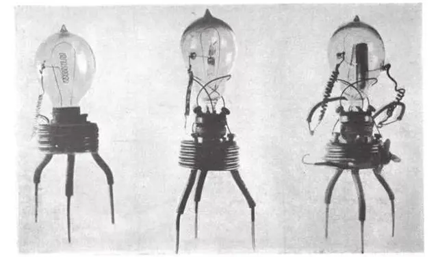
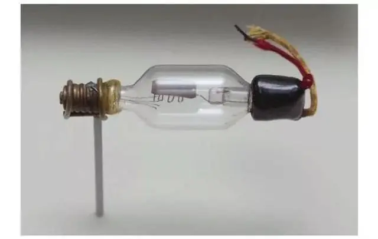
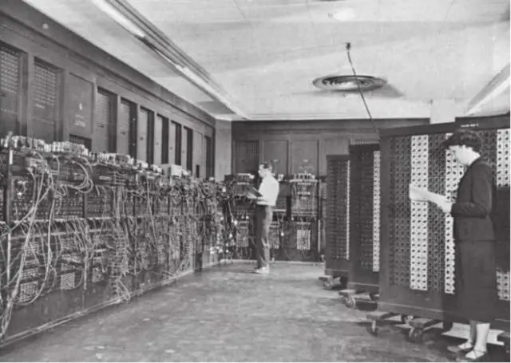
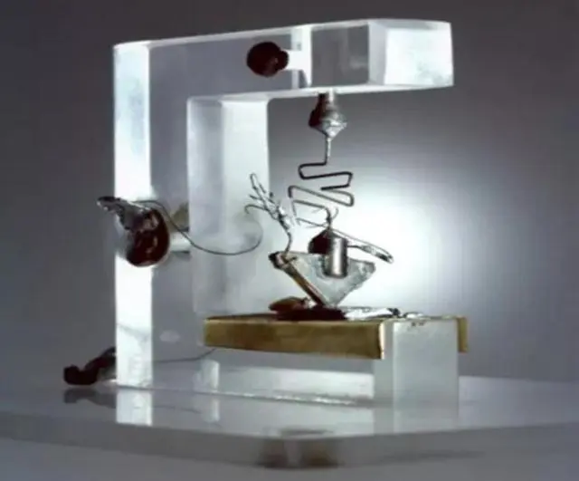
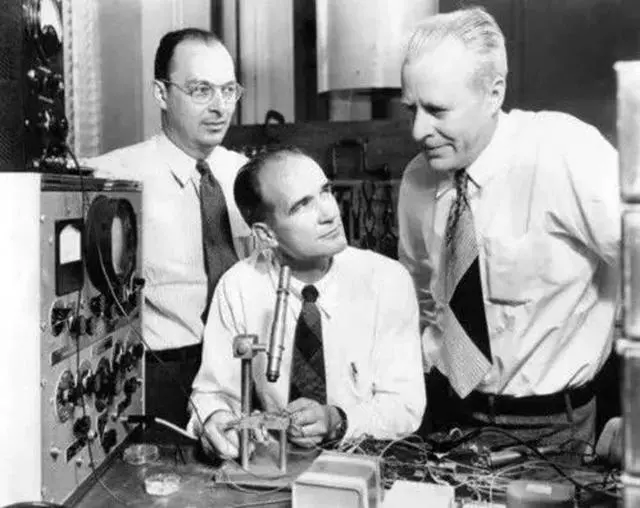
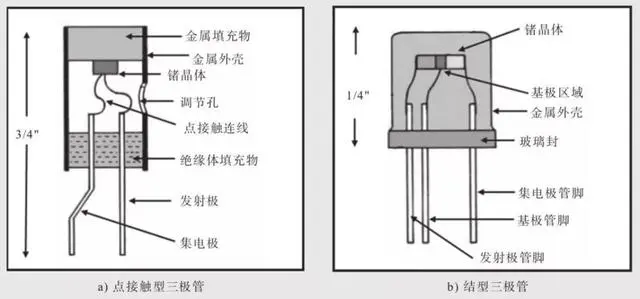

1999年，美国《洛杉矶时报》评选出“50名本世纪经济最有影响力人物”，其中并列第一名的有三个人：美国发明家威廉·肖克利、罗伯特·诺伊斯和杰克·基尔比。肖克利是晶体管的发明人之一，诺伊斯和基尔比是集成电路的发明人。

排在第二至四位的分别是现代汽车工业奠基人的亨利·福特，连任四届美国总统的罗斯福，以及创办迪斯尼动画王国的沃尔特·迪斯尼。

回顾二十世纪，无论是科技、商业，还是政治、军事、娱乐生活，几乎每一个领域都发生了狂飙突进式的巨变，每个领域也都诞生出了足以彪炳史册的“关键”人物。在二十世纪的“群星闪耀”中，我们该如何理解三位发明家能够位列第一的殊荣呢？

要知道，晶体管被誉为“20世纪最伟大的发明”，而集成电路的出现又真正奠定了第三次产业革命的基石。如果这样说略显抽象，不如我们换一个说法。在我们今天的生活中，手机、电脑、电视、汽车等所有的电子设备中，都离不开一种最核心的硬件——芯片。而芯片正是由半导体集成电路来实现的，而集成电路最基本的物理单元就是晶体管。晶体管，就是我们从物理世界通向数字世界的“细胞”。

如果你认可电子信息技术以及由此带来的数字经济的巨大价值的话，那么你一定也会同意将“最具影响力”的殊荣送给他们三人。当然你也知道，排名不过是我们对历史的一种“简化”认知，真正的殊荣也要分给推动这一技术实现的每一个科学家、发明家以及商业家们。

回到历史现场，成为我们重新审视这场技术“奇迹”的基本方法。当我们一点点还原出构成这一技术链条中的重要人物和重要节点，可能又会发现一个这样的事实：技术“奇迹”并不存在，一切都有迹可循。

那么，在回到1947年12月23日位于美国新泽西贝尔实验室的第一个晶体三极管发明现场之前，我们必须将目光先投向更早的十九世纪末，来到爱迪生实验室，去瞥见那一束照亮电子世界的微弱电流。由此重新出发，我们首先将经历一段“电子管”半个世纪的传奇故事，找寻到技术突破和产业变革背后的内在动因，才能最终理解“晶体管”出现的真正意义。

### 序曲：捕捉电子的起点纷争

1883年，饱受碳丝灯泡寿命问题困扰的爱迪生突发奇想，他在真空电灯泡内部碳丝附近安装了一小截铜丝，希望铜丝能阻止碳丝蒸发，但毫无悬念，碳丝再一次蒸发了。不过他却发现，那根没有连接到电路的铜丝竟然产生了微弱的电流。尽管当时他并没有特别重视这一现象，但这位敏感的发明家仍然为这一发现申请了专利。

此后，这一现象被称为“爱迪生效应”，而这一现象发生的原因就是热能使得物体上的电子克服束缚位能，通过热激发产生载流子。受此启发，英国物理学家约翰·弗莱明在1904年发明了世界上第一个电子管——真空二极管，并获得了这项发明的专利权。真空二极管也被视作开启电子时代的鼻祖。

    
    
<b>弗莱明发明的真空二极管</b>

1906年，美国工程师李·德·福雷斯特在弗莱明二极管的基础上又多加入了一个栅极，发明出新型的真空三极管，使得真空管在检波和整流功能之外，还具有了放大和震荡功能。福雷斯特于1908年2月18日拿到了这项专利。

    
    
<b>福雷斯特发明的真空三极管</b>

1911年，加入联邦电报公司的福雷斯特，再次改进了真空三极管的排列方式，发明了二十世纪最重要的一个电子器件——电子放大器，可以大幅改进电报信号的输出质量。也正是基于这些功能，真空三极管被人们认为是电子工业诞生的起点。

历史的吊诡之处就在于，两位发明人并未首先从这项发明中获益。由于弗莱明声称他拥有电子管的优先发明权，因此他所就职的英国马可尼公司就大张旗鼓地生产起真空三极管来，福雷斯特对此当然十分不满，将马可尼公司告上法庭。

直到1916年，经历十年的诉讼，法庭最后判决福雷斯特的三极管触犯了二极管的专利权，而马可尼生产的三极管也侵害了福雷斯特公司注册的三极管专利权。最终结果是两败俱伤，两家公司都不准许再继续生产三极管。

专利权的纷争尽管延缓了电子管的普及速度，但是我们更要记住的是，正是专利制度对于发明权的保护，才能成为这些技术公司和技术人员孜孜不倦地推动技术革新的动力之源。

此后三十多年，真空电子管技术和工艺得到多次改良，真空三极管技术也成为欧美几个大国重点争夺的“核心技术”。除了在无线电通信、广播领域的应用外，真空电子管带来了全新的电子技术和最早的电子计算机。

### 过渡：真空管的短暂“巅峰”时刻

二十世纪初，随着真空三极管的发明，人们已经意识到可以实现电子信号传递和放大的三极管可以用于模拟计算。

模拟计算的原理就是通过具体的电压值来表示物理世界的数量值，再通过真空三极管这一的电子器件组成的系统，按照加减乘除等数学运算法则来对电压进行变化，最终得到一个同样用电压值表示的运算结果，这样就使用电子器件完成了对物理世界的模拟和分析。这一器件被称为“运算放大器”，在此基础上，人们研制出了电子模拟计算机。

最早的真空三极管的信号放大作用，被贝尔实验室用于电话通信中，解决了弱信号的远距离传输问题，但是放大器的增益仍存在不稳定的问题。1927年，时年29岁的年轻工程师布莱克开始着手研究这一问题，提出了负反馈放大器的解决方案，并在1936年将负反馈放大器引用在电话机的放大线路中。

至此之后，负反馈放大器一直成为运算放大器的核心原理沿用至今，并且使得利用电子信号进行数学运算真正得以实现。

技术的突破带来硬件应用的加速。1941年，贝尔实验室的卡尔·施瓦茨尔在布莱克的专利技术基础上，设计出第一款商用的真空管运算放大器——加法器。同年，德国人康拉德·楚泽使用了大量真空管，制造出第一台可编程电子计算机，能够在每秒内执行3-4次加法运算。

1944年，哈佛大学研究人员霍华德·艾肯在IBM总经理托马斯·沃森的支持下，用机电方式研制出了MARK-1号计算机，可以实现每秒200次以上的运算。

二战时，由于像快速计算火炮弹道等需要，电子计算机有了非常现实的应用空间。1946年，宾夕法尼亚大学的工程师埃克特和物理学家毛希利等人共同研制出了真正意义上的第一台通用型电子计算机——埃尼阿克（ENIAC）。这台使用了18000多只电子管，重130多吨，占地面积170多平方米，每秒钟可作5000多次加法运算。之前的计算机需要2小时完成的40点弹道计算，ENIAC只需要3秒钟，在当时堪称奇迹。

    
    
<b>1946年，当时世界最先进的真空管电子计算机ENIAC</b>

ENIAC显示出电子计算机的巨大应用前景，成为这一时期真空管电子计算机的最先进代表。在此基础上，数学家冯·诺依曼对ENIAC作了关键改进，完善了现代计算机的模型，至今仍然是现代计算机的基础架构。

不过，ENIAC因其庞大的体积、巨额的功耗、短暂真空管寿命以及由此带来的高检修率，造成这一代真空管计算机难以实现获得快速升级和大规模普及。现实的需求呼唤技术的革新，半导体材料的出现让技术的革新成为可能。

出道即巅峰，巅峰即落幕，成为真空管电子计算机的宿命。很快，晶体管的出现让新一代电子计算机登上了历史舞台，并且一骑绝尘开启了我们熟知的“摩尔定律”的时代。

### 登场：晶体管的“奇迹”时刻

1947年的12月23日下午，圣诞节前两天，瓦尔特·布莱顿和希尔伯特·摩尔仍旧来到实验室，再次进行半导体放大实验。他们将这个装置的一端连接到一个麦克风，另一端连接到一副耳机。摩尔与布莱顿用麦克风讲话，其他人则从耳机里听到了他们被放大了18倍的声音。这一实验的成功标志着第一个具有放大功能的基于锗半导体的点接触式晶体三极管的诞生，这一天被视为晶体管的诞生日。

    
    
<b>贝尔实验室诞生的第一个锗半导体点接触式晶体管</b>

完成这一项目的正是贝尔实验室肖克利领导的固体物理研究小组。1945年，肖克利牵头成立了这一小组，并和化学家斯坦利·摩根、固体物理学家约翰·巴丁、实验物理学家瓦尔特·布莱特等人一起开始了对于半导体材料的研究。经过多次失败，他们尝试用锗和硅来制造半导体放大器。

12月15日，在布莱顿的精湛技术操作下，完成了这个由锗块、金线、弹簧、电池等组成的装置，并且观察到随着锗块上两个接触点的靠近而产生的电压放大作用。第二天，布莱顿在实验笔记中写下：“在锗表明上，用点接触方法加上两个电极，间隔400微米。此时1.3伏的直流电压被放大了15倍。”在这个实验数据下面，肖克利作为小组组长和见证人，签上了名字。这个装置在几个月之后被贝尔实验室称为“晶体管”（Transistor），由传导（Transfer）和电阻（Resistor）两个词合成。

不过，一个有趣的细节再次出现在晶体管专利的申请上面。尽管晶体管的诞生是基于肖克利的场效应理论，肖克利也直接参与了整个研究过程，但是这一晶体三极管的专利申请书上没有他的名字。专利代理律师给出的理由是肖克利的场效应理论与一项1925年生效的结型MOS专利冲突，另外，进行那项决定晶体管诞生的实验时，肖克利本人并不在场。这一结果自然让肖克利非常生气。

天才的愤怒就是用更高的成就来回应此事。一个月后，也就是1948年1月23日，肖克利提出了更先进的结型晶体管的构想。1950年，第一只结型晶体管问世，同年11月，肖克利发表了论述半导体器件原理的著作《半导体中的电子和空穴》，从理论上详细阐述了结型晶体管的原理。至此，肖克利再次证明了他在晶体管上面独一无二的贡献。

    
    
<b>巴丁<左>、布拉顿<右> 和肖克利<中></b>

1956年，因为在半导体的研究贡献和晶体管的发明，肖克利与巴丁和布拉顿分享了当年的诺贝尔物理学奖。

我们看到，晶体管的发明，并非一个天才一时的灵光乍现。即使是肖克利这样聪明又勤奋的科学家，也需要在团队的协助下实现技术的创新。而在此之前，更是需要长达一个世纪的理论准备和材料发现。

1833年，英国科学家法拉第在测试硫化银特性时，发现硫化银的电阻随着温度的上升而降低，这是人类首次发现的半导体现象。此后数十年间，半导体的光生伏特效应、光电导效应、半导体导电单向性的整流效应被陆续发现。进入二十世纪，关于半导体的整流理论、能带理论、势垒理论，才在众多科学家的努力下不断完成。而肖克利对半导体的整体理论构建其实是在前人的基础上完成的。而半导体理论的基础又离不开近代物理学，特别是量子力学理论的指导。

同样，半导体材料也是在对半导体理论的研究中逐渐成熟。最早科学家利用半导体材料的整流效应来制作检波器（点触式二极管）。从1907年到1927年，美国的物理学家研制成功晶体整流器、硒整流器和氧化亚铜整流器。1931年，硒光伏电池研制成功。1932年，德国先后研制成功硫化铅、硒化铅和碲化铅等半导体红外探测器。

此后，四价元素锗和硅成为最常用的材料，而在肖克利发明锗半导体的晶体三极管的几年后，人们发现硅更适合生产晶体管。此后，硅成为应用最广泛的半导体材料。这也是美国北加州被称为“硅谷”而不是“锗谷”的原因。

总体来说，使用半导体材料而制成的晶体三极管，既具有了真空电子管的功率放大和开关作用，又避免了真空电子管高耗能、低寿命、低效率的致命缺陷。另外，利用晶体管可以不断缩小的工艺特点，为电子设备的微型化提供了可能。更小的体积、更快的速度、更可靠的稳定性，让晶体管真正成为现代信息技术革命的基石。

1954到1956年，全美国共销售了1700万个锗晶体管和1100万个硅晶体管，价值约5500万美元，而同期的真空管销售了13亿个，市场份额超过10亿美元。但这几乎是真空管落幕前最后的“荣光”了。此后，晶体管将一骑绝尘，带来电子计算机的指数级发展。

### 凡终章，皆序曲：“奇迹”背后的创新逻辑

当我们简要回顾完从电子管到晶体管的跃迁的若干关键历史现场和几乎主要的技术节点之后，我们可以再一次确认，晶体管，这一带给全人类信息技术革命的“奇迹”发明，其之所以能够出现的每一个要素都可以在之前百年的技术演化中得到还原。

真空电子管的发明，已经从原理上或者说结构上，通过对电子的控制完成了对数字信号的处理，真空管电子计算机的实现更是从实践上证明了数字计算的广阔前景。而晶体管只需要完成对真空管原有功能的一次“完美复制”。

    
    
<b>巴丁、布莱顿发明的点接触型三极管和肖克利发明的结型三极管结构图</b>

当然，这一突破并不容易。晶体管的出现同时还需要人类对于半导体材料和特性的真正掌握。而这一进程也花费了百年时间。最终，在肖克利、巴丁、布莱顿等人对半导体特性的熟练掌握和对半导体PN结结构的创造性试验中，才将可以替代电子管放大器的晶体三极管给“奇迹”般的创造出来。

如果我们能够回到弗莱明、福雷斯特、肖克利等人生活的年代，与其一起工作的话，我们还会深切地感受到这些科学家、发明家对于科学理论研究和新技术发明的巨大热情。同时，我们也还能感受到他们对于技术发明转化为商业成功的巨大渴望。

如果我们再把视野放大，审视这些发明天才所处的时代环境，就会发现像英美这样完成两次工业革命的同时，所建立起的一整套的自由竞争的市场体制、鼓励创新的公司研发机制以及国家信誉保证的专利保护制度。正是在竞争激烈但规则有序的市场环境当中，科学的研究和技术的发明获得了来自商业最大程度的投入，商业利益也因为技术成果的转化而得到最大化的实现。

在众多的科学家和发明家的背后，我们能够列举出一长串的知名企业的名单：马可尼无线电公司、通用电气、西屋电气、西门子、IBM、美国电话电报公司（AT&T），以及未来我们会看到的德州仪器、仙童、英特尔等等。

接下来，我们将回顾硅半导体的技术史，深入到硅晶体的演进现场，来见证硅晶体管的时代到来。至于这位伟大的物理天才肖克利，我们也将在更后面看到他极具争议的人生下半场，以及由他所开启的那个“硅谷时代”。

### 参考文献：

1. 《芯片改变世界》，第一篇“半导体材料和半导体器件的前世今生”，2019年10月。

2. 《电子科技》，“史蒂夫·乔布斯列‘50名本世纪经济最有影响力人物第五位’”，1999年12月20日。

3. 《实用影音技术》，“胆机是怎样走过来的（上）”，2010年第10期。

---------

转载：https://baijiahao.baidu.com/s?id=1671426478614428845&wfr=spider&for=pc


