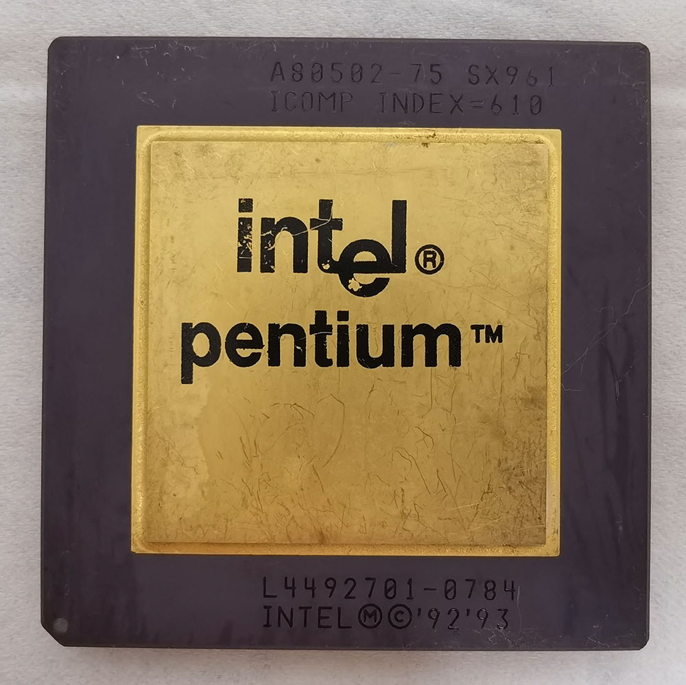

### 新兴的收集嗜好

集邮或是收藏艺术品已经行之有年，但是其市场规模之庞大，也就注定了一些比较稀有的物品，成为有钱人才能跨足的领域。收集处理器虽然相对冷门，这近年来已经有更多人开始注意到这个嗜好。当然越多人注意这个领域，好处在于异样的眼光逐渐转换成理解甚至于钦羡的眼神，但是其负面的影响就是古董处理器的价格也因此一飞冲天。但是相较于稀有的邮票或是艺术品，即使最稀有的收藏级处理器，其价格毕竟还是亲民许多。

    
    
<b>▲ 有些处理器的外观非常具有艺术感。图为Intel Pentium Mobile 300Mhz，为奔腾一代中速度最快的版本。</b>

CPU就是电脑的中央处理器（Central Processing Unit），也可以把它视为电脑的大脑，电脑的逻辑运算都在此完成，其运算速度也是电脑处理速度的重要指标之一。

    

英特尔（Intel）创立于1968年，最初从事记忆体制造，1971年时制造出全世界第一颗商用为处理器。一直在全世界电脑中央处理器制造商中，规模、技术都居于领先地位。由于该公司在处理器的历史地位及品牌知名度，Intel的处理器也一直是最热门的收集目标。

    

### 处理器4个收藏特性

严格说起来，处理器有几个非常独特的性质，导致于收集处理器远比收集其他类型的物品（比如说玩具）来得有保存价值。

第一，由于个人电脑的普及，每个人几乎在生活上多多少少都会接触到电脑，正如同邮票曾经一度为人们日常生活中的一部分一样，这种熟悉度不是一般物品皆有的。

    
    
<b>▲ 有些处理器的外观颇为特殊，图为Intel Itanium，该处理器研发了将近10年，但是上市没多久就因为效能太差而被淘汰了。</b>

第二，由于处理器需要大量金钱的投资才能制造出来，因此尽管电脑中央处理器种类众多，但是比起其他物品来说（例如：可口可乐），其范围及数量都在可估算的范围之内。

第三、处理器极难仿造，比起邮票、古画，处理器的防伪能力可谓极佳，毕竟晶圆厂不是人人有能力设的，而且几乎每款处理器上面都有序号（极早期的除外）。就算有人造出外观一模一样的赝品，插上主机板马上一翻两瞪眼。

第四，每款处理器都含有黄金，尤其早期陶瓷封装的处理器更是含金量十足，这种实质保值能力可是连现代的硬币纸钞都比不上呢。

    
    
<b>▲ 处理器的核心就是从晶圆上切割下来制成的，图为6吋矽晶圆。</b>

    
    
<b>▲ 早期的处理器含金量远比现在的多，几乎所有金属外露部分都镀有黄金。图为馆长收藏的 Intel Pentium 75MHz。</b>

### 把收集当作一种投资

收集处理器是相对新兴的收藏嗜好，所以接受度比起邮币古画毕竟还是少了许多。但是近年来早期古董处理器的市场价格已经开始起飞，以投资报酬率来看，那些处理器的投资效益已经远高于大部分的股票了。虽然处理器价格与艺术品一样，会随着世界经济小幅度波动，但是大致上还是呈现稳定成长的趋势。

有一位早年就开始大量收集处理器的美国驻韩生化武器专家，当他退休的时候，他选择了将手上处理器分批在网路上抛售。而这些处理器的价格比起当初购入的价格可说是涨了将近10倍，所以他的退休生活有一部分就是依赖这些处理器的拍买所得来维持。因为早期处理器数量只减不增，加上收集者越来越多，收集处理器的前景看好。

    
    
<b>▲ 早期处理器有多昂贵？以这颗Intel C4004来说，拍卖上价格高达1,025美元，折合人民币约7,000元以上。但是相较于其他收藏领域来说，这并不算特别昂贵。</b>

(未完待续)

<a href="talking_about_cpu_collection_2.html" class="btn btn-primary">下一篇</a> 
<a href="{{site.feedback_link}}" class="btn btn-primary"><i class="fa fa-comment-o"></i> 匿名提问</a> 

---------


