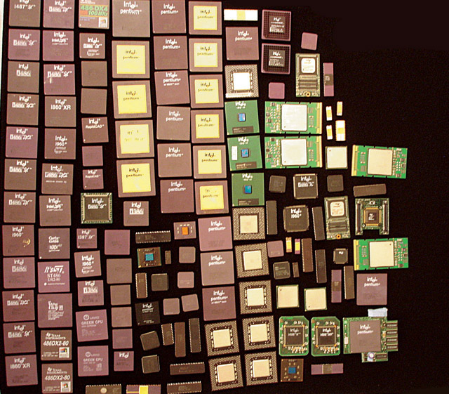
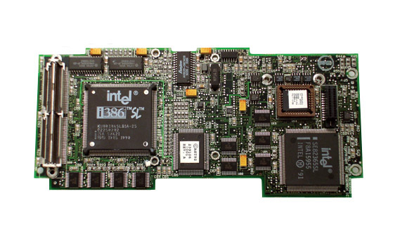
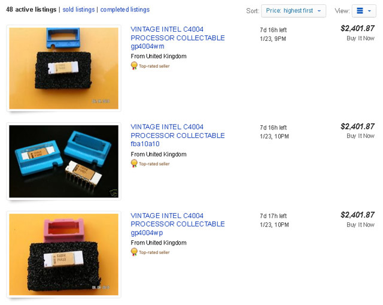
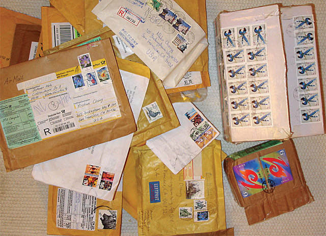
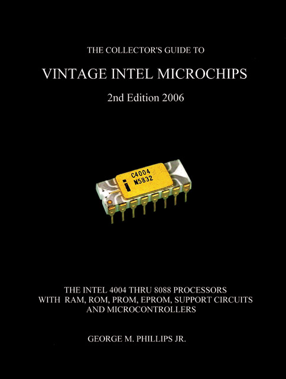
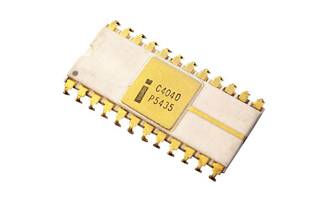
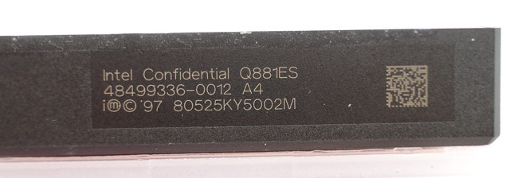
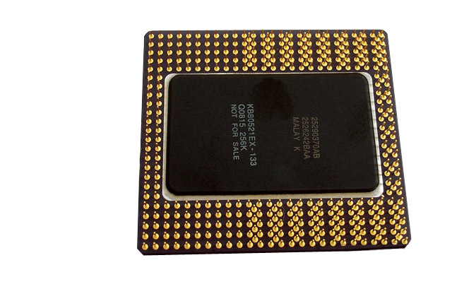

## 知识篇：CPU收藏从便宜开始

收集处理器一点都不难，花个几十块买个报废的处理器，你就入行了。收集东西背后所驱使的动力通常是因为兴趣，正如同跟集邮跟收藏艺术品一样，笔者非常不建议用纯投资的角度来收集处理器。

你本身如果对相关科技或是历史没有兴趣的话，收集处理器将会是一个乏味的过程。因为你在意的只是其市场价格，而非这实品所带给你的意义。更何况处理器的价值其实很多时候是你个人决定的，比如说在你成长过程中的第一台个人电脑的处理器，其对你个人的意义就远对其他人来得高。


### 订立收藏范围与目标

对于想要入行的朋友，笔者的衷心建议是，先为自己订立明确目标，并选定基本范围。先对你所要收集的目标做研究，有一定程度的了解之后再来开始进行有系统的收集，不然你会发现各种处理器琳琅满目，根本收集不完。可以从较熟悉、使用过或是对你有特殊意义的产品开始。

比如说有人就专门收集Intel制造的处理器，这样才不会落入市场的俗套，而变成你永远都在买市场上最热门或是最贵的产品。如果你完全不知道从何下手，那可以考虑选择被市场淘汰2∼3年的处理器，其单价通常不会超过数百元，非常适合入门者。

<div align="center">
    
    <p><b>▲ 琳琅满目的处理器，光分类与保存都是个大工程。</b></p>
</div>


### 从回收与交换做起

到底在哪边可以取得古董级中央处理器呢？最简单的当然就是从身边朋友的报废电脑开始，有组装电脑经验的人可以轻易地将里面的处理器取出来。不然除了二手商店，废电脑回收场也是个好去处。不过由于近年来金价飞涨，现在回收场的老板也学聪明了，价格上不会便宜到哪里去。

国内外相关网站很多都有论坛在讨论处理器收集，除了讨论与展示自己的收集以外，也有团购或是版友私下交易。有时候可以在上面用低于市价的价格购买到你想要的处理器，甚至可以跟其他收集者交换彼此多余的收藏型号。虽然此类交易比较没有保障，但是在金额不大或是对方是知名收藏者的情况下，笔者还没有遇过被骗的情形。

<div align="center">
    
    <p><b>▲ 想要取得笔记型电脑的处理器，往往就只能买老笔电来拆了。图为Intel i386 SL 25 MHz。</b></p>
</div>


### 上国外拍卖网站寻宝

国内闲鱼上的古董处理器除了货源少，价格也往往与国际行情严重脱节，所以通常要找到好物品都要倚赖国外的拍卖网站，像是号称什么都卖的eBAY产品数量就好多。

当然这也是恶梦的开始，设闹钟三更半夜爬起床抢在那最后几秒内下标，然后不断地重新整理网页，心怦怦地跳，深怕好不容易看中的处理器被别人抢走。

<div align="center">
    
    <p><b>▲ 拍卖网站是令收藏家又爱又恨的地方，稀有的处理器就只能在这边用高价标回。</b></p>
</div>

<div align="center">
    
    <p><b>▲ 与世界各地收集同好交换的副产品：各国邮票与邮戳。</b></p>
</div>

```
黄金提炼

由于早期中央处理器的镀金部分远比现在的多，在金价飞涨的今日几乎被废五金业者视为金矿。大量的废弃处理器，都会被打碎后浸入强酸溶液中，借此淬取其中的黄金，导致早期的处理器存世量不断减少。收集者往往必须与时间赛跑，赶在废五金业者销毁处理器之前，先一步将有收集价值的处理器挑选出来。
```


### 出价多少是个难题

上了拍卖网站，接着取而代之的问题就是「这个处理器到底价值多少？」。这个问题没有标准答案，而且往往是视卖家跟你的「对手」决定。由于大部分「收集导向」的处理器都已经停产，所以有些数量稀少甚至于独一无二的型号几乎都是可遇而不可求。有些数量较多的可能几个月会出现一次，但是有时候会出现一些「你错过可能一辈子都不会再遇到」的产品，这时你愿意出多少，就取决这产品是否在你的收集范围内跟对你个人的意义有多大。

虽然大部分的价格都是以eBAY过往的成交价为参考，不过杀红眼的收藏家们常常都会失去理智，即使是已经有公定行情的古董处理器，也是因为僧多粥少而价格屡创新高。往往你相中了一个你有兴趣的处理器，在做了一些研究之后，你决定用高出市价一成的价格下标，可是在最后结标的几秒却出现的「我跟，我再大你1000」的劫镖客。而下标下久了，你就会开始，自然而然会遇到一些「可敬」的对手、一些练有「例不虚发」的熟悉大户。

<div align="center">
    
    <p><b>▲ 有人专门在观察eBay上的古董处理器成交行情，并出了一本估价指南。不过杀红眼买家一直都在创下新的历史纪录。</b></p>
</div>

<div align="center">
    
    <p><b>▲ Intel 4040为4004的增强版，数量上极为稀少，不过价格上却始终压不过数量较多但较广为人知的Intel 4004。</b></p>
</div>


### 决定处理器价格的因素

上面的例子说明了，古董处理器的价格没有定值，从几十元到上万元不等，端看个人需求以及竞争对手的肾上腺素。不过市场大致上还是以品牌、独特性及其稀有度来决定处理器的价格。一般来说，Intel产品由于比较多人收集，其平均价格就会比其他品牌的高。每个产品线的首款处理器（也就是出场日期最早或是时脉最低的），由于其历史定位，也通常会比接下来的同系列产品高。

当然例外的就是比较稀有的型号，比如说曾经出错过的、销售量特别差的，或是工程样品乃至于军用品（军用报废品一般都会销毁，很少会流出市面），这些都是处理器发烧友争相收集的对象。


### 保存处理器的方法

基本上，除了极早期的塑胶封装产品，其针脚没有镀金比较容易氧化生锈之外，大部分处理器金属部分本身都有镀金，所以保存起来不用特别费心，只要注意不要挤压到就好。静电虽然是电子产品的大敌，不过多数收藏者在意的只是其品相及外观，加上相对应的主机板并不好找，收藏者大多不在意处理器是否能实际运作。

而过度的保护，比如上亮光漆之类的，笔者非常不建议如此处理。因为万一你打算脱手，上漆过的处理器在市场上是乏人问津的，就算你用有机溶剂去把亮光漆去除，其过程也有可能会伤害到处理器本身的字样。拿个适中的塑胶盒，里面塞些防静电泡棉就是它最好的家了。有些人则会将处理器插在防静电泡棉上并附上简介，裱框展示在客厅墙上，这也是不错的选择。


### 处理器样本的种类

工程样品为处理器在制造过程中，所生产出来的过渡期样品，而常见的处理器样品又分为4种。

- 机械样品Mechanical Sample（MS）：这通常是给周边厂商用来测试晶片封装用的，由于主要是用来测试其体积大小、规格及封装（比如说耐热、抗冲击等物理特性），所以有时候机械样品并没有运算能力，只是一个处理器空壳。

- 工程样品Engineering Sample（ES）：这通常是给内部工程师、相关企业、以及媒体用来测试这晶片性能用的。主要是用来测试其晶片运算功能、极限或是除错，所以通常工程样品并没有锁频，因此是超频者的最爱，同时可能没有其他特殊限制。

- 客户样品Customer Sample（CS）：这通常是给客户测试这晶片性能用的。这在早期比较常见，因为一般消费者不多，主要都是大企业在整批订购，晶片往往都可以特殊订制（比如说不同的指令集），所以晶片厂会提供一些样品供客户来测试。

- 验证样品Qualification Sample（QS）：这是要进入大量生产以前所发行的最后样品。

<div align="center">
    
    <p><b>▲ 通常工程样品上面还会加注Confidential（机密），图为Intel Pentium III Xeon 500 MHz。</b></p>
</div>

<div align="center">
    
    <p><b>▲ Intel Pentium Pro 133MHz的工程样品，反面注有Not for sale（不得贩售）字样。</b></p>
</div>

<div align="center">
<p>(未完待续)</p>
</div>


