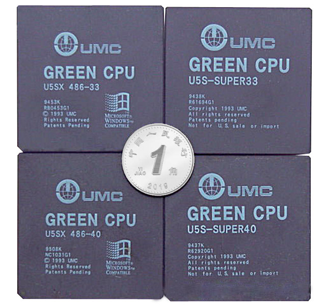

## 收藏篇：8款有趣的古董CPU

收集处理器跟收集其他物品一样，大家都有的物品就是无法满足收集者的胃口，似乎非得上天下海找到稀世珍品才能罢休。当然一些比较特殊的处理器自然会引起较多人的兴趣而导致于获得更多「关爱」的眼神。有时候其市场价格并不完全与其数量多寡成比例，但是会因为其特殊的历史地位而更受到众人瞩目。

## 世界首款微处理器：4004 (1971年)

凡事都有第一，当然处理器也不例外。Intel 4004身为全世界首颗单晶片的商用中央处理器，当然是世人的焦点，也是大部分处理器收集者梦寐以求的「圣杯」（Holy Grail）。该款处理器原先是Intel于1971年为一家名为Busicom 的日本公司而设计，用来生产计算机。

依照推出日期的早晚，Intel 4004又分有4种不同的封装。尽管内部电路大致相同，但是白色带有灰色花纹陶瓷封装，因为是最早也是最稀有的版本，导致于它也是公认的「价格第一」的地位。不过由于数量过于稀少，近年来几乎已经在拍卖市场上绝迹。数量较多的纯白陶瓷Intel 4004，而目前其市场价格约为1,500∼2,000美元左右，所以若未来有人愿意抛售灰色花纹版本，其价格可能又要创下新的纪录了。

    
    
<b>▲ 最初Intel 4004是应用在这款Busicom计算机上，当年的计算机比现在的笔电还要大台。（摄于美国加州的Intel博物馆）</b>

    
    
<b>▲ 4004有多种版本，其中白色瓷砖带有灰色花纹的是目前最稀有的版本，只有在1971∼1976年的产品才是这种封装。</b>

    
    
<b>▲ 世界上首款处理器外型与现在产品差异甚大，采用10μm（微米）制程，并有16个金属针脚。即使Intel博物馆的馆藏，也只有白色陶瓷封装的Intel C4004。</b>

## x86的祖师爷：8086 (1978年)

Intel 8086因为身为x86架构创始者，而享有特殊的历史地位。对于个人电脑发展史及架构稍微有认识的人，都应该知道目前大部分的个人电脑处理器就是以x86指令集为基础。就算Intel或AMD最新的个人电脑处理器都还保有x86相容指令，但是比较少人知道的则是x86的名称就是由Intel 8086这款处理器而来。Intel 8086最早期的产品就是用紫色陶瓷封装的版本，该版本几乎要每隔好几年才会在拍卖网站上出现一次，当然其价格也是天价。

    
    
<b>▲ 这小小薄薄一片就是x86处理器的祖师爷，相信这款处理器被制造出来的时候，很多人都还没出生，或是根本不知道电脑是什么。</b>

### 少见的军用样品：MG 80386 (1985年)

先前提过军事用品或工程样品，都是属于较为稀少而炙手可热的收集品，那么身兼两者的处理器呢？这款Intel MG80386就是一款极为稀有的军用处理器机械样本。军用处理器的运作标准温度，远比商用及工业用的严苛，这颗运作温度可在摄氏零下55度至125度之间。加上测试样本均属于研发的军事机密，能流到市面上的机会少之又少。 

    
    
<b>▲ 相信386处理器各位家中可能还翻的出来，不过这款代号MG 80386可就没这么常见，它是稀有军用样本。其中M表示军用温度，G代表PGA封装。</b>

### 超级电脑的处理器: i860 (1989年)

超级电脑大多是利用平行运算堆积出来的结果，比如说史丹佛大学的著名计画Folding@home，就是利用网路结合了全球的个人电脑用户及Sony PlayStation 3的运算能力，而一度成为世界运算速度最快的超级电脑。商业用的超级电脑也是利用同样的原理，所以超级电脑其实是由许多个节点（node）共同组成，而每个节点其实类似一台电脑。Intel Paragon超级电脑就是由许多含有Intel i860处理器的节点所组成。

    
    
<b>▲ Intel Paragon MP-64超级电脑的其中1个节点主机板，上面有3颗i860 XP。</b>

### 有设计瑕疵的处理器: Pentium (1993年)

除了早期80386有出现严重错误之外，Intel第一次因为错误而进行大量回收的产品就是拥有浮点运算缺陷的早期奔腾（Pentium）处理器。当时Thomas R. Nicely博士，公开表示奔腾处理器在处理某些除法运算时，会产生不正确的结果（FDIV bug）。这项宣布迫使Intel于1994年底宣布，接受顾客将有问题的处理器做更换。当时受影响的只有少部分晶圆批号（sSpec）的处理器受到影响，当然这些批号的产品后来也成为收集者的收集重点。

    
    
<b>▲ 此为FDIV错误的Intel Pentium 60MHz工程样本，其sSPec是Q0352，也是Intel所公布的第一个奔腾批号。</b>

    
    
<b>▲ Intel i386初期的产品执行32位元程式会造成错误，经过Intel全面对存货进行测试之后，功能正常的处理器上则会加注「ΣΣ」字样。</b>

### 最大的处理器: Pentium II Xeon (1998年)

在同架构下，伺服器用的处理器与个人电脑处理器，最大的差异通常在于快取暂存的大小，照理说两者实体大小的差异并不会太大。但是在Pentium II及Pentium III时代，Intel推出的Xeon伺服器处理器就硬是比个人电脑用的大了一倍。其体积几乎是一本小说的大小，约为15.2 x 12.7 x 1.9（cm），直到今天还没有同级处理器能打破这个纪录。由于商业伺服器淘汰产品皆有专门公司进行回收，加上卡匣式处理器的含金量不及之前的陶瓷封装，所以这些产品存世量不少，价格上也非常亲民，一般来说几百元就可以买回家。

    
    
<b>▲ 巨大的Pentium II Xeon处理器，实际上取得并不困难。</b>

### 胎死腹中的实验品: Timna (1999年)

你能想像将电脑所有元件缩小到1颗晶片上吗？Timna就是这概念下的产物，Intel尝试将处理器核心、绘图晶片以及I/O控制晶片整合至同一晶片上。这是有史以来第一颗以x86为基础架构的整合系统晶片，不过它奇差无比的效能，加上价格上并没有明显的优势，导致于该计画进行不到2年就胎死腹中，Intel Timna也因此从来没有机会在市场上亮相。这项产品由于知道的人不多，所以拥有的人自然也就凤毛麟角。

    
    
<b>▲ Intel Timna的工程样品，此为最早的x86整合系统晶片。</b>

### 台湾之光: 486 (1994年)

看了这么多Intel的产品，尽管有些是由中国台湾省代工厂代工，但是称不上是台湾自有的产品。除了威盛（VIA）因为是被台湾企业并购，而勉强称得上是台湾产品之外，其实联华电子（UMC）在1994年，曾经尝试推出与Intel 80486相容的微处理器晶片。后来受到Intel专利争议的影响，上面还打上不得在美国销售或进口的字样，不过最后联电还是选择与Intel和解，并放弃了自有微处理器品牌之路。由于这款是中国台湾省生产的第一颗自制的x86相容中央处理器晶片，很多台湾省的处理器收集者都会将其视为收集目标之一。

    
    
<b>▲ 联华电子当年推出的486处理器。</b>

    
    
    
<b>▲ 尽管德州仪器的486 DX4 100MHz处理器是在美国德州制造，但是在中国台湾省台北县中和市（现中和区）测试厂进行最后测试，因此该款处理器上面印有TAIWAN字样。</b>

### 处理器背后都有故事

看了这么多产品，除了对电脑中央处理器的历史有更多的了解之外，是否也觉得收集处理器这个嗜好，比想像中有趣许多呢？每颗处理器的背后都有其独特的技术发展背景，而这些故事更是与近年来的电脑科技发展息息相关。拥有了1颗处理器，就如同将那段历史的里程碑握在手上，成为电脑发展史的实际参与者。如果读者看了感到有兴趣，不妨有空多留意一下身边要淘汰的旧电脑，一起加入收集处理器晶片的行列吧！

    
    
<b>▲ Transmeta的第二代产品是由台积电代工，是少数处理器上面印有TAIWAN字样的处理器，图为Transmeta第一代产品TM5600。</b>

(The End)


