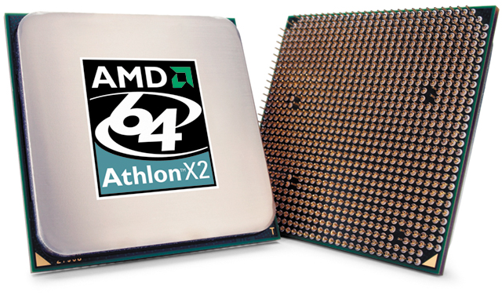

中央处理器 (CPU) 全名是 Central Processing Unit, 又叫做 Processor，如果将计算机主机比喻为人体的话，实际上 CPU 就相当于人类的脑袋中负责思考与运算的部分，是计算机核心三大组件之一 (CPU、主板、内存)，且处理器的选择会直接牵动内存与主板的搭配，因此其地位可说是计算机中数一数二的关键零组件。

    
    
<b>▲ 常见 CPU 的零售彩盒包装</b>

## 浅谈处理器

    
    
<b>▲ 处理器就在这个写着 Intel 字样的风扇下，从它的位置与专属风扇，应该不难看出 CPU 的地位有多重要。</b>

### 处理器架构概观

其实很多设备都有处理器的存在，一般来说我们比较熟知的是计算机与智能型手机，但实际上小至遥控器，大至飞弹、卫星其实里面都可以见到处理器的踪迹，只是根据不同的用途我们会使用不同类型的处理器，例如要求省电但性能要求不那么高，用途也不像计算机那么广泛的智能型手机与平板计算机就习惯使用 ARM 架构的 RISC 处理器 (Reduced Instruction Set Computing，精简指令集处理器)，更加要求省电且功能更加单一的有可能会使用 ARM Cortex M0 或是 8051 等更简单、更低阶的处理器 (电资科系的微处理机系统实验课程与计算器组织课程大概就是在搞这类东西)。

至于目前个人计算机主要使用的架构则是 x86 架构 (一种 CISC 处理器，Complex Instruction Set Computing，相对于 RISC 是精简，因此确实复杂很多的 CISC 就被命名为「复杂」了) 的延伸，这个架构的最早版本实际上在 1978 年就已经出现，是由 Intel 提出的，名称的由来也很简单，当时 Intel 推出的芯片是以 4008、8008 这样的编号命名的，而第一个采用 x86 架构的产品的名字就是 8086，之后 Intel 也将后来几代个人计算机用处理器依序命名为 80186、80286、80386、80486 等共计五款的 80×86 系列产品，其中 8086、80186、80286 是 16 位处理器，之后开始则升级为 32 位 (后来被 Intel 称为 IA-32，Intel Architecture, 32-bit)。

    
    
    
<b>▲ 早期的 CPU，左为 Intel 8086 (x86 的始祖)、右为 Intel 386。</b>

至于后来由于美国商标法规定不能使用数字当注册商标，因此 Intel 就把 80486 的后继者－80586 命名为我们熟知的「Pentium」了，尽管已经不叫 80586，但 x86 指令集的称呼已经为大家所习惯了因此就延续至今 (其实 Windows Vista 以前的 Windows，只要是 32 位版本的，安装档案目录都放在「i386」里面，其实就是 x86 架构适用的意思)。

### 抛弃 x86 架构的尝试

x86 架构发展至今已经将近四十年，早已经过无数的修改、调整，至今其实已经成为一个很庞大、很复杂，甚至被批评为效率不佳、一团混乱的架构了，实际上 Intel 也曾经努力尝试过抛弃日益混乱的 x86 架构，其中最具体的作为就是当时 Intel 发展了一种称为 IA-64 的「纯 64 位」架构 (全名就是 Intel Architecture, 64-bit)，IA-64 虽然名称与 IA-32 很像，但实际上与 x86 架构几乎没有任何关联，是砍掉重练的结果 (其实目的就是要取代 x86 架构，抛掉过去的包袱)，然而当时个人计算机的应用其实已经相当普及，且都是 x86 架构的天下，IA-64 架构整个砍掉重练带来的后果于是变得非常明显：

 - 由于架构整组砍掉重练，因此原有的 x86 架构程序全都不能用了。
 - 如前所述，IA-64 架构与 x86 完全不兼容，程序都得用新的编译器重新编译，甚至有不少需要修改以迎合新的架构。
 - IA-64 架构使用 VLIW 设计 (超长指令字，Very Long Instruction Word)，允许在一个指令字中放入多个指令，原意是要提高处理性能，减少花费在并行处理时损失的性能，但导致的结果却是使得 IA-64 架构程序性能会很大程度受到编译程序设计是否良好的影响，这直接导致在不少情况下 IA-64 架构的性能甚至不及原本的 x86 处理器。
 - 后来为了解决不能执行现有程序的问题，所以 Intel 设计了能在 IA-64 处理器上执行 x86 程序的方法，但需要透过模拟 (肇因于上一点所说的 VLIW 设计)，因此在 IA-64 处理器上执行 x86 32-bit 程序的效率仍旧不理想，比原有的 x86 处理器还要慢。
 - 受制于专利，其他厂商无法自由使用 IA-64 架构的技术。(可说是 IA-64 无法普及的重要原因之一)

    
    
<b>▲ Intel Itanium 2 处理器</b>

***BTW，IA-64 架构实际上不是 RISC 也不是 CISC，而是 HP 与 Intel 在当时合作新研究出来的 EPIC 架构，没听过吗？其实站长也不是很了解这是什么架构，但唯一一款使用这种架构的就是 IA-64，所以大概也没甚么必要去了解了其实 XD 以站长目前的认知来说，这系列真正 EPIC 的其实是外观吧…….确实挺宏伟的。***

现在看来你可能会觉得这些原因没甚么，顶多几年的阵痛期过去，大家转换到 IA-64 的程序不就好了吗？不过实际情况并不是这样，如果你有开过任务管理器看过程序的执行状态的话，就会发现实际上我们已经转换到 64 位架构这么多年，实际上绝大多数程序都仍然还是基于 32 位的架构，所以其实 IA-64 推不起来也不是什么很值得意外的事情。

    

Intel 旗下基于 IA-64 架构的处理器都命名为 Itanium 系列，中文译名叫做「安腾」，第一款产品发布于 2001 年，安腾系列的绝大多数产品都用于服务器市场，且大部分来自于惠普 (HP)，因为 IA-64 架构是由 HP 与 Intel 两间公司合作而成的，IA-64 架构目前被 Intel 称为 Intel Itanium Architecture。

### 抛弃不了，所以干脆改良它－x86-64 (AMD64, EM64T, Intel 64, IA-32E)

IA-64 架构现在看起来基本上是失败的，最后 IA-64 架构处理器只能在服务器市场中看到，实际上市占也不算高，只排到第四名而已，输给 x86-64、IBM 的 Power 架构、SPARC 架构，而 Intel 在 2012 年释出 Itanium 9500 系列后，至今也没有再推出新的 IA-64 处理器，微软等公司也在 2010~2011 年间宣布不再开发 Itanium 用的软件，尽管 Intel 目前还是说不会放弃 IA-64，但最具体的作为仅是帮 Itanium 画了与第六代 Core 同系列的 Logo，看起来应该是很难继续走下去了。

    
    
<b>▲ 新的 Intel Logo 群 (对应 Skylake 架构家族)</b>

而在 Intel 搞出 IA-64 架构之后，AMD 也发展了自己的 64 位架构，与 Intel 走了相反的路线，AMD 选择继续使用 x86 架构，而且还要「继续扩充 x86 架构」，最终的产物就是 AMD64 (第一款实际运用的产品是 2003 年的 Opteron 处理器)，AMD64 实际上就是目前你我所使用的 64 位架构，虽然把本来就已经够复杂的 x86 架构搞得更加恶心了，但 AMD64 架构作为 x86 架构的延伸，能够做到维持与过去 x86 架构近乎完全的兼容性 (连重新编译都不必)，因此 AMD 这回合在市场上获得了巨大的成功，这大概是 AMD 公司历史上最辉煌的时期，与 Intel 几乎可以有平起平坐的地位与市占率。

    
    
<b>▲ 基于 AMD64 架构的 AMD Athlon 64 X2 处理器，其实早期的处理器与 AMD 绝大多数的处理器背面并不是平的，而是许多针脚组成的 PGA 封装</b>

实际上在大约同一时间 Intel 也开始偷偷设计 x86-64 架构，偷偷的开始了「Yamhill」计划，尽管一开始 Intel 是极力否认这个研究计划的存在 (其实就是嘴硬加上拉不下脸来承认 Intel 居然会有需要采用 AMD 技术的一天 XD)，并且炮轰 AMD，认为 IA-64 架构才是「未来」，不过看着 AMD64 的成功，Intel 也逐渐开始正视自己市占率被 AMD 蚕食鲸吞的事实，因此在 2004 年改口承认自己正在发展一项称为「Clackamas Technology」的技术，其实从 Intel 光是在 2004 年内就为这个技术起了 IA-32E (Extended Intel Architecture, 32-bit)、EM64T (Extended Memory 64 Technology) 等名字就可以看出当时的 Intel 有多么慌乱。

EM64T 架构从 2004 年就开始广泛用于 Pentium 4 与 Xeon 处理器上，时至今日，Intel 将 x86-64 架构称为 Intel 64，目前你所能在一般市场买到的 Intel 处理器，全部都基于这个架构。

    
    
<b>▲ Intel 旗下第一款支持 EM64T 的消费性处理器－LGA775 版本的 Pentium 4 (部分型号)</b>

(未完待续)

<a href="{{site.feedback_link}}" class="btn btn-primary"><i class="fa fa-comment-o"></i> 匿名提问</a>

---------


