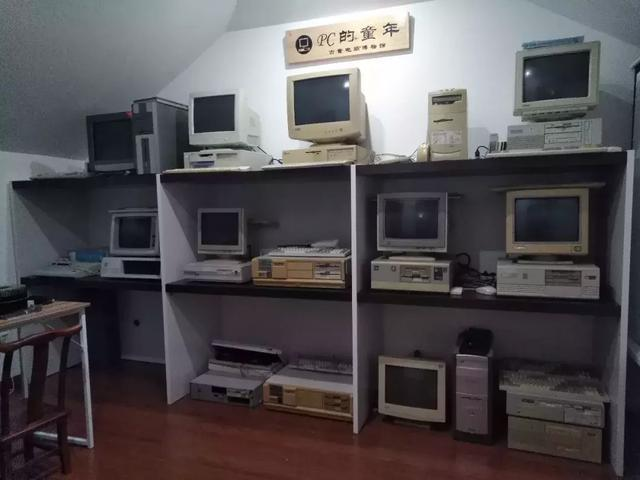
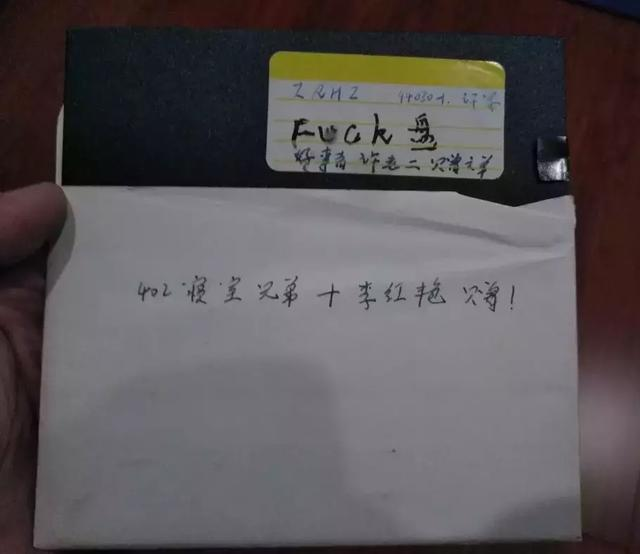
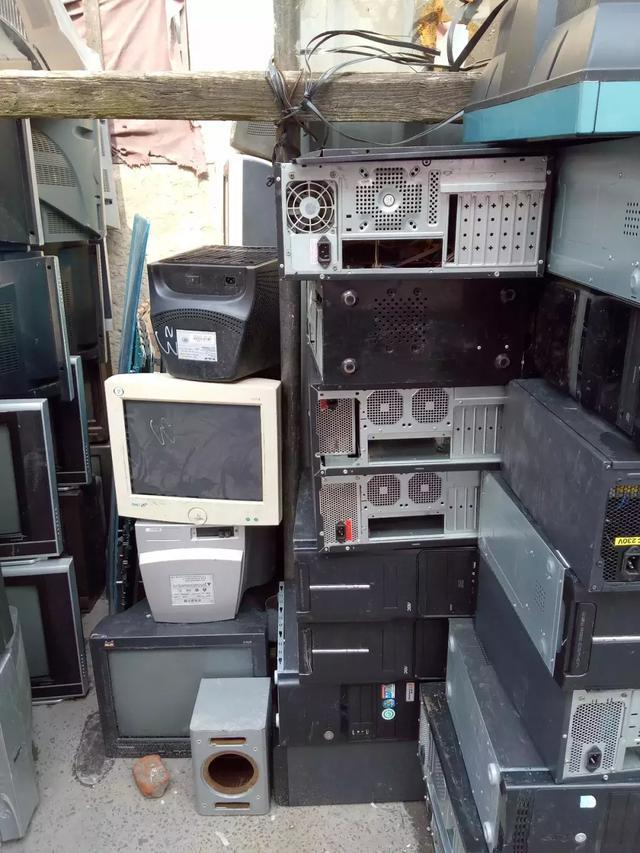
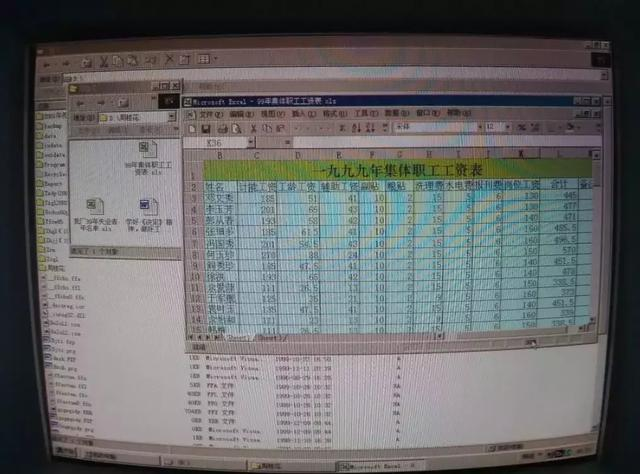
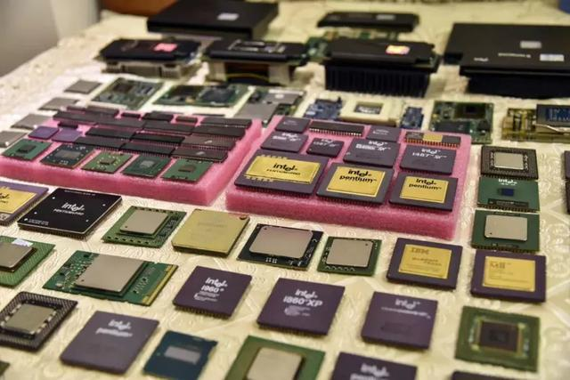
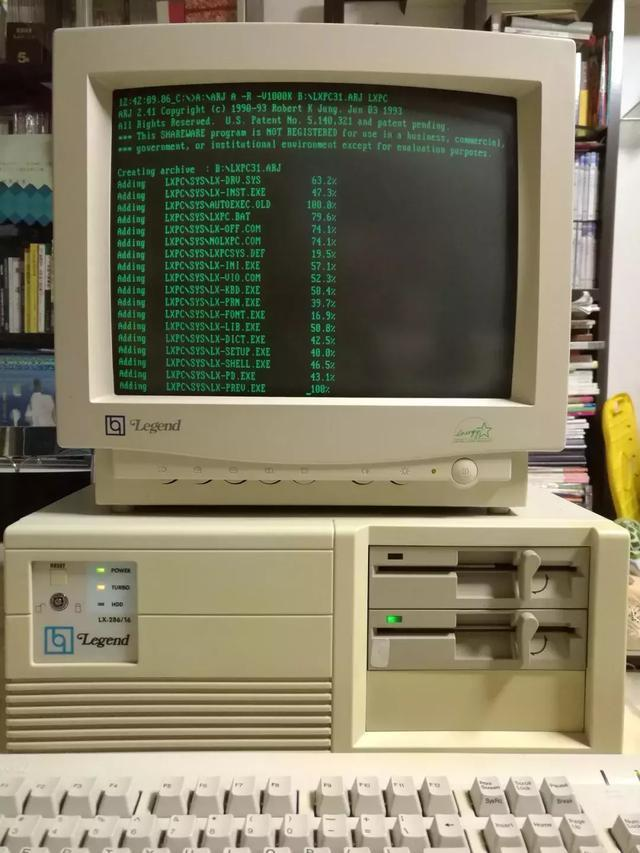
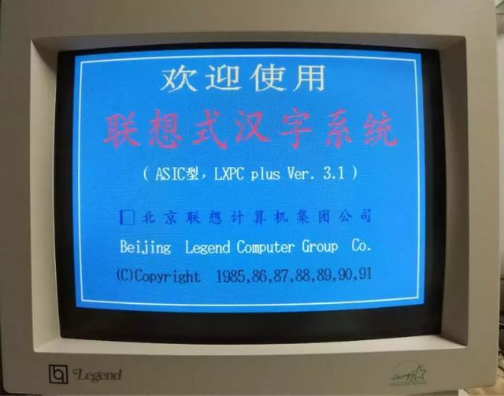

“电脑不仅仅是肉身，它的操作系统、应用软件、文档资料，都有不可割裂的关系。一台可以开机使用，教会人使用的古董电脑，才是电脑收藏的梦幻境界。”

在沉醉于古董电脑研究的梁华栋先生心中，电脑就是一件有血有肉的“活物”。

人的血肉灌注于头颅、心脏、躯干，而在计算机的次元里，组成它们身体的是那些关键配件：CPU、应用软件、汉卡、主机。轻薄如一块小小的芯片，在IT爱好者心中也是惊艳了时光的神圣存在。

在QQ群上，《IT时报》记者认识了一群民间古董电脑收藏家。他们的私人宝库虽然撑不起千万级规模的计算机博物馆，但是星星之火渐成燎原之势，记者好比管中窥豹，重游了一段PC的童年。

    
    
<b></b>

### 在“垃圾”里寻宝的痴人

说到邸鹏收藏古董电脑的契机，非常偶然，就是某一天他翻出了一张20年前的软盘。“这是大学兄弟的毕业留念。”邸鹏半开玩笑地说。包裹软盘的纸袋上，“402寝室兄弟赠！”的笔迹清晰如昨。邸鹏从来没看过软盘里到底有什么内容，于是突发奇想准备一探究竟，可是现代电脑已经没有能够读取它的软驱了。就这样，他的脑中兴起了收藏老电脑的想法。虽然这件小事牵起了邸鹏和古董电脑的缘分，但是这件故事的结局却有点悲惨，“我用我的ast 386去读这个软盘，什么都没读到，盘片已经划伤了，我永远都不知道里面有什么了。”

    
    
<b>20年前的软盘，邸鹏收藏的契机</b>

不只是阔别二十载的兄弟情怀，邸鹏本身在计算机方面也有不错的“先天条件”。大学时，他便常常去表哥开办的电脑公司帮忙，从286电脑（1980-1990年代的IBM PC/AT兼容机）一路玩过来，熟得很。现在他的本职工作又是设计芯片，一度还仿制过6502 CPU，即Apple II用的CPU，所以收藏老电脑让他十分有亲切感。

和大多数电脑发烧友一样，邸鹏的藏品主要来源于闲鱼平台。“在里面搜索古董电脑，会有很多卖货的。不过老实说现在好货不多了，一般都是秒没。”虽然自诩为入行才一年多的“新人”，但是这种初生牛犊似的热情在邸鹏身上时有显现。为了寻找有价值的藏品，他甚至一度跑去废旧电器拆卸厂“寻宝”。那里是多数电脑的坟墓，常常光顾此地的圈内人还被冠上了“垃圾佬”的名号。可惜他这段平生仅此一次的冒险最终一无所获，因此再不打算模仿“垃圾佬”的路线。

    
    
<b>废旧电器拆卸场，“垃圾佬”的据点</b>

“圈内的人有不同的派系，玩键盘的，玩CPU的，专收板卡的。拿古董鼠标为例，拆解和研究都是很有乐趣的，有些人对此很痴迷，甚至要自己复刻当年的产品。还好我中毒不深。”邸鹏表示，除了自娱自乐，收藏过程中也能满足一些经济目的，因为稀缺的藏品升值很快，譬如他当初花2000元买来的一台IBM 5160，一年左右的时间就涨到3500元了。

想当初，软盘上的一道伤痕就令邸鹏与20年前的青春纪念失之交臂，可见挖到宝藏对收藏家来说还不算完，之后的维修和清理才考验基本功。走运的话，“老古董”里的文件可能还保存完好，就像藏品之一的奔腾二，向邸鹏展现了一个20年前的世界：怀旧的开始菜单界面，一九九九年集体职工工资表、失业青年名单等文件历历在目。奔着硬件收藏而去的邸鹏，无心插柳地找到了一种考古的感觉。

    
    
<b>1999年的工资表</b>

一年多来，邸鹏一共收集了近20台Wintel架构的老电脑，从第一代8088到奔腾四的全系列，每种1-2台经典型号，都是品牌机，另外还有10台左右的8位计算机，时间可追溯到1980年。在上海浦东的家中，邸鹏将这些跨越30余年的宝物整整齐齐地码成一堵墙，还在顶端镶上一条醒目的牌匾：PC的童年（古董电脑博物馆）。

随着藏品的增加，邸鹏的计算机知识储备也被刷新了一番。在他收藏的部分8位电脑中，很多上面都写着Personal Computer（个人计算机），令他感到意外。“我们通常认为的PC机都是Wintel架构的。其实在IBM的PC机确立领导地位以前，市场上还有很多类型的PC机。这有点像历史上的春秋战国时代，竞争的结局是IBM一家独大，其他类型的电脑都被边缘化了。”邸鹏如是向《IT时报》记者形容PC界的“战国史”。

现在，邸鹏的时间主要耗在搜寻藏品和维修上，等以后有了闲暇，他就打算为每台电脑写个详细的序，“再过五年，估计就很难找到有价值的东西了，差不多都拆卸了。”

### 和改革开放同龄的X86

“有的人整天把老硬件、老CPU喊做垃圾，能卖点钱就是利润，而真正热爱技术的人都在讨论怎么点亮、修复一台电脑，怎么安装古老的软件，拿着这些垃圾当宝贝。”CPU收藏爱好者张淼感慨道。

2018年对于张淼是个别具意义的年份，不仅有普天同庆的改革开放40周年，还是X86系列处理器诞生40周年，他也因此产生了收集CPU铺成一面艺术墙的念头。然而，在国内收藏CPU相当困难，除了大量的知识，也需要靠运气，因为“垃圾佬”并不能辨别一块CPU是多么罕见难找的金顶（Intel的一种 CPU，因顶盖是金色，含金量略高而被玩家取名），很多CPU都被拿去炼金了。

作为80后，张淼在电脑的认识上算不上“早熟”，直到2000年，他才有了自己的第一台电脑，奔腾四1.3GHz CPU，要价9000元，在那个时代是笔大价钱。可是刚买回“高科技”的他偏偏不按牌理出牌，一回家就把电脑拆了，研究每一个零件。多年后电脑被淘汰了，那块CPU却被保存了下来，成为他的第一件收藏。

“想要收藏，知识储备必须足够多，否则很难在一大堆型号和产品中找到想要的东西。我只是收集了一些普通版本的CPU，收藏最多的人手上还有ES（工程样板）和早期稀有版本，比如Intel 4004，金顶的可能要上万元，而塑料的才几百元。”计算机专业出身的张淼对硬件有着浓厚的兴趣，上千个CPU型号都烂熟于心，其中几个型号甚至承载了整个CPU历史上最为辉煌壮阔的故事。

    
    
<b>张淼的CPU，intel 1969-2018全系列，数量破百</b>

这就要说说张淼单独收集最多的系列，图拉丁。1999年，第一代intel奔腾三处理器问世，此后一共发展了三代，核心代号分别为katmai、铜矿和图拉丁。图拉丁作为末代奔腾三处理器于2001年面市，也是首个采用0.13微米工艺制造的处理器，展现了优秀的超频能力，性能之强大甚至打败了新推出的奔腾四，“当年一个赛扬图拉丁1.0GHz CPU，可以轻松超频到1.3GHz，性能大增，价格还低，是广大玩家最喜欢的CPU。”

新产品打不过旧产品的局面放在产品迭代上看实在令人匪夷所思，于是Intel决定加速图拉丁的灭亡，动用过削减二级缓存、限制出货量等手段后，终结了图拉丁短暂的历史。尽管有点生不逢时的味道，匆匆谢幕的图拉丁却被硬件爱好者视为技术的代名词，用来表达以最低价换取高性能的动手精神，因此专注于硬件改造的DIY一族也爱自称为“图钉”，还催生了百度贴吧历史上赫赫有名的图拉丁吧。

### 复刻软硬件的回忆

IT从业者王隽宇自2010年起便开始收集老电脑，同时他还喜欢复刻它们的系统、软件和游戏。到目前为止，他已收藏了大小旧电脑200多台，其中不乏在电脑史上具有重要意义的机型，如微型电脑的开山鼻祖牛郎星、苹果电脑的第一台原型机Apple I以及中国的中华学习机。

“一开始纯粹是觉得好玩，但后来随着修复这些电脑，慢慢地就有了感情，觉得修复老电脑是一种责任，而且我比较注重写这些电脑的模拟器，这样不仅能感受到旧PC带给我们的震撼，而且可以让大家透过它们亲自见证时代的稳步发展。就像我们从牛郎星电脑上看到了一个科技的新时代即将崛起，Alto的图形化界面又让我们认识到电脑并不是死板的办公工具，而是发展得更加亲近民众，更加大众化的存在。”

王隽宇表示，现在自己主要是将ROM（只读内存）中的系统提取出来，然后写成模拟器，供人们欣赏这些漂亮的系统和富有历史见证意义的电脑，例如Apple II的模拟器在线版132.232.73.133。家在青岛的他常常在中美两国之间奔忙，工作之余也稍稍满足了收藏的目的，可以买一些硬件带回国，或者在西雅图活电脑博物馆里欣赏自60年代以来的各种机型。令他感动的是，西雅图博物馆里的旧电脑不是被隔绝在展柜里，而是插着电源依旧运作着，向人们展示昔日的辉煌。

“中国计算机学会准备在杭州萧山筹建国家级的计算机博物馆了。”身在北京的梁华栋深谙其中的机遇和挑战，他告诉《IT时报》记者，目前国内私人计算机收藏的水平仍然有限，单体体积和运输报关成本比较大，所幸星星之火渐成燎原之势，在深圳、上海、北京、江浙都有一些浮现。

今年9月，北京中关村创业大街上诞生了首家创业博物馆，电脑区、手机区、游戏出版物区等数百件“老物”在这里诉说着科技发展历程的故事。专注于中文计算机历史的梁华栋大方“割爱”，捐展了不少包括汉卡、中文输入系统、历史期刊在内的藏品，希望能藉此补足互联网上相关资讯缺失的一角。“我个人就花了很多精力，才复原了原本只存在于回忆文字中的联想汉卡实际使用情景。”

1984-1987年左右的计算机，内存和硬盘比较小，至多100MB左右的硬盘，无法存储海量的中文字库，也就无法处理中文。“中国人用电脑，首要解决的问题就是信息技术中文化，包括中文显示、中文输入、中文处理。由于80年代的个人计算机性能配置不高，操作系统也尚未进行底层汉化，因此中文化成就了今日许多知名公司的起点，包括长城、联想、金山、方正、四通、巨人和王码（五笔输入法）。”梁华栋说道。

    
    
<b>联想LX-286/16</b>

汉卡是一种将汉字输入法及其驱动程序固化为一个只读存储器的扩展卡，以联想汉卡为例，手掌大小，市场价格在1300元左右，利润约为700元，相比之下，同样售价的雪花电冰箱的利润则大大低于联想汉卡。

梁华栋表示，汉卡作为软硬件结合的产品，一方面通过直接写屏、矢量字库、固化字库等技术，有提高处理速度和处理能力的优势，另一方面也可以在商业上有效地保护知识产权，比纯软件能更好地反盗版。

在他的一台联想旧电脑上，汉字环境软件LXPC plus Ver. 3.1幽蓝的界面已经点亮。从此，陌生的历史也有望再度被触碰。

    
    
<b></b>

来源：《IT时报》公众号vittimes

<a href="{{site.feedback_link}}" class="btn btn-primary"><i class="fa fa-comment-o"></i> 匿名提问</a>

---------


