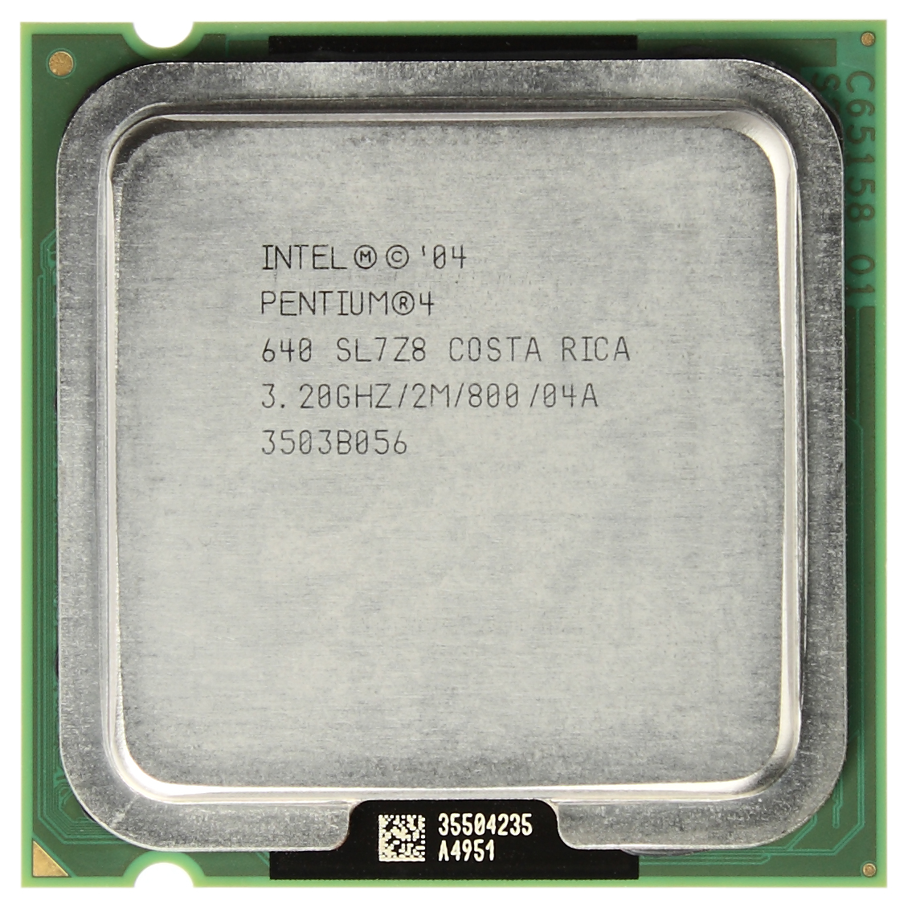

近年的 CPU 除了前一节谈过的基本参数之外，通常还有很多「技术特性」加持，这些技术能提供某些额外的功能或是提升运算性能，因此要了解 CPU 的规格，对这些技术的简单了解是不可或缺的！一般而言，处理器的技术特性有指令集与专属技术两大类，本节将先探讨指令集的部分。

不过由于指令集实际上是很复杂的东西，需要有资工系必修课程－计算器组织甚至是研究所课程的计算器结构的概念才能比较深入理解，因此本篇将比较偏向于介绍知名指令集的年代、历史与其作用，目的在于下次看到时能让你不致于完全不知道这些名词代表什么。

## 处理器指令集简介

首先介绍什么是「指令集」，其实指令集就是一款处理器所能支持执行的所有指令的总集合，就称之为指令集，英文用词为 Instructions。

其实我们先前所讨论过的「x86 架构」就是一群指令集的结合，除了一般用于基本运算的指令之外，为了提高运算性能，CPU 厂商也会在 CPU 中将经常会使用到的功能设计成额外的指令，以节省执行这些功能时所花费的时间，这样的做法就是「Make common case fast」，让经常用到的功能跑得比较快，在整体性能提升上会有比较明显的效果。

而本节当中所要讨论的指令集实际上都是 x86 架构指令集的「延伸」，但在用词上我们同样习惯称呼这些「扩充套件」为指令集。

目前而言绝大多数的处理器指令集都是为了多媒体而加强。由于指令集的部分要深入了解需要有计算器组织与汇编语言的概念，因此馆长在这篇不会详谈。

### MMX
起用年代：1996 年至今，首款产品为 Intel Pentium Processor with MMX Technology

    
    
<b>▲ Intel Pentium MMX</b>

MMX (Matrix Math eXtensions 矩阵数学扩充) 可以说是 x86 架构中多媒体指令集的始祖，具有 57 条指令，主要功能为强化多媒体数据的处理能力，所以亦有译为 Multi Media eXtensions 者，基本上从 1997 年以后你所能看到的 CPU 大概都具备 MMX 支持，同时 MMX 也是后来的 SSE 家族与 AMD 专属的 3D Now! 指令集家族的基础，以向量宽度而言，MMX 只支持到 64-bit。

    
    
<b>▲ 第一款支持 MMX 技术的处理器 (Pentium)</b>

不过距今年代已远，基本上现在已经看不到纯粹使用 MMX 优化的程序了。

### 3D Now!

起用年代：1998 年至 2011 年，首款产品为 AMD K6-2 Processor (AMD 于 2010 年宣布将抛弃 3D Now! 指令集)

    
    
<b></b>

3D Now! 指令集是由 AMD 基于 MMX 指令集设计的 SIMD 多媒体指令集，支持单精度的向量运算，总共有 21 条指令，发布的时间点正好是 3D 计算机图形刚开始发展的时候，要说这套指令集陪伴 AMD 一路成长，可是一点也不为过。首次出现于 AMD 的 K6-2 系列处理器，当时有许多游戏厂商与微软的 DirectX 7 为 3D Now! 指令集进行优化，因此优于 Intel 的游戏性能带来了一时的声名大噪，Intel 的所有处理器都不支持 3D Now! 指令集。

    
    
<b>▲ AMD K6-2 处理器</b>

之后 AMD 在 1999 年推出 AMD Athlon 时则是在原有的 3D Now! 指令集中再新增 5 条指令，增强 DSP 方面的性能，称之为「Enhanced 3D Now!」。

    
    
<b>▲ AMD Athlon 家族处理器</b>

### SSE

起用年代：1999 年至今，首款产品为 Intel Pentium !!!

    
    
<b></b>

SSE 指令集可说是近代个人计算机处理器数一数二重要的多媒体指令集，全名为 Streaming SIMD Extensions，是 Intel 针对 AMD 3D Now! 指令集进行的反击，基础仍旧来自于 MMX，SSE 提供了 70 条的新指令，由于 3D Now! 能做到的，SSE 几乎都做得到，甚至能够做得更好，因此 Intel 瞬间将 AMD 暂时的优势地位翻转了回来。

    
    
<b>▲ 首次支持 SSE 指令集的 Intel Pentium !!! 处理器</b>

SIMD 的意思是「Single Instruction, Multiple Data」，也就是单一指令能处理多个数据操作的意思，此外 SSE 支持的向量长度比 MMX 多出一倍，来到了 128-bit。

之后 AMD 则是在 2001 年推出的 Athlon XP 系列中加入了对 SSE 的完整支持 。

### SSE2

起用年代：2001 年至今，首款产品为 Intel Pentium 4 (Willamette)

    
    
<b>▲ 第一代 Intel Pentium 4 (Willamette) 首次支援 SSE2</b>

SSE2 是 SSE 的延伸，新增了 144 条指令，同时具有完全取代 MMX 的能力，AMD 则在 2003 年推出 AMD64 系列处理器时纳入 SSE2 的支持。

### SSE3

起用年代：2004 年至今，首款产品为 Intel Pentium 4 (Prescott)

    
    
<b>▲ 第三代 Intel Pentium 4 (Prescott) 加入对 SSE3 的支持</b>

SSE3 是 Intel 为 Pentium 4 后期的核心 (代号 Prescott) 新增的 SSE 系列指令，因此又被称为 PNI (Prescott New Instructions)，SSE3 新增了 13 条新指令，其中有 2 条新指令是针对 Hyper-Threading 技术而设计的，而 AMD 则在 2005 年之后开始将 SSE3 用于自家产品上 (但不包含 2 条 Hyper-Threading 优化指令)

### SSSE3

起用年代：2006 年至今，首款产品为 Intel Core 2 (Conroe)

    
    
<b></b>

SSSE3 (Supplemental Streaming SIMD Extensions 3) 是 SSE3 的补充，新增了 16 组 (每组有两种，分别用于 64bit 与 128bit 的缓存器中) 指令，**AMD 则是要从 2011 年的推土机架构 (Bulldozer) 才开始支持**。

### SSE4 家族

起用年代：2008 年至今，首款产品为 Intel Core 2 (Penryn)

SSE4 的历史相对于上面几项来说复杂了不少，首先看 Intel 的部分，实际上 Intel 将 SSE4 分为 SSE4.1 与 SSE4.2 两个，其中 SSE 4.1 有 47 条新增指令，从 Intel Core 2 (Penryn) 开始就能看到，SSE 4.2 则包含 7 条指令，直到 2007 年的 Nehalem 才纳入。

AMD 的话当时则是在 2007 年的 Barcelona 核心也新增了命名为 SSE4a 的指令集，只包含两条指令，实际上与 Intel 的 SSE4 没有什么关联，只是命名上故意想造成混淆而已。

### 胎死腹中的 SSE5

2007 年八月 AMD 干了一件很幼稚的事情，如同前面所说我们知道 SSE 系列的各个指令集其实都是 Intel 制定的，没想到在 SSE4 产品都还没出的时间点，AMD 就突然发布新闻稿与规格书，表示他们将在 2008 ~ 2009 推出支持 SSE5 的 CPU，此举当然让 Intel 不开心了，于是 Intel 就直接宣布「我们将不会支持 SSE5」，由于指令集实际上是编译程序优化的工具之一，若使用这种指令集的人很少，就不太容易让人有动力去开发能够针对这种指令集优化的编译程序，造成的直接结果就是这指令集会变得一点用处也没有，所以当时消息一出真的让许多人跌破眼镜。

最后的结局嘛，SSE5 终究从来没有在正式产品上出现过，AMD 最后也妥协改使用 Intel 后来提出的新指令集的方式重新设计 SSE5，并放弃 SSE5 的名称，也就是后来的 AVX，而部分没有出现在后来 AVX 的功能，则是被 AMD 拆分为 FMA4、XOP、CVT16 三个功能。

### Intel AES-NI

起用年代：2008 年至今，首款产品为第一代 Intel Core Processor Family (部分型号)

    
    
<b></b>

AES-NI 的全名是 Advanced Encryption Standard New Instructions (进阶加密标准新指令)，是少数与多媒体比较没有关系的指令集，主要是针对信任计算 (Trusted Computing) 与加密、解密性能提升而设计的指令集，新增了 7 条指令，AMD 则从推土机架构开始跟进。

    
    
<b>▲ 第一代 Core i7 处理器 (Nehalem) 引入了 AES-NI</b>

### AVX

起用年代：2011 年至今，首款产品为 Intel Sandy Bridge 架构处理器与 AMD 推土机 (Bulldozer) 架构处理器

    
    
<b></b>

AVX 的全名是 Advanced Vector Extensions (高级向量扩展指令集)，某种程度上概念来自 AMD 当年胎死腹中的 SSE5，因此其实可以看做是 SSE 家族的后续，简单来说是将原有的缓存器 (XMM Registers) 的长度全部增加一倍，由 SSE 的 128 bit 提升为 256 bit (YMM Registers)，因此能够提高处理器在处理特定向量与浮点数运算时的效率，主要带来的提升也是在多媒体方面，例如影片编码等等浮点运算量大的时候。在极端情况下可以提高到两倍 (当然实际情况不可能这么强大)。

另一方面 AVX 透过支持三运算符指令 ( 3-Operand Instructions)，因此可以减少在编码过程中需要复制数据到缓存器的次数，提高了执行向量运算时的效率。

值得注意的是，AVX 指令集需要操作系统的额外支持，Windows 系统至少需要 Windows 7 Service Pack 1 (需要安装额外的更新) 或是 Windows 8 以上。

### FMA3、FMA4

起用年代：2011 年至今，首款产品为 AMD Bulldozer 架构处理器。

    
    
<b></b>

FMA3 与 FMA4 实际上原先是 SSE5 的一部分，是 AMD 的 SSE5 作战失败之后被拆出来的功能，因此你只会在 AMD 的处理器上看到 FMA3 与 FMA4。

而对到 Intel 的处理器来看，AVX 基本上是包含 FMA3 的，也就是前面说过的三运算符指令 ( 3-Operand Instructions)，这部分由于馆长没有深入去看原始规格，所以大概只能这样描述，毕竟其实本来就是两大厂之间商业互斗的结果。

至于 FMA4，顾名思义其实就是对四运算符指令的支持。

### AVX2

起用年代：2013 年至今，首款产品为 Intel Haswell 架构处理器。

    
    
<b>▲ 第四代 Core 家族 (Haswell) 处理器引入 AVX2 支持</b>

AVX2 顾名思义是 AVX 的升级版本，透过增加两个 FMA (Fused Multiply-Add，熔合乘法累积单元) 来达到强化浮点运算能力的效果，每个 FMA 可以支持 8 个单精度或 4 个双精度浮点数。

此外，AVX2 也将 AVX 中未被扩充的整数向量运算指令扩充到与浮点数相同的 256-bit，因此在极端状态下，「理论上」AVX2 可以达到以往将近两倍的整数运算性能。

### Intel TSX-NI

起用年代：2013 年至今，首款产品为 Intel Haswell 架构处理器。

    
    
<b></b>

说起来这个指令集有点难解释，全名叫做 Transactional Synchronization Extensions，翻作事务性同步扩展指令集。

官方的说法是主要用来提升多线程 (Multi-threading) 下的性能，原理上大致是从硬件层着手去改良在多线程或多核心状况下会遇到的锁定 (lock) 问题的处理方针，不过需要软件的支持，因此这主要是比较针对软件工程师的技术，一般人大概是感受不到什么差别。

不过说到 TSX-NI，比较广为人知的可能反而是这则新闻：在 Haswell 与部分 Broadwell 架构核心的处理器上，TSX-NI 指令有重大缺陷，会导致系统发生预期以外的行为。

当时 Intel 的做法很简单，直接将 TSX-NI 从 BIOS 端关掉就没事了，嗯，所以目前能用到 TSX-NI 指令的人，大概是少数中的少数吧，Skylake 的部分应该是没有这问题的，不过接下来的 HEDT 高阶平台是 Broadwell-E，中阶以上服务器是 Broadwell-EP 跟 Broadwell-EX 呢……

### AVX-512

起用年代：2017 年 (预计)，首款产品预定为 Skylake-EP (中高阶服务器用 Skylake)。

AVX-512 实际上是一个非常乱的指令集，分成许多组别，在不同用途的处理器上可能会提供不一样的组别 (目前已知有 F、CDI、ERI、PFI、BW、DQ、VL 等组合)，其中只有 AVX-512F 是一定有的 (F 是 Foundation 的意思)。

目前来说大概就认知到 AVX-512 会将向量的处理能力再次翻倍来到 512-bit 就可以了，其他规格会不会变其实还很难说，而且短期内一般人应该是碰不到有支持 AVX-512 的处理器的。

呼，终于介绍完常见的指令集了，其实这长度应该已经能分成上、下两篇的，不过因为指令集坦白说不是什么很有趣的东西，因此馆长后来想想，还是干脆一次出完早点把这个主题结束吧 XD

下次的主题应该会比较贴近大家现在已有的认识吧？例如 Hyper-Threading (HT) 等等技术的简单介绍。

(未完待续)

<a href="{{site.feedback_link}}" class="btn btn-primary"><i class="fa fa-comment-o"></i> 匿名提问</a>

---------


