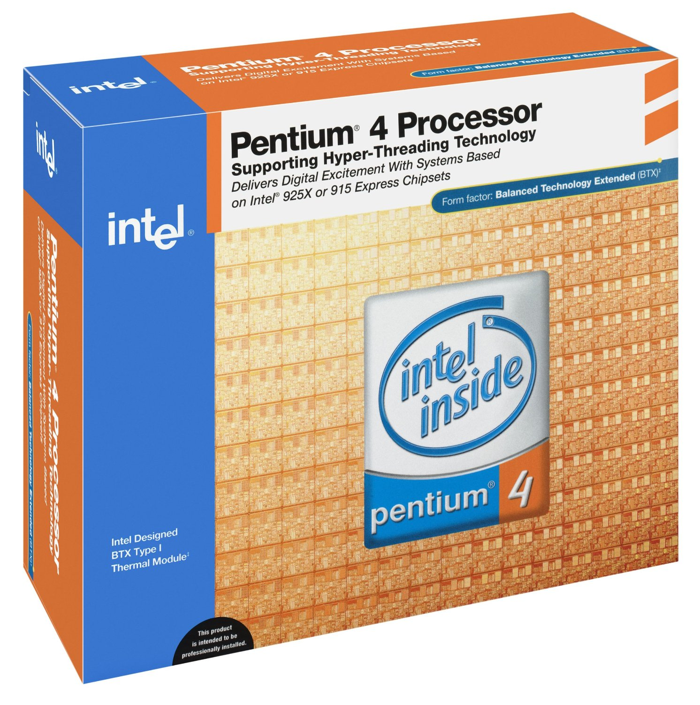
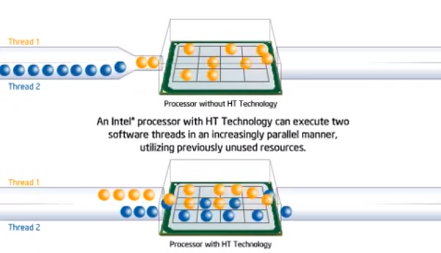
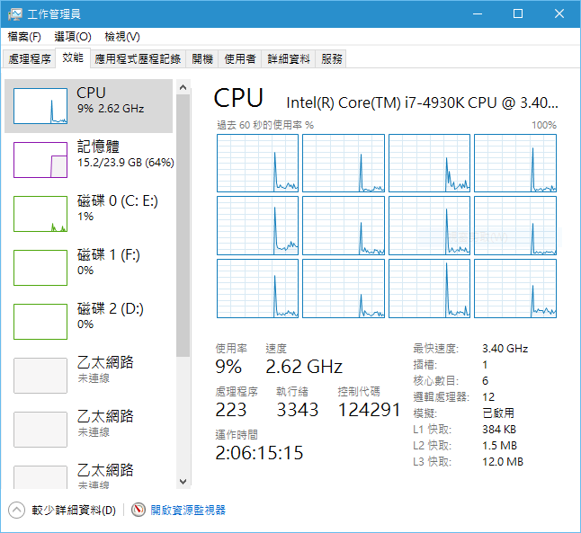
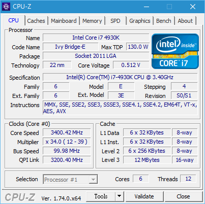
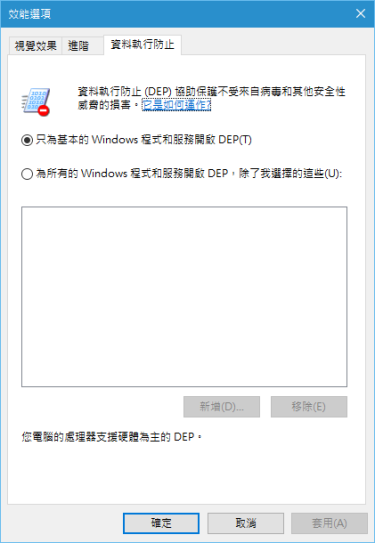
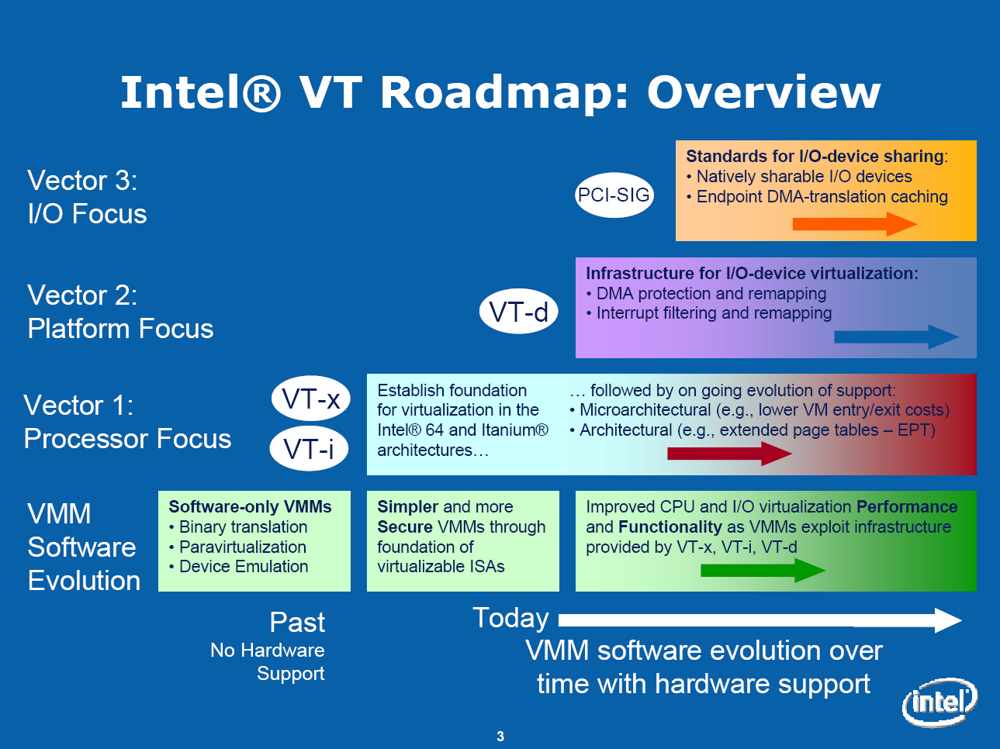

延续上一篇的主题，馆长在这节将会继续谈处理器的「技术特性」，在一般人可能比较少听过，也比较不是那么好理解的指令集之后，本节介绍的「专属技术」部分应该是大家会比较感兴趣甚至是有听过的，由于这部分技术特性其实蛮多、蛮杂乱的，因此馆长目前只先挑出有代表性的技术介绍，如果你有特别对哪个技术有兴趣的话，可以在留言的地方提出来，馆长会将介绍新增到这里。

## Hyper-Threading Technology (超线程)

拜 Intel 铺天盖地宣传之所赐，Hyper-Threading (简称 HT) 应该是最广为人知的处理器技术特性了吧？Hyper-Threading Technology 的中文叫做「超线程」，开发代号为 Jackson Technology，其实以整个计算机领域来说不是一个非常新颖的技术，最早出现于 2002 年，当时称为 Super-Threading，用于 Xeon 服务器家族的处理器上，而 HT 真正广为人所知是在 2003 年，Intel 将其加入旗下的 Pentium 4 系列处理器 (Northwood 核心架构) 之后才真正进入主流化的阶段，但之后在 Core 2 家族中被取消，而到了第一代 Core i7 (Nehalem) 处理器时又被加回，至今则广泛用于所有 Core i7 与 Core i3 处理器上。

    
    
<b>▲ 或许还有些人有印象，当时其实 Intel 砸了不少广告成本在宣传 Hyper-Threading 上，那两条橘色徽标就是支持 HT 技术的象征。</b>

***按：其实 HT 只是 Multi-threading 多种实作方法的其中一种罢了，但由于一般人大概只会接触到基于 SMT 的 HT 技术，因此本篇不会深入去谈其他种类的 Multi-Threading。***

### Hyper-Threading 的运行模式

HT 的原理基本上是将处理器内的实体运算核心 (Physical Core) 内的其中一部份前端模块从一组改为两组，称之为 Logical Core (逻辑核心)，以达到「看起来」好像有两个处理核心的效果，但实际上运算核心仍然只有一组，大致上 HT 技术的运行模式可以用下面这张图解释：

    
    
<b></b>

如同上面这张图，Hyper-Threading 基本上可以这样比喻：进入核心的道路从一条变成两条，而核心本身仍然只有一个。

    
    
<b>▲ 启用 HT 技术之后，本来具有 6 个核心的 4930K 就变成具备 12 个逻辑处理器了 (6C12T 的说法就是这么来的)</b>

### Hyper-Threading 对效能的影响

由于处理器核心本身并没有增加，也没有变得更强，HT 技术只是将「进入处理器核心的通道」从一条变成两条，因此 HT 对效能的提升基本上是来自于「**充分榨出核心的潜能，让核心闲置的时间变少，让线程花在排队等待其他线程的时间变少**」，而不是真正对运算性能带来提升。所以实际上 HT 技术在处理器本身已经被用满的状况下是没有办法带来性能提升的，甚至可能因为安排与交错而造成效能不升反降的结果。不过由于绝大多数时候，CPU 核心并不是被 100% 利用的，因此 HT 技术提高核心使用率之后，在大多数情况下还是可以带来 3% ~ 25% 不等的性能提升。

但在实际运用上还有另一个问题：程序是否有对 Multi-threading (多线程) 进行优化会对 HT 的效果带来很明显的影响，如果程序未对多线程优化，则 HT 的改善效果将会显得很不明显，甚至是带来负面影响。不过随着多核心处理器的普及，近来已有不少程序会针对多线程进行优化，因此这个问题在未来应该会逐渐被淡化，所以 HT 技术还是有其存在的价值。

## 处理器省电调控技术

### Enhanced Intel SpeedStep Technology (EIST)
SpeedStep 是 Intel 处理器的省电技术，最早用于行动版 Pentium !!!-M 上，当时的 SpeedStep 技术是让对处理器设计高、低两种不同的运行频率，由于当年还无法做到实时切换，因此主要是设计成使用电池时用低速档，插电使用时则跳为正常频率 (高速檔)。

后来在 Pentium M 处理器 (虽然 Pentium M 销售量不是那么高，也不是很为人所记忆的处理器，但其实 Pentium M 在 Intel 后期的发展史很重要)，上新发展出了增强版的 SpeedStep 技术 (EIST)，做到了实时切换的能力，处理器会根据当下的使用率来调整倍频与电压的高低以达到省电的效果，从 Pentium M 以后的 Intel 处理器，倍频锁不再是固定的数字，而是一个范围。

    
    
<b>▲ 之前就曾经出现过的 CPU-Z，图中可以看到标准倍频为 34 倍的 4930K，其实可以降频到 12 倍。</b>

而进入多核心时代之后，EIST 也有能力暂时性地将没有用到的核心关闭，以达到更进一步的省电效果。

### Intel Turbo Boost Technology

Turbo Boost 其实可以当成反向的 SpeedStep，运用 EIST 技术的原理来达到相反的作用：当处理器负载高的时候，Turbo Boost 可以将特定核心的运行频率拉到比平常还要高一些。以 Intel 的设计而言，搭配 EIST 关闭非使用中核心的功能，当所有核心没有同时在运行中时，Turbo Boost 可以将目前使用中的核心的倍频拉到更高，从上面那张图也可以看到，标准倍频为 34 倍的 4930K，其实可以拉高到 39 倍。

AMD 后来也推出了类似的功能，称为 TurboCore。

### AMD PowerNow!

PowerNow! 功能上其实就是 AMD 版本的 SpeedStep，最早也是用在自家的笔记本电脑用处理器上，至于名称的由来则是为了类似 3D Now! 而用，最早出现在 AMD K6-2+ 处理器上，原理与 EIST 相似，是配合 CPU 核心使用率来动态调整运行频率与核心电压。

### AMD Cool’n’Quiet

Cool’n’Quiet 与 AMD PowerNow! 的原理与作用大致相同 (仅有小部分设计上的差异)，而 Cool’n’Quiet 只用于 AMD 旗下的桌面计算机用处理器上，而服务器产品线 Opteron 则是称为 Optimized Power Management，至于 Cool’n’Quiet 的限制则比 EIST 多，不同于 EIST 的全时有效，Cool’n’Quiet 只会在操作系统的电源管理功能内使用省电模式时作用。

## 数据执行防止 (Data Execution Prevention)

DEP 是一项安全技术，透过将内存中大部分区块标示为「禁止执行」(除了明确存放需要执行的应用程序之内存区块外)，来达到控管系统内存存取的效果，能防止恶意软件透过违规存取内存取得越权破坏系统的机会。DEP 有软件与硬件两种实作方式，从 Windows XP Service Pack 2 就开始支持这项功能。

    
    
<b></b>

而透过硬件实作 DEP 则是需要处理器的支持，这项技术有很多种名称，不过都是指同一件事情，例如 AMD 称其为 Non-eXecute Bit  (NX Bit)、Intel 则称之为 eXecute-Disable Bit (XD Bit)，嗯？这个 XD 可不是图释哦。

## 虚拟化技术 (Virtualization Technology)

虚拟化技术是一门很深的学问，对一般人来说最直接的认识大概就是虚拟机 (Virtual Machine, VM) 的用途。早期的 VM 其实是非常慢的 (因为纯粹靠软件仿真)，一般只能用在测试或开发用途，其他用途基本上都非常勉强，几乎可以说是不太可能做，直到处理器发展出 VT 技术，开创了硬件辅助虚拟化的时代之后，才开始带来变化，随着技术的发展，至今虚拟化技术已经获得了非常广泛的应用，特别是在服务器与商业用途领域之中。

    
    
<b></b>

### Intel Virtualization Technology (VT-x / VT-i)

开发代号为 Vanderpool 的 Intel VT 技术是 Intel 处理器支持硬件辅助虚拟化的开端，其中配合 x86 架构处理器的 VT-x 则首次出现于 2005 年的 Pentium 4 处理器上 (VT-i 则适用于 Itanium 处理器的 IA-64 架构上)，至于 AMD 则是在 2006 年的 Athlon 64 系列上开始支持称之为 AMD-V (AMD Virtualization) 的 VT-d 技术，又称为 SVM (Secured Virtual Machine)。

由于篇幅有限，馆长不打算在这里详细说明 VT 技术的原理。

### Intel Virtualization Technology for Directed-I/O (VT-d)

VT-d 则是关于 I/O 的虚拟化，因此主要是在芯片组的功能，所以此节将不会特别叙述。

(未完待续)

<a href="computer_lecture_3.html" class="btn btn-primary">上一篇</a> 
<a href="computer_lecture_5.html" class="btn btn-primary">下一篇</a> 
<a href="{{site.feedback_link}}" class="btn btn-primary"><i class="fa fa-comment-o"></i> 匿名提问</a>

---------


