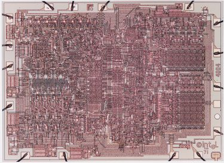

在前面的 CPU 概论结束之后，我们接下来要进入的是一段「历史课程」，由于现今 x86 个人计算机处理器只剩下 Intel 与 AMD 两大厂商，因此馆长将只谈这两家的产品，并从 Intel 的第一颗处理器－Intel 4004 开始到最新的 Skylake 与即将出现的 AMD Zen，由于这段历史很长，所以可能会拆成五到七篇文章的量。

第一篇将介绍上古时代，包含 Intel 的 4004、8008、8080、8085 等进入 x86 架构以前的处理器。

## 上古时代－处理器产业的开端

### 一切的开始：Intel 4004

Intel 4004 是 Intel 这间公司的第一款微处理器 (Microprocessor) 产品 (其实 Intel 本来是生产内存芯片的厂商)，同时也是全世界第一款被商用化的微处理器 (在此之前似乎还有一两款军方专用的产品)，采 4-bit 架构，包含了 2300 个晶体管，原先是为了日本计算器公司 (Nippon Calculating Machine Corporation) 旗下的产品 (Busicom 141-PF 计算器) 而设计的芯片。

    
    
<b></b>

当时实际上 Intel 为了这家公司设计的是一整套的芯片，一共包含了中央处理器 (4004) 与辅助 ROM 内存芯片、用于处理数据的 RAM 内存芯片和负责处理输入与输出端的缓存器芯片，这某种程度上也是未来计算机的基本架构雏形。

    
    
<b>▲ Intel 4004 的电路图 (Die shot)</b>

或许 4004 在推出当时就被认为是一款失败的芯片 (性能不佳)，但实际上一枚 3mm x 4mm 大小的芯片就能够有足以匹敌 1946 年的始祖级计算机－ENIAC (足足要占据一整个房间的大小) 的性能，还是让人惊叹的。

除此之外，当时的 CPU 主要材质为陶瓷，后来才发展出塑料封装的形式。

之后 Intel 另外在 1974 年推出了 Intel 4004 的升级版－Intel 4040，增加了额外的内存寻址与缓存器和一些新指令，同时封装针脚数也增加到 24 针脚，不过由于出现得比 Intel 8008 还要晚，所以不太受到关注。

**Intel 4004 规格诸元**

 - 发布时间：1971 年 11 月 15 日
 - 封装方式：16 针脚 DIP
 - 制造工艺：10 微米 (μm)
 - 运行电压：15 V
 - 运行频率：108 kHz ~ 740 kHz
 - 晶体管数：2300 个
 - 指令集架构：4 位 BCD 运算、支持 8 位指令集与 12 位地址集合

>*<b>DIP 封装</b> 
全名为 Dual In-line Package，外型就如同 4004 这样，背面有两排针脚，直到现在仍然常用于简单的集成电路芯片上 (例如面包版实验时用的芯片)。*

### 进入 8 位时代：Intel 8008

Intel 8008 同时身兼了两个「第一」，Intel 旗下的第一款八位处理器，同时也是全世界第一颗八位处理器，因此是很有代表性的产品，具有划时代的意义，发布于 4004 推出后的来年－1972 年。

    
    
<b></b>

8008 原先被叫做 1201，是 Intel 为 Computer Terminal Corporation (CTC) 公司旗下的 Datapoint 2200 可程序化终端机设计的芯片，不过由于交货时间延迟加上性能未达要求，最终被 CTC 所舍弃，而后来由于 SEIKO 公司表达了购买 1201 用于科学计算器产品的兴趣，在 Intel 与 CTC 的协议中，CTC 放弃了对此芯片的知识产权，允许 Intel 对其他客户销售此芯片，在经过一些修改之后，1201 就成为了我们现在所认识的 8008。

    
    
<b>▲ Intel 8008 的 Die shot</b>

起先 Intel 担心这款芯片卖不出去，不过最后，他们成功了，值得一提的是，虽然绝大多数 8008 的频率低于前代的 4004，但由于 8008 是八位处理器，因此实际上效能还是比 4004 强很多，8008 至多可以支持 16 KB 的内存。

**Intel 8008 规格诸元**

 - 发布时间：1972 年 04 月
 - 封装方式：18 针脚 DIP
 - 制造工艺：10 微米 (μm)
 - 运行电压：5 V
 - 运行频率：200 kHz ~ 800 kHz
 - 晶体管数：3500 个
 - 指令集架构：8008 8 位指令集

### 具有指标意义的处理器：Intel 8080

之后 Intel 在 1974 年将 8008 改良之后生产了 Intel 8080 这款处理器，这款处理器的指令周期「大幅提高」到 2 Mhz，且能提供直接内存寻址与支持 64 KB 的内存。

    
    
<b></b>

之所以说这款处理器具有指针意义呢，其实不是因为他的效能或是架构有什么非常跨时代的改变，而是因为它带动了当时计算机产业，当时有一款叫做 Altair 的畅销计算机就是使用这款处理器，这台计算机其实蛮常在与硅谷有关的电影 (特别是讲述微软的历史时)，因为比尔盖兹当时创办微软的起头，就是为了帮这台计算机设计 BASIC 程序语言开始！

    
    
<b>▲ Intel 8080 的 Die shot</b>

此款处理器的另一项特色则是，有许多厂商争相加入生产兼容于 Intel 8080 的产品，值得注意的是，AMD 也在这时候正式进入微处理器市场，生产了从 Intel 8080 逆向工程得来的 Am9080 芯片，之后则「先上车后补票」在 Am9080 上市之后才与 Intel 达成授权协议 (1976 年)，成为 8080 芯片的第二生产者 (其实 Intel 是为了打入硅谷的市场才这么做的，当时硅谷有许多大公司要求采用产品时，该产品必须要有两家以上的货源)。

**Intel 8080 规格诸元**

 - 发布时间：1974 年 04 月
 - 封装方式：40 针脚 DIP
 - 制造工艺：6 微米 (μm)
 - 运行电压：5 V
 - 运行频率：2 MHz
 - 晶体管数：6000 个
 - 指令集架构：8080 8 位指令集

### 生命周期超长：Intel 8085

在 1975 年时 Intel 发布了 Intel 8085 这款芯片，是 8080 的改良版，主要是免除了过去 Intel 8080 需要同时提供 +5 V、 -5 V、 +12 V 三种不同电压才能正常运行的困扰，Intel 8085 只需要提供 +5V 就足够了，其实这也是型号中「5」这个数字的由来，因为单一电压方便，加上改进了 8080 的不足，因此很快就全面取代了 Intel 8080。

    
    
<b></b>

8085 这款芯片最大的特色在于超级长寿，从 1976 年 Intel 发布这款芯片开始，一路生产到 2000 年以前，生命周期超过 25 年，甚至是在今天的微电脑设备中仍然偶尔可以看到这款处理器的影子，继续担纲控制器的角色。

    
    
<b></b>

由于指令集没有太大变化 (只新增了几条指令)，因此 Intel 8085 可以完全兼容于为 Intel 8080 编写的软件，但在降低周围电路的需求之后，OEM 厂商可以用 Intel 8085 生产更便宜的计算机。

**Intel 8085 规格诸元**

 - 发布时间：1976 年 03 月
 - 封装方式：40 针脚 DIP
 - 制造工艺：6 微米 (μm)
 - 运行电压：5 V
 - 运行频率：3 MHz ~ 6 MHz
 - 晶体管数：6500 个
 - 指令集架构：8080 8 位指令集

上古时代的部分大概就介绍到这边，这些东西距今都已经超过 40 年了呢，甚至其中不少已经成为收藏家的目标了，身价可是水涨船高啊。

(未完待续)

<a href="{{site.feedback_link}}" class="btn btn-primary"><i class="fa fa-comment-o"></i> 匿名提问</a>

---------


