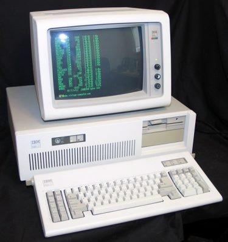

延续上一节的主题，本节馆长要谈的是「中古时期前半」的个人计算机 CPU 发展史，从这里开始就进入 x86 指令集架构的时代了，后来你所能见到的个人计算机 CPU 几乎都奠基于此 (即使是最新的 Skylake Intel Core i7)，这段时间的产品具有多重大的意义自然也就不言可喻了，这段时期与上一节相同，当时的 AMD 还是以生产与 Intel 兼容 (其实说白了就是照抄) 的处理器为生的。

其实这段历史里面 Motorola 扮演了很重要的角色，不过受制于篇幅，加上 Motorola 早已离开处理器产业数十年之久，因此馆长暂时不会提到 Motorola 的处理器，或许之后有机会再来补上这块拼图？

本节介绍的有 Intel 8086、8088、80186、80286、80386、80486。

## 中古时代前期－x86 王朝的开端

### 无心插柳柳成荫：Intel 8086

Intel 8086 是世界上第一颗 16 位处理器，名称中的 86 就是后来繁衍数十年的 x86 处理器家族命名的由来，这款处理器从 1976 年 5 月开始研发，直到 1978 年中完成，上市时除了 8086 这个代号以外还有一个 iAPX 86 的命名 (iAPX = Intel Advanced Performance Architecture)。

    
    
<b>▲ Intel 8086</b>

命运之神经常喜欢捉弄人，当时的 Intel 其实主力是在发展 iAPX 432 这款处理器 (1975 年，当时计划名称为 Intel 8800)，8086 计划其实只是一个「风险比较低的备案」，本来用意是要拿来在 8080 与 iAPX 432 之间担任垫文件产品而已。

    
    
<b>▲ Intel 8086 Die shot</b>

iAPX 432 是一款划时代的 32 位 CISC 处理器，完工于 1981 年，不过造化弄人，这款以当时来说架构非常先进的处理器，性能却非常糟糕，因此最后 iAPX 432 在市场上是非常失败的，当时的纽约时报这么评价 iAPX 432：「**iAPX 432 比竞争对手 Motorola 的 68000 还要慢上 5 到 10 倍！**」，相较于 iAPX 432 的整组砍掉重练，8086 使用了 8085 的基础与相似的工艺，因此 Intel 8086 的开发进程相对而言顺利与快速非常多。

当时的 Intel 大概怎么也想不到，8086 会对后世的计算机有如此巨大的影响。

    
    
<b>▲ 据说这是 iAPX 432 的样子，不过馆长也不确定。</b>

Intel 8086 内建的晶体管数量提升非常大，来到了将近三万个，是前代的四到五倍，运行频率也拉高到 4.77 MHz 起跳，可以支持至多 1 MB 的内存寻址，同时使用的指令集也全面翻新，这个时期里创造出的 x86 指令集成为未来个人计算机处理器的奠基石，之后的个人计算机 CPU 也都以此为基础，不再有砍掉重练的事情发生 (随着计算机的普及，尽管中间曾经尝试过要砍掉重练不过都失败了，因为指令集砍掉重练现有的程序就都得重新编译甚至是需要修改才能使用，会造成很大的麻烦)。

Intel 8086 与之后的 80×86 系列都有伴随推出搭配的浮点运算协处理器，也就是 80×87 系列。

    
    
<b>▲ Intel 8087</b>

**Intel 8086 规格诸元**

 - 发布时间：1978 年 06 月 08 日
 - 封装方式：40 针脚 DIP
 - 制造工艺：3 微米 (μm)
 - 运行电压：5 V
 - 运行频率：4.77 MHz ~ 10 MHz
 - 晶体管数：29,000 个
 - 指令集架构：x86-16 指令集

### 真正意义上的个人计算机之始：Intel 8088

Intel 8088 其实并不算很特别的一款处理器，但在个人计算机历史上却占有非常重要的地位。说穿了其实 Intel 8088 就是 Intel 8086 的简化版，你可以把它与 Intel 8086 的关系当成今日 Celeron 与 Core 的差别，Intel 8088 将 Intel 8086 的数据总线带宽降到 8-bit，预取队列也从 6 bytes 降到 4 bytes。

    
    
<b>▲ Intel 8088</b>

Intel 8088 最大的特色就是便宜，在那个年代里便宜又堪用的性能就意味着普及。 (其实现在不也是这样吗？)

    
    
<b>▲ Intel 8088 Die shot</b>

前面说到 Intel 8088 在个人计算机历史上占有非常重要的地位，其实就是因为如此，IBM PC 采用了 Intel 8088，这台推出于 1981 年的计算机，是后来所有 IBM PC 兼容机个人计算机的前身 (不要怀疑，除非你用的是 Mac，否则你眼前这台大概就是了)。

**Intel 8088 规格诸元**

 - 发布时间：1979 年 07 月 01 日
 - 封装方式：40 针脚 DIP / 44 针脚 PLCC
 - 制造工艺：3 微米 (μm)
 - 运行电压：5 V
 - 运行频率：4.77 MHz ~ 10 MHz
 - 晶体管数：29,000 个
 - 指令集架构：x86-16 指令集

>*<b>PLCC (Plastic Leaded Chip Carrier) 封装</b> 
PLCC 封装的中文为「塑料电极芯片载体封装」，能搭载比起以往 DIP 封装更多的针脚，概念上近似于以一个塑料底板中间镂空，将集成电路芯片本体嵌入载体以达到扩充接脚孔位的效果，这种封装方式在现在仍然经常可以看到，例如用于 BIOS 的 Flash ROM 芯片。*

### 短暂出现的 Intel 80186

Intel 80186 是 8086 的升级版，主要针对嵌入式市场推出，与其说他是处理器不如说是具备外部内存的控制器，大致上由 Intel 8086 的核心加上中断控制器、UART、定时器、DMA、I/O 等外设芯片组成，别名又称为 iAPX 186。

    
    
<b>▲ Intel 80186 的外型开始比较接近现代的 CPU 了呢</b>

由于整合了很多外设芯片，因此晶体管数也飞涨来到了前代的 2 倍。

由于发布之后只过了几周，80286 就出现于市场上了，因此 80186 在个人计算机处理器界中并没有引发太大的回响，但是在工业领域中则如预期地被当作微电脑控制器大量运用。

    
    
<b>▲ Intel 80186 Die shot</b>

Intel 80186 与 Intel 8086 一样具有价格较为低廉的低价版本，称为 Intel 80188，Intel 80188 的数据总线与 8088 一样被降到 8-bit。

可与之搭配的浮点运算协处理器为 Intel 80187。

**Intel 80186 规格诸元**

 - 发布时间：1982 年
 - 封装方式：68 针脚 PLCC / 68 针脚 PGA / 100 针脚 PQFP
 - 制造工艺：3 微米 (μm)
 - 运行电压：5 V
 - 运行频率：6 MHz ~ 25 MHz
 - 晶体管数：55,000 个
 - 指令集架构：x86-16 指令集

### 造就个人计算机大流行：Intel 80286

Intel 80286 的官方定名为 iAPX 286，发布时间与 80186 非常接近，从 80286 开始 Intel 将 CPU 的运行模式分为实模式与保护模式，这是后来 Windows 操作系统能够执行的重要条件。

    
    
<b>▲ Intel 80286，这颗的封装长得有一点像 BIOS 芯片吧？</b>

当处于实模式下时，80286 只能直接存取 1 MB 的内存，在保护模式下则可以存取 16 MB (地址总线宽度增加到 24-bit)，同时具备能在多个线程内切换的多任务能力，性能可以达到 8086 的五倍以上。

    
    
<b>▲ Intel 80286 Die shot</b>

同时 80286 也因其被广泛应用于 IBM PC/AT ( 1984 年) 的兼容机之中，这台计算机有多有名应该不需要馆长特别说明吧？现今机壳规范的 ATX 的上一代就是 AT，这个 AT 就是来自于 IBM PC/AT 这台计算机，同时也引入了在 PCI 之前最广为被使用的总线－ISA 以及 VGA 显示能力。

    
    
<b>▲ IBM PC/AT</b>

可与之搭配的浮点运算协处理器为 Intel 80287。

**Intel 80286 规格诸元**

 - 发布时间：1982 年 02 月 01 日
 - 封装方式：68 针脚 PLCC / 68 针脚 PGA / 100 针脚 PQFP
 - 制造工艺：1.5 微米 (μm)
 - 运行电压：5 V
 - 运行频率：4 MHz ~ 25 MHz
 - 晶体管数：134,000 个
 - 指令集架构：x86-16 指令集

### 进入 32 位世代：Intel 80386

Intel 80386 (后来主要被简称为 386 与 i386)，是 Intel x86 架构 CPU 中第一款提升至 32 位的处理器 (IA-32 架构)，包含的晶体管比起前代又多了一倍，同时 Intel 80386 也是第一款开始运用「高速缓存」的处理器，不过当时的高速缓存还是放在主板上的。

    
    
<b>▲ Intel 80386，PGA 封装的 CPU 至今也还是主流之一</b>

如果你对 Windows XP 或更早版本的 Windows (基于 NT 的版本) 还有印象的话，安装光盘里的 i386 目录就是指 Intel i386 兼容平台。

    
    
<b>▲ Intel 80386 Die shot</b>

Intel 80386 有数个不同版本，其中 DX 是完整的版本，具有 32 位的内外部数据总线与 32 位的地址总线 (可支持 4 GB 内存)；而较低阶的版本则是 SX，推出于 1988 年底，外部数据总线降为 16 位 (支持到 16 MB 的内存)，地址总线则降为 24 位，与 80286 较为接近，但效能远胜于 80286，且价格只有 DX 版本的三分之一左右，因此在市场上相当成功。

既 80286 新增了保护模式之后，80386 又额外新增了用于执行 8086 老版本程序的虚拟模式。

除了 SX 与 DX 以外，Intel 在 1990 年还分别对应推出了低功耗版本的 SL 与 DL，新增电源管理功能，包含自动降速与休眠等节能能力，主要用于便携计算机。

由于总线宽度的不同，因此与之搭配的浮点运算协处理器也分为 387 DX 与 387 SX。

**Intel 80386 规格诸元**

 - 发布时间：1985 年 10 月
 - 封装方式：132 针脚 PGA / 132 针脚 PQFP (DX)、88 针脚 PGA / 100 针脚 PQFP (SX)
 - 制造工艺：1.5 微米 (μm) ~ 1 微米
 - 运行电压：5 V
 - 运行频率：12 MHz ~ 40 MHz
 - 晶体管数：275,000 个
 - 指令集架构：x86-32 指令集

### 首次内建浮点操作数件：Intel 80486

在 1989 年推出的 Intel 80486 (正式名称为 i486) 是以 80386 为基础而产生的改进，就指令集而言基本上只比 80386 多出几条新的指令。

    
    
<b>▲ 同样采 PGA 封装的 Intel 80486</b>

不过如果因为这样你就认为 80486 没甚么长进的话，那可就错了！80486 相较于前代而言几乎是全面翻新了一轮，首次引入了多重管线设计与内建 8 KB 的 L1 快取，这对效能提升有非常明显的帮助，在极端状况下可以达到将近 80386 的两倍之多，同时 80486 也是第一个使用超过一百万个晶体管的 CPU、第一个广泛使用「Socket 插槽」安装的 CPU，确立了 Socket 1、2、3、6 四种规格，Socket 插槽让安装 CPU 变得简单许多，不再需要额外的工具，从此成为各种 CPU 的标准设计。

    
    
<b>▲ 由左而右分别是从早期到末期支持 Intel 80486 的 Socket 插槽</b>

    
    
<b>▲ Socket 2 插槽，其实除了孔比较少跟比较小以外，跟现代 CPU 也没啥不同。</b>

**指令管线化设计** (Instruction pipeline) 是当代处理器不可或缺的技术，等到馆长谈到 Pentium 4 的时候更会扮演重要的角色，一般而言处理器执行一道指令会经过 IF (指令读取)、ID (指令译码)、EX (执行指令)、MEM (内存存取)、WB (回写至缓存器) 五个阶段，Pipeline 设计让处理器可以同时执行数个处于不同阶段的指令，而减少指令之间互等损失的时间，这在效能上的影响会是很显著的，尽管 486 并非后来我们常见的超纯量架构，但仍然是相当具有指标意义的。

    
    
<b>▲ 指令管线化示意图 (图为 5 阶管线)</b>

此外，80486 也是第一次将浮点运算单元整合入 CPU 本身的尝试 (仅限 DX 型号，较廉价的 SX 型则没有，需要搭配 i487 SX)

    
    
<b>▲ Intel 80486 Die shot</b>

同时这也是目前馆长所知最早 Intel 使用相同的芯片，透过遮蔽故障区域的功能来区分型号的尝试 (早期的 80486 DX 与 SX 其实是一样的，只是 SX 的 FPU 部分被遮蔽)，这样的作法在现代处理器中很常见。

此外，Intel 80486 也是第一个运用倍频器 (Multiplier) 的 x86 CPU，首见于 1992 年发布之 Intel i486DX2，从此 CPU 可以使用倍速于主板其他基本频率的速度运行，从此 CPU 的频率可以与主板其他组件脱钩，让处理器能发展更高的运行频率。

**Intel 80486 规格诸元**

 - 发布时间：1989 年 04 月
 - 封装方式：PGA / 196 针脚 PQFP / 208 针脚 SQFP
 - 适用插槽：Socket 1 (169 针，5 V 限定)、Socket 2 (238 针，5 V 限定)、Socket 3 (237 针)、Socket 6 (235 针，罕见)
 - 制造工艺：1 微米 (μm)
 - 指令管线：1 对五阶段管线，非超纯量架构
 - 运行电压：5 V / 3.3 V
 - 运行频率：16 MHz ~ 150 MHz
 - 晶体管数：1,180,235 个
 - 指令集架构：x86-32 指令集

不知不觉篇幅又超出预期了，这老毛病真得改改啊 XD

下一篇馆长会谈中古时代后半的 CPU 发展史，预计会介绍大名鼎鼎的 Pentium 家族，如果你觉得馆长偏心一直介绍 Intel 都不提 AMD 的话，其实是直到这里为止 AMD 都还只是生产照抄 Intel 的产品，在市场中作为 Intel 之外的备用选项或是价格较低廉的替代品而已，还没有开始建立自己的产品，下一节中 AMD 就会开始活跃了。

(未完待续)

<a href="computer_lecture_4.html" class="btn btn-primary">上一篇</a> 
<a href="{{site.feedback_link}}" class="btn btn-primary"><i class="fa fa-comment-o"></i> 匿名提问</a>

---------


