由于篇幅过长，因此馆长在完稿之后决定将 Intel Core 架构的前世今生分成两篇，这篇是下篇 (Intel Core 架构的逆袭)，主要谈 Core 架构本身。

其实馆长等着要写这篇等很久了，2006 年应该是近代 CPU 发展史上最戏剧化的一年，同时也是奠定未来好几年 (至今仍是) 个人计算机世界基础的一年。

**从 Intel Core 2 系列开始的 Intel CPU，在规格参数上高低落差很大 (因为共享架构之后型号与产品线差异来自于规格数字的直接调整)，因此从本篇开始馆长将不再放上先前几篇文章有的处理器参数介绍。**

# Intel Core Microarchitecture

馆长要再次强调 2006 这个年份在个人计算机发展史上的重要意义，2006 年同时是 Intel 最惨的一年，却也是奠基后来从 Nehalem、Sandy Bridge、Ivy Bridge、Haswell、Broadwell、Skylake 甚至未来可见的所有 Intel x86 处理器架构基础的 Intel Core 架构诞生的一年，说是帝国复兴、绝地反攻其实一点也不为过。

    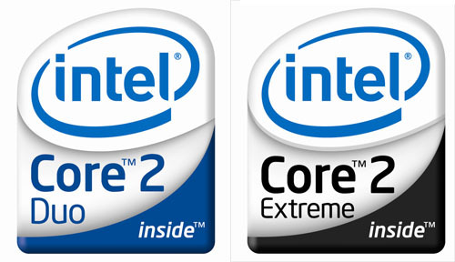

## 架构回归统一局面

由于相较于 Netburst 架构的失败而言，Pentium M 与 Yonah 架构可说是获得了巨大的成功，因此 2006 年下半推出的 Core 架构再次将行动平台与桌面、服务器平台的 x86 处理器架构统一，整体而言 Core 架构的特性仍然比较接近 Pentium M 与更早期的 P6 架构，因此一般而言我们会认为 Pentium M 就是 Core 架构的前身 (尽管 Intel 官方一再强调 Core 架构是从零打造起的，且融合了 Netburst 与 Pentium M 的架构，不过基本上只是为了给 Netburst 一个比较好的下台阶而已)。

    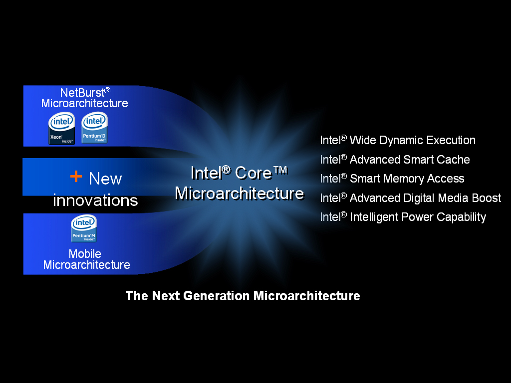

第一款基于 Core 架构的处理器是 Core 2 Duo，相较于前做 Yonah 而言比较明显的差异是 L2 快取大小的大幅提升与纳入早已出现在晚期 Netburst 架构产品中出现的 EM64T。

    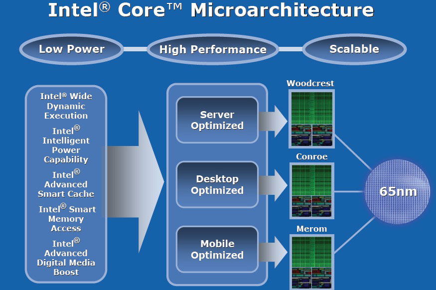

Intel Core 架构主要有三大面向的特性，分别是低耗电、高性能与可扩展性，其中最容易说明且至今仍然适用的是可扩展性这项，因此馆长打算先说明。

## 可扩展的架构设计

    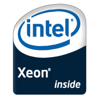

可扩展性可分为两个层次，第一个层次是架构可以适用的范围有多广 (Platform Scalable)，以 Core 架构而言，服务器级别的 Woodcrest、个人计算机使用的 Conroe、笔记本电脑使用的 Merom 都是从同样的 Core 架构与同样的 65 纳米制造工艺分化出来的。

    <a href="../images/blogs/computer_lecture/woodcrest_die.jpg">
        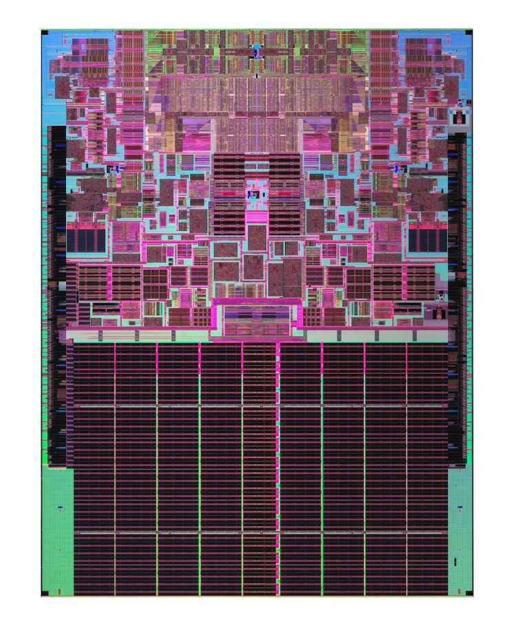
    </a>
    
<b>▲ Intel Xeon (基于 Core 架构，代号为 Woodcrest) 的 die shot</b>

Intel 开发的时候是先设计出共同的「架构」之后才去分化出不同用途与级别的型号，有需要时 Intel 可以很容易地透过「复制」的方式延展处理器的结构，制造出四核心以上同架构处理器。

    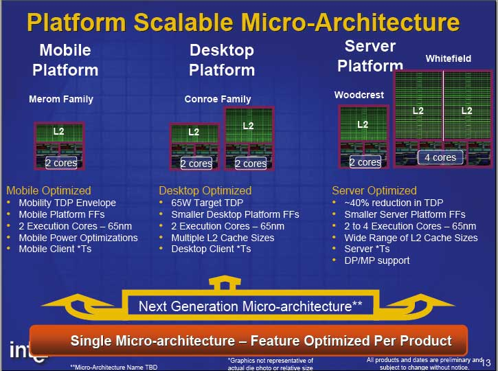

第二个层次则是处理器内部结构的模块化设计 (Modular Design)，这个特性要等到再下一代的 Nehalem 架构才见得到，因此馆长留待届时再说明。

## 朝向高效率的设计观点

如同前面所说的，以往 Netburst 架构强调整体性能的提升，因此选择追求拉高频率，尽管因此造成分支预测命中率下降、IPC 性能低落等问题，但在频率的疯涨之下总体的性能仍然是提高的，因此在当时被认为是「好的发展方向」，处理器改良的目的在于极尽所能地提高性能，至于省电与发热量的降低则不是主要考虑。

然而这样的设计方针在 Netburst 走到后期时已经被证实并不可行，因为散热装置无法无止尽的延伸下去来承受处理器发热量的不断增长，而且处理器发热量增长的幅度到了后期已经远远超出性能的增加幅度，在无止尽的拉高频率之后性能提升的幅度越来越少，甚至呈现负成长。

    

因此从 Pentium M 开始，到 Core 架构与现今的 Intel 处理器都朝向提高「效率」的方向前进，强调的是每单位耗能 (瓦) 能带来的性能有多少，效率是能耗与性能的比值，因此除了提高性能很重要之外，降低能耗与发热量也是重点。

## Core 架构的新特性

Intel 在宣传 Core 架构时主要强调这五个新特性：

 - 宽带动态执行技术 (Wide Dynamic Execution)
 - 智能型内存存取技术 (Smart Memory Access)
 - 进阶智能型快取 (Advanced Smart Cache)
 - 进阶数字媒体增强技术 (Advanced Digital Media Boost)
 - 智能型电源管理功能 (Intellignet Power Capability)

不过既然是宣传用的，其实这五大点没办法完整说明 Core 架构引入的新特性，所以馆长还是拆开来说明。

### 宽带动态执行技术 (Wide Dynamic Execution)

    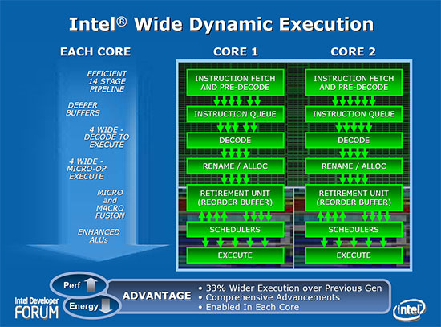

宽带动态执行技术 (Wide Dynamic Execution) 其实包含了很多东西，例如接下来介绍的宏融合技术、比 Pentium M 略多一些的 14 级管线设计 (还是不到 Prescott 夸张的 31 级管线的一半呢)、每个 cycle 可以处理四个指令 (如果有使用到宏融合则可以是五个) 等，同时 Core 架构的 Simple Decoder 比以往多了一组，分支预测的带宽比 Banias 多了 25%，同时也是 Netburst 的五倍。

### 宏融合技术 (Macro-Fusion)

    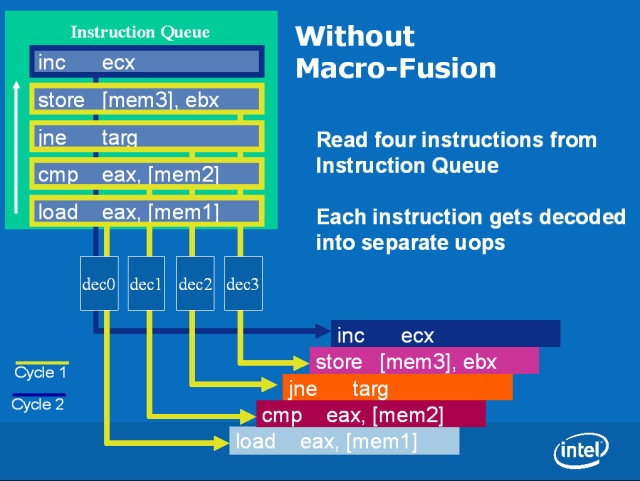

宏融合是 Intel Core 架构中很重要的一个特性，主要的意思是在指令译码的阶段将特定种类 (不是随便两条指令都可以融合) 的两条连续的 x86 指令合而为一，从而提升指令译码与执行的效率，在此代 Core 架构中只能融合 32 位指令，因此在 Core 2 系列上有时候可以观察到 32 位版本程序比 64 位版本还要快 (除了宏融合以外另一个原因是 EM64T 只能使用特定几个专属的缓存器)。

    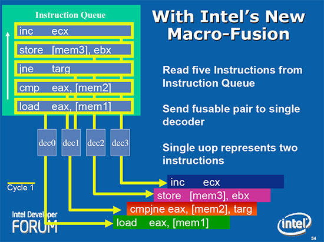

尽管宏融合支持的指令种类相当有限，能融合的情况下也有很多条件要求 (例如必须连续、一个频率周期内只能融合一组、被融合的第一条指令中必须至少用到一个缓存器等)，但由于实务上符合条件的情况在编译完成之后的程序中非常常见，因此对性能的提升是可见的 (而且不需要重新编译就能享受到提升)，之后历代的 Core 处理器也几乎都会对宏融合这项功能进行强化，足见这项功能的重要性。

### 进阶智能型快取 (Advanced Smart Cache)

    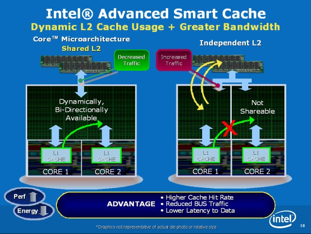

其实这项技术说穿了就是两个核心共享一个大的 L2 快取，从而降低 L2 快取的失误率 (miss rate)，因为以前各自使用专属 L2 快取的时候经常会发生 Core 1 需要的数据在 Core 2 的 L2 快取，或是反过来，而这种情况会导致 L2 快取失误，以致于需要向较慢的记忆体重新取得数据，而且出现在错误位置的数据反而变成占用该核心所属 L2 快取，连带也让另一个核心的 L2 快取失误率拉高。

而且很多时候其实两个核心的负载不会刚好平分，改成共享快取可以让处理器动态分配，给负载较高或需要较多快取的核心更多资源 (不论是快取大小或带宽)。

**要注意的是，今日 Intel CPU 的 Smart Cache 其实是指 L3 共享快取 (以 Skylake 为例，L2 是每个核心各自专属的)，但在 Core 2 的时代指的则是 L2。**

    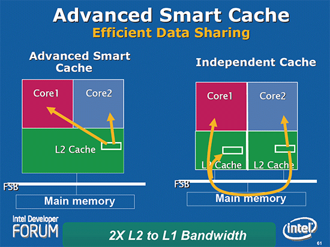

此外这项设计也给处理器核心之间一个互相沟通的管道，以往两个处理器核心之间是没有链接的，如此造成系统的前端总线负担变得非常重 (一次只能接受一个核心使用，再加上一次只能处理一个方向，因此常常会发生排队排到天荒地老的状况)，以 Core 2 需要 Core 1 所属 L2 Cache 中的资料为例，得从 Core 2 走 FSB 到主板北桥、内存绕一圈回到 Core 1 的 L2 Cache 才拿得到。

至于在省电方面的帮助则是处理器现在可以关闭暂时没有用到的 L2 部分电路，或是关掉其中一个核心却维持整个 L2 的运作，不像以前是以核心为单位，一次关得全关，有更高的弹性来达到更省电的效果。

### 进阶数字媒体增强技术 (Advanced Digital Media Boost)

    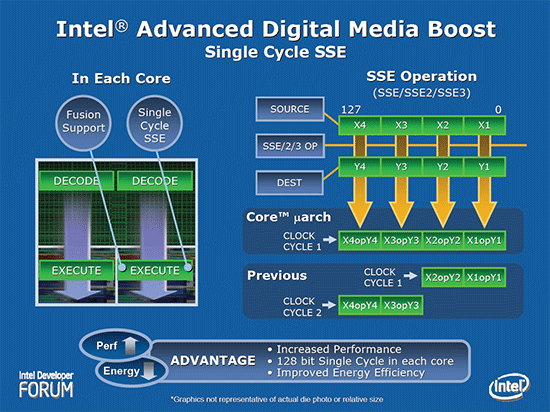

以往受制于实际电路中只设计一组 64 位的 SSE 运算电路，一个 128-bit 的 SSE 指令会需要两个 cycle 才能完成，Core 架构中的乘法、加法、加载、储存指令都能一次处理 128-bit 长的指令，所以又称为 Single cycle SSE。

### 智能型内存存取技术 (Smart Memory Access)

    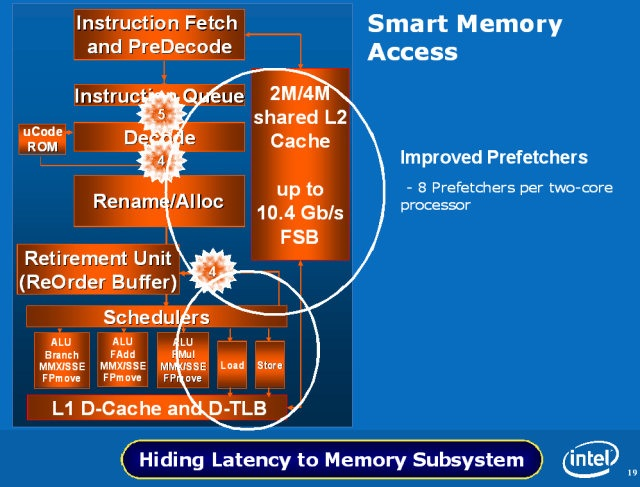

这部分比较难解释，主要是关于 Core 架构降低数据存取延迟对系统性能影响的努力，例如用上 8-Way 的 L1 Cache、16-Way 的超大 L2 快取等，并放弃了过去 Netburst 架构设计的追踪快取 (Trace Cache) 设计。

Core 架构中，每个核心有四组预取器 (Prefetcher)，其中一组负责预取指令，一组负责预取 L2 快取，两组负责内存预取，让处理器有能力「学习」最佳的数据存取方式以降低延迟。

    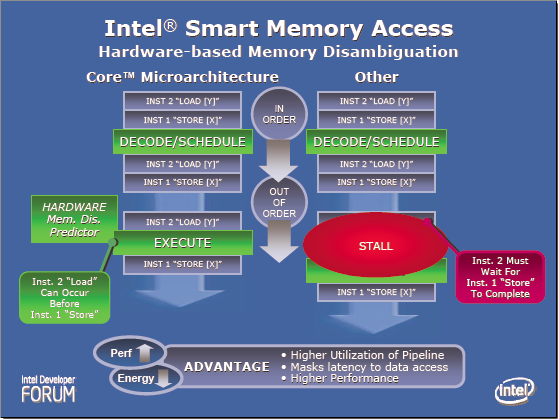

另一项重要的功能称为 Memory Disambiguation，透过硬件上实作电路来达到预测后续的指令是否会用到相同的内存位置，从而避免不必要的指令等待，能够提升乱序执行的性能。

## 首次引入 Tick-Tock 战略规划

    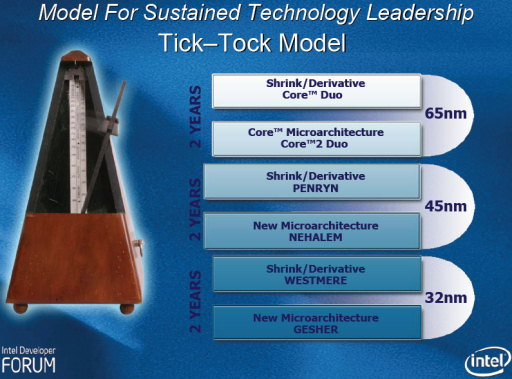

众所皆知的 Tick-Tock 两年一轮战略规划也是从 2006 年开始的，可以看到后续的 Nehalem、Westmere 都是早在当时就已经确定的规划，至于最下面的 Gesher 后来则改名为 Sandy Bridge。

# 第二代 Intel Core Microarchitecture (Penryn)

Intel 在 2008 年依照 Tick-Tock 战略规划的预期，推出了称为 Penryn 的新版架构，Penryn 基本上可以认为是 Core 架构的制程升级版，导入新的 45 纳米制造工艺与 High-K 金属闸极技术。

    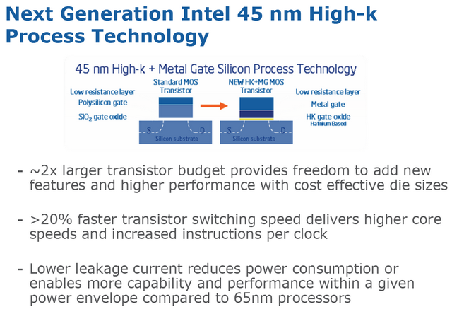

随着制程的不断缩小，漏电流对半导体制成品的影响越来越明显，有越来越高比例的能耗其实是被漏电流「浪费掉」的，因此必然需要做额外的努力来降低漏电流的产生，这就是 High-K 金属闸极技术的目的，同时号称能提高 20% 的晶体管切换速度，可以带来更高的 CPI 与频率。

然而除了制程以外，Penryn 与 Core 在架构上还是有一些不同的，这些不同都是依据 Core 架构强调的五大特性进行更多的强化以求能榨出 Core 架构中潜藏的性能。

    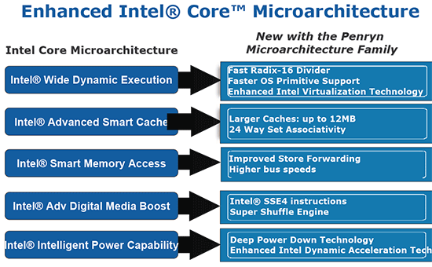

主要比较明显的新特性是新加入的 SSE4.1 指令集、更快的前端总线 (FSB) 与更大的 L2 快取 (加大 50%)、速度更快的 Radix-16 除法器，除了这些之外，Intel 表示在虚拟化技术的性能上也有提升。

# 结语

我想 Intel 在 2006 年发生的事情可以说完美举例了「危机就是转机」、「有心栽花花不开，无心插柳柳成荫」这两句话吧，当年耗费如此多的功夫想发展「全新」的 Netburst 架构，觉得未来会非常顺利的一路向前发展，最后才发现其实当初认为没有办法再走下去而被弃置一旁的 P6 架构才是公司真正的未来，从 P6 架构改良而来的 Core 架构奠下的基础几乎让往后十年 (至今依然如此) 的 Intel 几乎立于不败之地。

(结束)

<a href="{{site.feedback_link}}" class="btn btn-primary"><i class="fa fa-comment-o"></i> 匿名提问</a>

---------


