来到 CPU 发展史的第三回，本节馆长要谈的是俗称 586 世代的部分，馆长在划分上称其为「中古时代后期」，比起前面那些过于古老的「收藏品」，进入这个阶段以后，大家应该会觉得比较有亲切感、比较熟悉一些吧？实际上从这里开始也是 x86 CPU 发展史真正要开始有趣的地方，一方面是 AMD 终于开始研制自家设计的 CPU 了，另一方面则是计算机信息科技产业的发展差不多就是在此时正式进入突飞猛进的阶段。

# 中古时代后期－计算机信息科技起飞 (上)

## 「奔腾」家族的元老：Intel Pentium (1993 – 1999)

### Pentium 的由来

    <a href="../images/blogs/computer_lecture/pentium.png">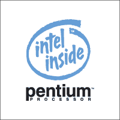</a>
    
<b>▲ Intel 8086</b>

其实 Intel 本来应该是打算延续过去的命名方式，将 80486 的下一代命名为 80586 的，但由于当时 Intel 对其他竞争厂商使用相近命名方式，甚至是在「命名数字」上超越 Intel 的作法感到困扰 (例如 AMD 搞了一款称为 Am5x86 的产品，看起来很像 586 世代，不过其实只是 486 ，而美国的商标法又规定纯数字不能作为商标使用，因此 Intel 就有了帮旗下产品取一个英文名字的需求，最后就决定定名为 Pentium，含意是由希腊语中的「penta」(第五，代表第五世代 x86 处理器) 与拉丁文中用于代表「元素」的字尾 -ium 组成 (代表 CPU 是计算机不可或缺的元素)。

### Pentium 的主要改进

Pentium 比起 486 来说进步其实蛮明显的，首先是引入了超纯量架构 (Superscalar)，能在处理器核心中执行指令的平行运算，透过允许处理器同时分派多个指令给不同的功能单元处理，来让处理器能在一个频率周期下执行多个指令，让处理器在相同的频率下能有更高的吞吐率 (throughput)，Pentium 具有两组数据路径 (datapath) 来达成这样的效果。

除了引入超纯量架构之外，Pentium 也开始真正具有现代化的指令管线化设计，成为具有 2 条 5 阶管线设计的循序处理超纯量 CPU。

至于 Pentium 的数据路径则提高至 64-bit，可以一次从内存提取两倍的数据量，但缓存器仍然为 32-bit，因此 Pentium 仍然是一款纯粹的 32 位 x86 处理器。

### 第一代：P5 Microarchitecture

 - 发布时间：1993 年 03 月 22 日
 - 运行频率：60 MHz ~ 66 MHz
 - L1 缓存大小：16 KB (数据与指令各 8 KB)
 - 支持插槽：Socket 4 ( 273 针脚 PGA 封装)
 - 电压需求：5 V
 - 晶体管数：310 万枚
 - 制造工艺：0.8 微米 (µm)

    <a href="../images/blogs/computer_lecture/Intel_Pentium_80501.jpg">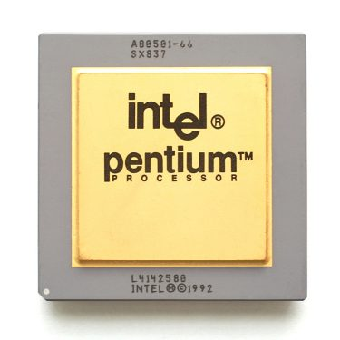</a>
    
<b>▲ Intel Pentium (P5, 80501)</b>

从 Pentium 开始，我们区分 Intel CPU 产品换代的依据是以 Microarchitecture (微架构) 的开发代号区分，至于原因呢则是因为从 Pentium 开始，Intel 不再频繁的更换处理器销售时所使用的名称，以近来的产品而言，不论是 Ivy Bridge, Haswell, Broadwell, Skylake，通通都使用 Core i 与 Pentium、Celeron 的命名，因此光从名称其实已经很难判断处理器是哪一代了。

    <a href="../images/blogs/computer_lecture/P5_die_shot.jpg">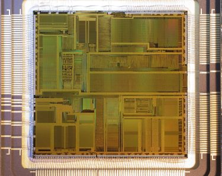</a>
    
<b>▲ Intel Pentium (P5) Die shot</b>

P5 架构是 Pentium 处理器的第一代产品，产品代码为 80500 (工程样品) 与 80501，有 60 MHz 与 66 MHz 两个版本，使用 5 V 供电，缓存也增大到 16 KB，基于 0.8 微米 BiCMOS 制造工艺，包含了 310 万个晶体管 (是前代的将近三倍)，不过 P5 的低频率使其与 486 相比之下的效能优势并不明显，基于 5 V 的供电设计也带来较高的能源消耗。

    <a href="../images/blogs/computer_lecture/intel-pentium.jpg">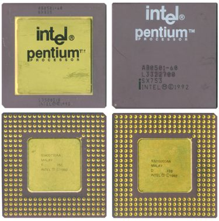</a>
    
<b>▲ 两种不同的 Intel Pentium 封装方式</b>

值得注意的是 Pentium 基本上是与上一代的 486 同时并存了蛮长一段时期，后来 Intel 还发展出了称为 Pentium OverDrive 的产品，OverDrive 在今天来说是「超频」的意思，而当年这款产品则是将 Pentium 经过大幅度的修改 (例如数据总线被降回 32-bit) 之后，让 Pentium 的部分新特性可以用于 486 的计算机系统上，让用户可以不必重买整套计算机就能将现有的 486 计算机升级 (当然还是比不上全新的 Pentium 计算机的)。

另一件值得注意的事情是，早期基于 P5 微架构的 Pentium 处理器 (部分 60 MHz ~ 100 MHz 的型号) 内建的乘法表中，有 5 个数字有错误，在使用这些 Pentium 处理器进行浮点数除法时，在处理特定某些数字时就会得到不正确的结果，这事件称为 Pentium FDIV bug (由一位大学教授 Thomas Nicely 在 1994 年 10 月提出)。

    
    
<b>▲ Intel Pentium 钥匙圈(?)</b>

尽管官方一开始以「正常使用下大约要七百年才会遇到这个问题，这几乎不可能发生，所以不是什么大问题」灭火，在网络上还可以找到当时台湾英特尔的公关是如何冷处理这件事情，不过要知道，计算机的本质其实就是计算器，消费者要一台算不出正确答案的计算器干啥呢？所以理所当然事件并未因此平息，最终越演越烈的媒体迫使 Intel 在 1994 年底召回所有早期的 Pentium 产品。至于召回去的东西最后如何呢？大部分被 Intel 做成钥匙圈了 XD

而且后来可能是发现有利可图吧？Intel 还真的有一段时间会把做坏的处理器拿去做成钥匙圈卖……

### 第二代：P54C Microarchitecture

 - 发布时间：1994 年 10 月 10 日
 - 运行频率：75 MHz ~ 120 MHz
 - FSB 频率：50 MHz ~ 60 MHz
 - L1 缓存大小：16 KB (数据与指令各 8 KB)
 - 支持插槽：Socket 5 ( 273 针脚 PGA 封装) / Socket 7 ( 321 针脚 PGA 封装)
 - 电压需求：3.3 V
 - 晶体管数：320 万枚
 - 制造工艺：0.6 微米 (µm)

    <a href="../images/blogs/Intel_Pentium_A80502_P54C.jpg">
        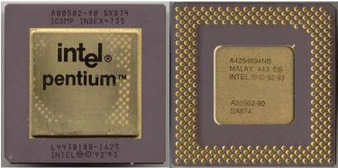
    </a>
    
<b>▲ Intel Pentium (P54C, 80502)</b>

在 1994 年 10 月 Intel 推出了改良版的 Pentium 处理器，开发代号为 P54C (产品代码为 80502)，主要是将供电的部分修改为 3.3 V (后来当时与 Pentium 并存的 486 处理器也对应推出了 3.3 V 的版本) 并提供了新的电源管理功能与在 CPU 内整合了 APIC 与提供双向多任务的能力。

除此之外加入了倍频器，运行频率得以倍增并突破 100 MHz 大关，同时也是从此时开始，Pentium 与 486 之间的性能差距明显拉开，Pentium 的架构优势在频率拉高之后带来了让人惊艳的效果，为了区别 P54C 与 P5 的差别，因此当时 P54C 又被称为 Pentium-S。

    <a href="../images/blogs/P54C_die_shot.jpg">
        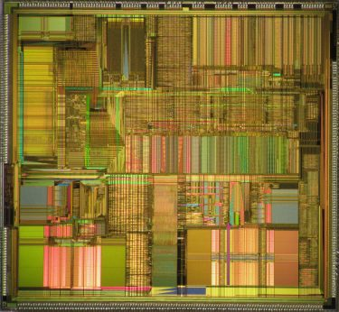
    </a>
    
<b>▲ Intel Pentium (P54C) Die shot</b>

75 MHz 到 100 MHz 的 P54C 处理器中，也有部分型号有 P5 架构的 FDIV bug，因此同样在召回列表中。

至于其他的改变则主要出现在制程上，P54C 采用 0.6 微米制造工艺，晶体管数则微幅增加到 320 万。

    <a href="../images/blogs/Intel_Pentium_Overdrive_Socket4.jpg">
        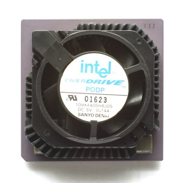
    </a>
    
<b>▲ 用于 Socket 4 主板的 Intel Pentium OverDrive</b>

在这个时期里出现了第二种 Pentium OverDrive，但与前作的意义不同，主要是让 Socket 4 的主板能使用频率更高 ( 2 倍) 的 Pentium 处理器而不需要换成新的 Socket 5 (3.3 V 电压) 主板。

后来 Intel 又推出了第三种 Pentium OverDrive，能让使用 Socket 5 主板及 Pentium 75 ~ 100 MHz 的用户使用比目前更高的频率 (倍频为 2.5 倍)。

### 第三代：P54CS Microarchitecture

 - 发布时间：1995 年 06 月 10 日
 - 运行频率：133 MHz ~ 200 MHz
 - FSB 频率：60 MHz ~ 66 MHz
 - L1 缓存大小：16 KB (数据与指令各 8 KB)
 - 支持插槽：Socket 7 ( 321 针脚 PGA 封装)
 - 电压需求：3.3 V
 - 晶体管数：330 万枚
 - 制造工艺：0.35 微米 (µm)

    <a href="../images/blogs/Intel_Pentium_80502.jpg">
        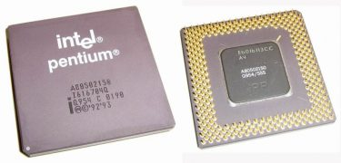
    </a>
    
<b>▲ Intel Pentium (P54CS, 80502)</b>

1995 年中释出的 P54CS 则是制造工艺提升至 0.35 微米，并将芯片本体的面积从 148 mm2 降至  91 mm2，以实现更高的频率，除此之外没有太的变化。

    <a href="../images/blogs/P54CS_die_shot.jpg">
        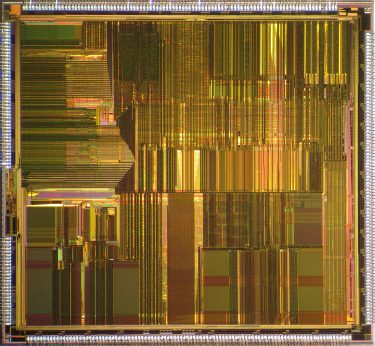
    </a>
    
<b>▲ Intel Pentium (P54CS) dieshot</b>

在 P54CS 与 P54C 之间则还有一款过渡时期的 P54CQS，是只降制造工艺，而不改变芯片本体面积的版本。

### 第四代：P55C Microarchitecture

 - 发布时间：1997 年 01 月 08 日
 - 运行频率：120 MHz ~ 233 MHz
 - FSB 频率：60 MHz ~ 66 MHz
 - L1 缓存大小：32 KB (数据与指令缓存各 16 KB) 4-way
 - 支持插槽：Socket 7 ( 321 针脚 PGA 封装)
 - 电压需求：3.3 V
 - 晶体管数：450 万枚
 - 制造工艺：0.35 微米 (µm)、0.28 微米 (µm)

    <a href="../images/blogs/Intel_Pentium_MMX_Processor_Logo.png">
        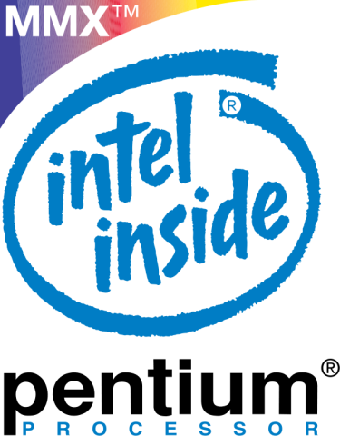
    </a>
    
<b>▲ Logo 上这么大的 MMX，不难看出 Intel 多强调这个指令集的功用</b>

P55C (产品代码 80503) 是 Pentium 产品线的最后一次改版，同时也是规模最大的改版，在 P55C 中首次引入了 MMX 指令集，同时也将频率再次往上拉高并将原有的五阶管线深度改为六阶。

    <a href="../images/blogs/P55C_die_shot.jpg">
        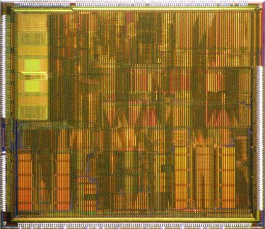
    </a>
    
<b>▲ Intel Pentium MMX (P55C) Die shot</b>

为了弥补管线深度增加造成的分支预测失误率与减少分支预测失误时耗费的时间而强化相关功能并将 L1 缓存的大小加倍、由 2-way 改为 4-way，同时芯片的 die size 也因此有明显上升 ( 91 -> 141 )。

    <a href="../images/blogs/Pentium-mmx2.jpg">
        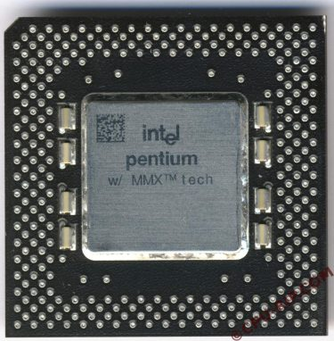
    </a>
    
<b>▲ Pentium MMX 的正面</b>

由于加入了 MMX 指令集，因此在市场上是以 Intel Pentium Processor with MMX Technology 发售，由于 die size 上升造成成本的提高 (单一一块晶圆能切出的 CPU 数量变少了)，当时售价相当高昂。

    <a href="../images/blogs/Pentium-mmx1.jpg">
        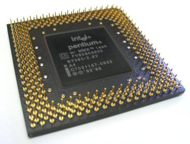
    </a>
    
<b>▲ Pentium MMX 的背面</b>

同时期又推出了第四种 Pentium OverDrive MMX，可以让正在使用 Pentium 120 ~ 200 Mhz 的使用者使用更快的频率 (倍频为 3 或 2.5 倍) 并享有 MMX 技术带来的优势。

    <a href="../images/blogs/Intel_Pentium_MMX_Overdrive.jpg">
        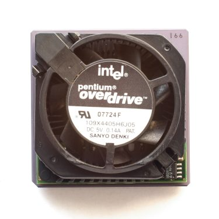
    </a>
    
<b>▲ Intel Pentium OverDrive MMX</b>

    <a href="../images/blogs/PENTIUM_OD.jpg">
        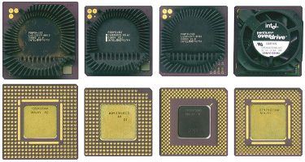
    </a>
    
<b>▲ 四种 Intel Pentium OverDrive 的比较 (由左而右依序为 Socket 4、Socket 3、Socket 5、Socket 5 或 Socket 7 (MMX) 四种)</b>

### 笔记本电脑专属版本：Tillamook

 - 发布时间：1997 年 08 月
 - 运行频率：166 MHz ~ 300 MHz
 - FSB 频率：66 MHz
 - L1 缓存大小：32 KB (数据与指令缓存各 16 KB) 4-way
 - 支持插槽：MMC-1 (280 针便携计算机专用处理器卡匣)
 - 电压需求：2.5 V
 - 晶体管数：450 万枚
 - 制造工艺：0.25 微米 (µm)

    <a href="../images/blogs/TILLAMOOK.jpg">
        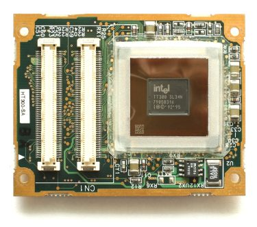
    </a>
    
<b>▲ 据说这个就是 Tillamook 的 MMC-1 模块的外型</b>

Tillamook 这东西挺特别的，架构上大致与 P55C 相似，是只用于便携计算机 (如笔记本电脑) 的版本，但**频率却比桌面计算机使用的 P55C 还要更高**，可以达到 300 MHz，除了规格很特别以外，外型也很奇特，是将 CPU 本体焊在一块称为 Mobile Module 的模块电路板上的组合。

采用的制造工艺也是所有 Pentium 当中最先进的，使用了 0.25 微米制造工艺，销售时命名为 Mobile Pentium MMX。

### Pentium 家族中的贵族：Pentium Pro (1995 ~ 1998)

 - 发布时间：1995 年 11 月
 - 运行频率：150 MHz ~ 200 MHz
 - FSB 频率：60 MHz ~ 66 MHz
 - TDP：31.7 W ~ 44 W
 - L1 缓存大小：16 KB (数据与指令缓存各 8 KB) 4-way
 - L2 缓存大小：256 KB / 512 KB / 1 MB
 - 支持插槽：Socket 8 ( 387 针脚 PGA 封装)
 - 电压需求：3.1 V ~ 3.3 V
 - 晶体管数：550 万枚
 - 制造工艺：0.50 微米 (µm) ~ 0.35 微米 (µm)

    <a href="../images/blogs/PPRO_LOGO.jpg">
        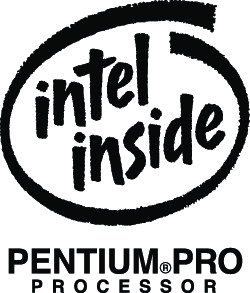
    </a>
    
<b></b>

Pentium Pro 是 Intel 的第六代 x86 处理器 (有些人会称他为 i686)，基于全新发展的 P6 微架构，与以往的架构大有不同。

    <a href="../images/blogs/Intel_Pentium_Pro.jpg">
        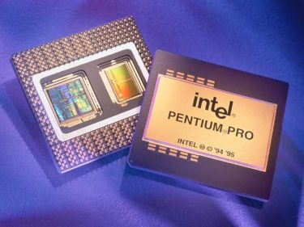
    </a>
    
<b>▲ 「长方形」的 Intel Pentium Pro，两颗芯片一颗是核心，另一颗是 L2 缓存</b>

Pentium Pro 的改变有很多，其中最鲜明的大概是整合入处理器本体 (这时期 Intel 还没有能力将 L2 缓存整合到核心里面，因此只是把核心跟缓存两块芯片封装在一起而已) 内的 L2 缓存首次出现，从此让对高速内存有庞大需求的乱序执行 (Out-of-order Execution，可以降低管线造成的延迟) 成为可能 (因为 L2 缓存纳入 CPU 本身之后就能以与 CPU 相同的频率运行，而以往放在主板上的 L2 缓存则只能以 FSB 的频率运行)，对性能提升打下了稳固的基础，而增加到 36-bit 的地址总线则允许 Pentium Pro 寻址高达 64 GB 的内存。

    <a href="../images/blogs/Pentium_Pro_Black.jpg">
        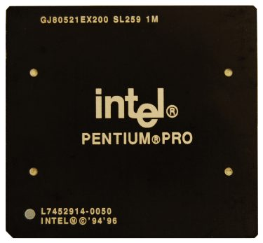
    </a>
    
<b>▲ 馆长觉得这颗缓存 1 MB 的顶级版本超帅的，这是最早的「黑盒版」CPU 吧 XD</b>

除此之外 Pentium Pro 还引入了一些 RISC 处理器的特性，例如将复杂 x86 指令拆解成 RISC 形式指令或将简单 x86 指令结合成 RISC 形式指令的译码器等 ( x86 处理器全部都是 CISC 复杂指令集处理器)。

    <a href="../images/blogs/Socket8.jpg">
        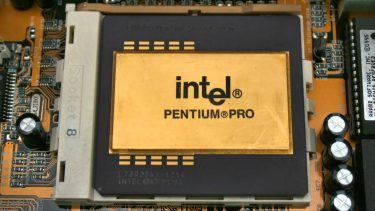
    </a>
    
<b>▲ 安装在 Socket 8 上的 Pentium Pro，确实很有 Pro 的气势</b>

同时 Pentium Pro 的管线化设计也与 Pentium 有明显的不同，深度一口气提高到 14 阶 (当时称为超级管线，Super-pipeline)，也是首次可以支持多处理器 (至多可以同时安装四个 Pentium Pro)。

    <a href="../images/blogs/QUAD_PPRO.jpg">
        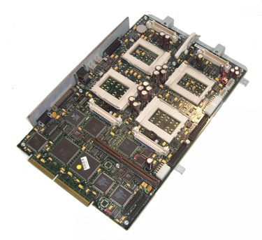
    </a>
    
<b>▲ 各位观众，四个 CPU 插槽！</b>

此外，由于 Pentium Pro 只对 32 位程序优化，因此在执行传统 16 位程序时效能并不理想，甚至比 Pentium 还要差，因此在 Windows 9x 与 DOS 操作系统下表现不佳，在市场上表现可说是相当失败，又加上缺乏 MMX 指令集的问题，因此在图形计算方面也显得非常贫弱，在 Pentium MMX 出现之后就更显失色了。

    <a href="../images/blogs/PPRO_die_shot.jpg">
        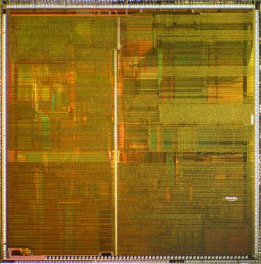
    </a>
    
<b>▲ Intel Pentium Pro Die shot (特别注意，L2 缓存还没整合到核心上，所以还是看不到现代 CPU 里面大片同色的缓存区域)</b>

然后又加上 Pentium Pro 运行的温度超高 (这也让频率拉不上去)，价格又超贵，集各种卖不出去的因素于一身，因此没多久就从市场上消失了。

    <a href="../images/blogs/PPRO_256KB.jpg">
        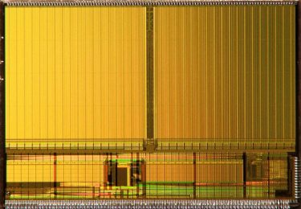
    </a>
    
<b>▲ 隔壁小颗的 L2 Cache 芯片的 die shot</b>

不过 P6 架构本身的重要性并不随着 Pentium Pro 的挫折而有所减损，实际上从 Pentium II 以降直到今日的 Core i7，除了中间的 Pentium 4 以外，全部都是以这 P6 架构为基础发展出来的。

### AMD 初试啼声：AMD K5

 - 发布时间：1996 年 03 月 27 日
 - 运行频率：75 MHz ~ 133 MHz
 - FSB 频率：50 MHz ~ 66 MHz
 - L1 缓存大小：24 KB (数据缓存 8 KB，指令缓存 16 KB)
 - L2 缓存大小：256 KB / 512 KB / 1 MB
 - 支持插槽：Socket 5 ( 273 针脚 PGA 封装) / Socket 7 ( 321 针脚 PGA 封装)
 - 电压需求：3.525 V
 - 晶体管数：430 万枚
 - 制造工艺：0.50 微米 (µm) ~ 0.35 微米 (µm)

    <a href="../images/blogs/AMD_K5_PR166_Front.jpg">
        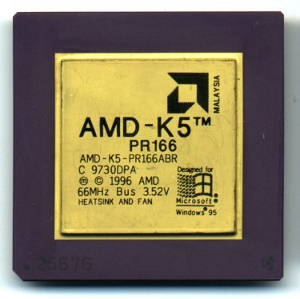
    </a>
    
<b>▲ AMD K5 (5k86)</b>

是的，AMD 终于出现了。AMD K5 是 AMD 第一次尝试从头到尾「靠自己」去设计一款 x86 处理器 (毕竟没得抄了，而且随着计算机产业产品生命周期的持续缩短，一直照抄下去永远被 Intel 抛在后面也不是办法)，因此也是非常有代表意义的一款产品，主要是设计用来对抗 Pentium，不过实际上显得有一点措手不及。

    <a href="../images/blogs/amd_k5_pr133_back.jpg">
        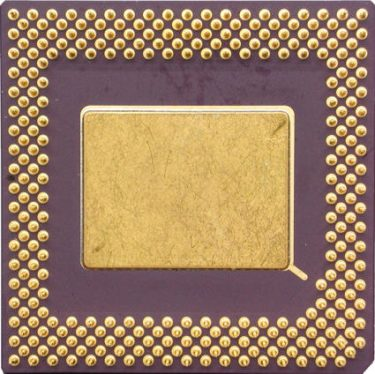
    </a>
    
<b>▲ AMD K5 的背面 (同样是 Socket 7 规格)</b>

K5 可分为前期与后期两个阶段，前期的产品称为 SSA/5，后期则称为 5k86 (发布于 1996 年 10 月)，两款最后都是以 AMD K5 为名发售，其实两款产品大同小异，主要是运行频率与制造工艺的不同，SSA/5 的频率为 75 MHz 至 100 MHz，5k86 则是从 90 MHz 起跳，最高到 133 MHz，前者有一部份产品基于 0.50 微米制造工艺，后者则全部都基于 0.35 微米制造工艺。

K5 的设计其实以当时来说是相当先进的，比起与 Pentium 相似来说其实更接近 Pentium Pro，但毕竟 AMD 的财力与团队都不及 Intel，在开发过程中遇到的阻碍并不小，理想与实作的差距颇大 (例如 K5 的分支预测单元用了将近 Pentium 的五倍面积，但实际上性能却不及 Pentium)，因此最终 K5 的性能只能做到「接近」Pentium，而且频率没办法像 Pentium 中期以后那样拉高。

    <a href="../images/blogs/AMD_K5_die.jpg">
        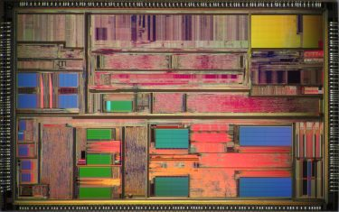
    </a>
    
<b>▲ AMD K5 die shot</b>

由于推出时间较晚加上性能表现不甚理想，因此 K5 并未获得广大回响，随着 Pentium 加入了 MMX 技术之后，缺乏 MMX 与 3D Now! 的 K5 也就逐渐在市场上销声匿迹了。

值得一提的是，AMD K5 也是 AMD 第一次使用 PR 值 (Performance Rating) 而不是实际频率来命名处理器，有些人认为第一次这么做的是 AMD Athlon XP (例如 2300+)，其实并不是，例如 K5 PR 120 的实际频率其实只有 90 MHz。

除此之外你可以从上面看到，AMD K5 使用与 Intel Pentium 相同的插槽 Socket 5 与 Socket 7，这是个人计算机发展史上极为罕有的情况，可以彼此互用。

    <a href="../images/blogs/Socket4_5_7_8.gif">
        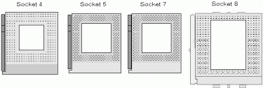
    </a>
    
<b>▲ Socket 4,5,7,8 的比较</b>

由于中古时代后期的 CPU 历史复杂很多，篇幅实在很难控制，因此本节的介绍就到这边，下篇将从 Intel Pentium II 与 AMD K6 开始介绍 (终于要进入馆长我开始接触计算机的年代了啊……)。

(未完待续)

<a href="computer_lecture_6.html" class="btn btn-primary">上一篇</a> 
<a href="computer_lecture_8.html" class="btn btn-primary">下一篇</a> 
<a href="{{site.feedback_link}}" class="btn btn-primary"><i class="fa fa-comment-o"></i> 匿名提问</a>

---------


