# 中古时代后期－个人计算机开始普及的时代 (中)

## 绝地反攻：AMD K6

    <a href="../images/blogs/computer_lecture/AMD_K6_logo.png">
        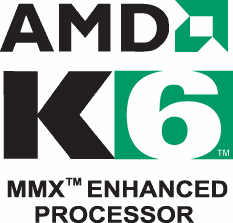
    </a>
    
<b></b>

AMD 在经过 K5 的出师不利之后，学到了一些教训，那就是作为较弱势的厂商，产品太晚出气势就输人了，而且若晚出又比不上别人已经有的产品，那就只有惨败或廉售的可能，于是 AMD K6 最后赶在 Pentium II 之前，于 1997 年 04 月上市。

    <a href="../images/blogs/computer_lecture/NX586.jpg">
        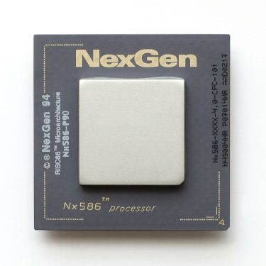
    </a>
    
<b>▲ 比起 K5，K6 可能还比较接近这颗 Nx586 一点。</b>

AMD K6 的设计是来自于一家叫做 NexGen 的公司，当时正在设计一款名为 Nx686 的处理器，而后来 AMD 将这间公司收购之后就发展成为后来的 K6，因此 K6 与 K5 之间的亲缘关系其实很薄弱。

### 急起直追 Intel

AMD K6 加入了 MMX 指令集，在性能方面基本上是足以接近 Pentium MMX 的，甚至在某些情况下可以追上同频的 Pentium II，虽然性能仍然不及 Intel (浮点运算性能大概只有同频 Pentium 的一半，不过我们的日常用途主要以整数运算为主，这方面 K6 就没有输了)，但相对而言低廉许多的售价，加上与 Pentium 完全兼容的脚位 (同属 Socket 7) 让 AMD 成功开始在市场上攻城略地 (虽然离要追上 Intel 还早得很，但至少已经开始追了)，同时也加速个人计算机售价的下跌与普及。

    <a href="../images/blogs/computer_lecture/amd-k6-die-shot.jpg">
        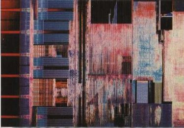
    </a>
    
<b>▲ AMD K6 Die shot</b>

不过 AMD K6 本身并没有整合 L2 Cache，而是使用 Pentium 时代的老方法，将 L2 Cache 放在主板上。

### 前期产品：K6 (Model 6)

 - 发布时间：1997 年 04 月 02 日
 - 运行频率：166 MHz ~ 233 MHz
 - FSB 频率：66 MHz
 - L1 快取大小：64 KB (数据与指令快取各 32 KB)
 - 支持插槽：Socket 7
 - 电压需求：2.9 V ~ 3.3 V
 - 晶体管数：880 万枚
 - 制造工艺：0.35 微米 (µm)
 - 指令集：x86-32 + MMX

    <a href="../images/blogs/computer_lecture/K6-model6.jpg">
        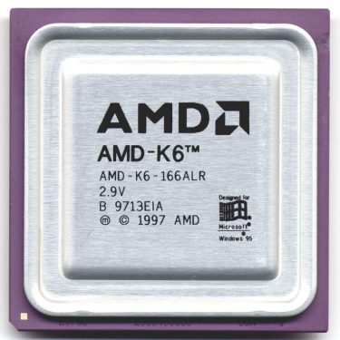
    </a>
    
<b>▲ AMD K6 (Model 6)</b>

### 后期产品：K6 “Little Foot” (Model 7)

 - 发布时间：1998 年 01 月 06 日
 - 运行频率：200 MHz ~ 300 MHz
 - FSB 频率：66 MHz
 - L1 快取大小：64 KB (数据与指令快取各 32 KB)
 - 支持插槽：Socket 7
 - 电压需求：2.2 V
 - 晶体管数：880 万枚
 - 制造工艺：0.25 微米 (µm)
 - 指令集：x86-32 + MMX

    <a href="../images/blogs/computer_lecture/K6-model7.jpg">
        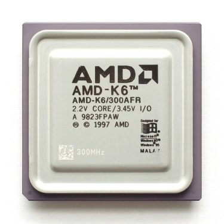
    </a>
    
<b>▲ AMD K6 (Model 7)</b>

Little Foot 基本上就是第一代 K6 (Model 6) 的制程改进版，受益于制程改进所以可以有更高的频率，只需要更低的电压，或许是出于防伪的目的？Model 7 的 K6 除了使用印刷方式打上频率之外，正面的铁壳左下角也会蚀刻出频率与序号的二维条形码。

不过由于电压下降与倍频的增加，部分的 Socket 7 主板上没办法使用 Model 7 版本之 K6 的。

## P6 架构大放异彩：Intel Pentium II

    <a href="../images/blogs/computer_lecture/Intel_Pentium_II.png">
        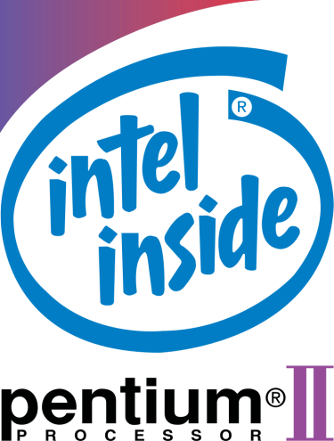
    </a>
    
<b></b>

Pentium II 在 1997 年 05 月 07 日推出，与 Pentium Pro 一样是基于 P6 微架构的产物，因此其实它是 Pentium Pro 的改良版，与初代 Pentium 之间的亲缘关系反而不大 (从内部型号中 Pentium II 与 Pentium Pro 同属 Family 6 就可以印证这点)，同时也是从 Pentium II 开始，由于核心架构不常改变，因此我们改为使用核心的开发代号来区分不同时期。

Pentium II 基本上就是针对当年 Pentium Pro 的弱点进行补强，例如强化了在处理 16-bit 程序时的性能、纳入 MMX 指令集等，由于 16-bit 处理能力有了长足的改善，因此 Pentium II 在 Windows 9x 上的表现明显比 Pentium Pro 要好得多，又比 Pentium Pro 便宜，因此在市场获得了巨大的成功。

### 特殊的卡匣外型

Pentium II 长得与以往的处理器相差非常远，是做成有点像游戏卡匣的外型，单面包覆塑料卡匣外壳 (不过有部分型号是没有外壳的) 中包裹着一块电路板，L2 快取与处理核心就放置在这张电路板上，另一面则以散热片或风扇接触核心本身以进行散热，主板上的插槽也因此由 Socket 转型为长条状的 Slot。

    <a href="../images/blogs/computer_lecture/Pentium_II.jpg">
        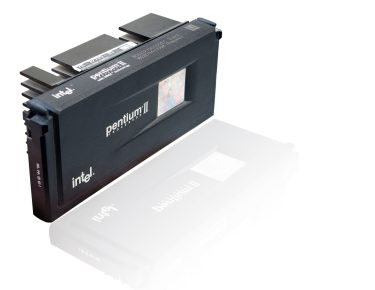
    </a>
    
<b>▲ 以现在来说长这样的 CPU 或许很奇怪，但它确实是</b>

采用这种封装的目的是为了将 L2 快取从 CPU 本体抽出来 (成本与技术能力上的考虑，这跟追求良率提升也有关系)，但又能维持与 CPU 够近的距离以维持一定的速度，这点与减半速度的 L2 快取是 Pentium II 能比 Pentium Pro 便宜的主因，同时也让 Intel 可以很容易的透过抽换电路板上的快取芯片来生产不同等级的 CPU。

还有最后一个理由：Slot 1 是有专利的，所以任何厂商都不能生产支持 Slot 1 的处理器，本来是 Intel 想甩掉竞争对手的策略，不过没想到最后反而让其他厂商在 Socket 7 的世界苟延残喘活了下来 (当时计算机很贵，一般人可禁不起主板跟处理器都要换的支出)。

### Xeon 与 Celeron 的初登板

当年 Pentium Pro 由于价格过高加上 16 位处理能力不佳，因此最后被 Intel 用于针对高价市场、服务器专业市场发售，而中阶与消费性市场则由 Pentium MMX 担纲，后来 Intel 发布 Pentium II 时，便决定用 Pentium II 统一这两条产品线，并打算往下扎根，生产更便宜的处理器以扩大市场。

如同前面说过的，改成卡匣设计之后 Intel 可以很容易的透过抽换快取来生产不同等级的 CPU，实际上这就是后来 Celeron、Pentium II、Pentium II Xeon 的由来与差别。

 - Celeron  
    最便宜，可能没有 L2 快取 (前期)，或是快取大小比 Pentium II 小 (通常是减半)，使用 Slot 1 插槽。
 - Pentium II  
    主流市场战线的武器，具有 L2 快取，但 L2 快取的速度只有 CPU 核心的一半，使用 Slot 1 插槽。
 - Pentium II Xeon  
    面对服务器市场与旗舰市场的产品，具有全速的 L2 快取，使用较长的 Slot 2 插槽。这个时期里 Xeon 还不是独立的系列，只是 Pentium 品牌下的一种型号识别罢了。

### 第一代：Klamath (80522)

 - 发布时间：1997 年 05 月 07 日
 - 运行频率：233 MHz ~ 300 MHz
 - FSB 频率：66 MHz
 - TDP：34.8 W ~ 43 W
 - L1 快取大小：32 KB (数据与指令快取各 16 KB)
 - L2 快取大小：512 KB
 - 支持插槽：Slot 1 (卡匣外型)
 - 电压需求：2.8 V
 - 晶体管数：750 万枚
 - 制造工艺：0.35 微米 (µm)
 - 指令集：x86-32 + MMX

Klamath 是第一代的 Pentium II，全系列的 FSB 都是 66 MHz，当时推出了 233、266 与 300 三个型号，如同前面说过的，Klamath 的 L2 快取是与 CPU 在同一块电路板上，但并未封装在一起也没有整合入核心，设计上是以处理器主频的一半运行。

    <a href="../images/blogs/computer_lecture/klamath-front.jpg">
        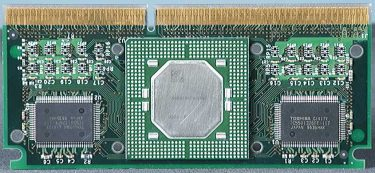
    </a>
    
<b>▲ Intel Pentium II (Klamath) 正面</b>

当年 Klamath 的起跳售价为 636 美金，最高级的 Pentium II 300 甚至要价惊人的 1,981 美金，虽然比起 Pentium Pro 曾经出现的 2,675 美金来说便宜不少，但其实对一般人来说，仍旧是很难接近的东西。

    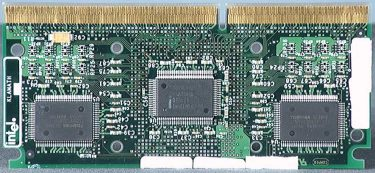
    
<b>▲ Intel Pentium II (Klamath) 背面</b>

后来在 1997 年 07 月 14 日 Intel 对 OEM 厂商推出了将 L2 快取升级为具备 ECC 能力的对应 Klamath 型号，Klamath 具有支持多处理器的能力，至多可以同时安装 2 个 Pentium II。

### 第二代：Deschutes (80523)

 - 发布时间：1998 年 01 月 26 日
 - 运行频率：266 MHz ~ 450 MHz
 - FSB 频率：66 MHz ~ 100 MHz
 - TDP：16.8 W ~ 27.1 W
 - L1 快取大小：32 KB (数据与指令快取各 16 KB)
 - L2 快取大小：512 KB
 - 支持插槽：Slot 1 (卡匣外型)
 - 电压需求：2.0 V
 - 晶体管数：750 万枚
 - 制造工艺：0.25 微米 (µm)
 - 指令集：x86-32 + MMX

    <a href="../images/blogs/computer_lecture/deschutes.jpg">
        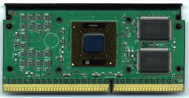
    </a>
    
<b>▲ Intel Pentium II (Deschutes) 正面 (右边两块就是快取芯片)</b>

1998 年推出的 Deschutes 是 Pentium II 的第二代产品，相较于 Klamath 来说，Deschutes 在各方面都显得更加成熟，受益于制程进入 0.25 微米，Deschutes 的 TDP 与使用的电压都明显较 Klamath 下降很多，同时频率的成长也大有斩获，来到了 450 MHz。

    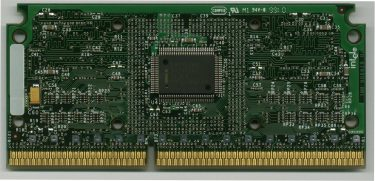
    
<b>▲ Intel Pentium II (Deschutes) 背面</b>

其中除了运行频率为 333 MHz 以下的 Deschutes 使用的 FSB 为 66 MHz 外，其余都已提升至 100 MHz，然而 Deschutes 最特别的地方其实不在其本身的特性有多少改变，而是 Intel 就是在这个时候开始创建 Xeon 与 Celeron 这两条产品线的，而且当时的产品都是直接衍伸自 Deschutes。

### Intel Celeron (based on Deschutes)

当时的 Celeron 就已经是独立的一条产品线，目的是要抢攻较低价的市场 (以当时来说其实这样的作法对于让个人计算机普及化也有相当的帮助)。

第一款 Celeron 的开发代号为 Covington，发布于 1998 年 04 月，只有 266 MHz 与 300 MHz 两个型号，最明显的特性是没有 L2 快取 (其实就是直接拿掉 L2 快取的 Deschutes)，因此性能上相当让人失望，价格又不是真的低廉很多，所以在市场上造成的回响有限 (国外评论认为初期的好销量都来自于 Intel 的名声，之后马上就消失了)，引起了不小的抱怨声浪，但值得注意的是，少了 L2 快取的 Covington 反而具有良好的超频能力。

    <a href="../images/blogs/computer_lecture/Celeron_Covington.jpg">
        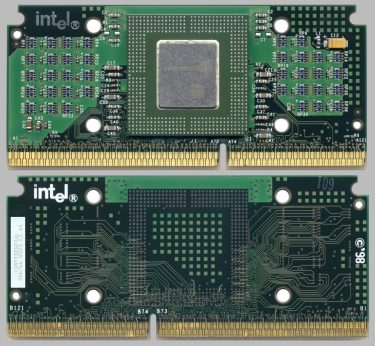
    </a>
    
<b>▲ 少了快取的 Celeron (Covington)，两侧显得相当空旷</b>

由于缺乏 L2 快取的 Covington 性能真的太差，连带反而救了 AMD 与 Cyrix 等厂商 (AMD 的 K6-2 从价格与性能上都可以把 Covington 压着打)，Intel 在 1998 年 08 月推出了改版的 Celeron，代号为 Mendocino，运行频率从 300 MHz 起跳 (300 MHz 型号为了与 Covington 作出区分所以称为 Celeron 300-A)，最高到 533 MHz，不过这次 Intel 似乎又「矫枉过正」了，Mendocino 内建了 128 KB「全速」的快取，而且 Mendocino 还是第一款将 L2 快取整合到核心中 (on-die) 的零售处理器，这让 Mendocino 的性能大为增强，而且超频潜力依旧庞大。

    
    
<b>▲ 看似空旷依旧，不过其实 L2 快取已经塞进中间变大的芯片里了。</b>

尽管 Mendocino 的 FSB 只有 66 MHz，但对性能的影响并不大，因此基于 Mendocino 的 Celeron 在市场上获得了巨大的成功，除了把 Cyrix 弄倒以外，还压制了 AMD 的 K6-2，甚至是影响到了自家中高阶产品线 Pentium II 的销售。

    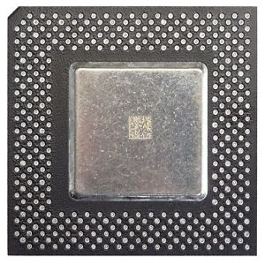
    
<b>▲ Socket 370 版本的 Intel Celeron (Mendocino)</b>

后来由于 Mendocino 没有外置的 L2 快取芯片，因此后来 Intel 又发展了 Socket 370 规格的版本，取代为了外置 L2 芯片而设计的 Slot 1，至于笔记本电脑的部分，则是在 1999 年推出了称为 Tocino 的核心，与 Mendocino 相当接近，值得注意的是有一款低电压版本出现，电压为 1.5 V，TDP 仅 7.9 W (频率为 267 MHz)。

### Intel Pentium II Xeon

    <a href="../images/blogs/computer_lecture/Pentium_II_Xeon.jpg">
        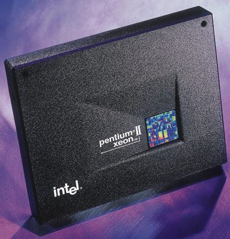
    </a>
    
<b>▲ 巨无霸级别的 Pentium II Xeon</b>

相对于 Celeron 而言，Xeon 版本的 Pentium II 就没那么特别了，当时 Xeon 也还不是一个独立的系列，而是附属于 Pentium 品牌之下。发布于 1998 年 06 月的 Pentium II Xeon (代号为 Drake) 同样是基于 Deschutes 的设计，只是将外置的 L2 快取芯片由降半速改为全速的芯片，容量则有所增加，有 512 KB、1 MB、2 MB 三种大小，至于运行频率则从 400 MHz 起跳，最高同样是到 450 MHz。

    <a href="../images/blogs/computer_lecture/Pentium_II_Xeon_pcb.jpg">
        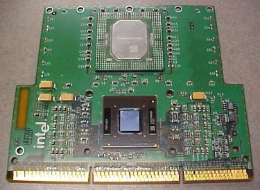
    </a>
    
<b>▲ 巨无霸级别的 Pentium II Xeon</b>

值得注意的是 Pentium II Xeon 使用的插槽与其他 Pentium II 不同，是使用较长的 Slot 2 (具有 330 触点)，高度也比 Slot 1 处理器来得高许多，且 Pentium II Xeon 具有多处理器 (SMP) 的能力，至多可以同时安装四颗 Pentium II Xeon。

### Intel Pentium II OverDrive

    <a href="../images/blogs/computer_lecture/Intel-Pentium-II-Overdrive-333-SL2KE-v1.1-3.jpg">
        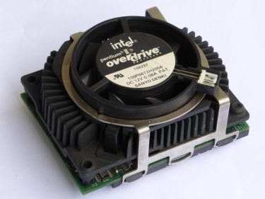
    </a>
    
<b></b>

Pentium II OverDrive 推出于 1998 年，同样基于 Deschutes 核心的 Pentium II，使用与 Pentium Pro 相同的脚位 (Socket 8)，是提供给原 Pentium Pro 用户升级使用的 Pentium II OverDrive，至多可以支持双处理器，因此原本使用 4 处理器 Pentium Pro 的用户在升级之后只能舍弃掉两个 Socket。

    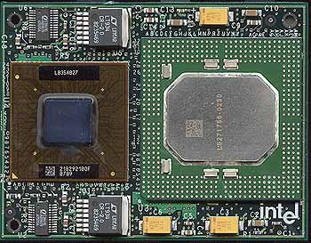
    
<b>▲ 把散热模块拿掉之后的样子，左边是 CPU 核心，右边是 L2 快取。</b>

Pentium II OverDrive 具有 512 KB 「全速」的 L2 高速缓存 (但仍然为外置)，FSB 则为 60 至 66 MHz，不过 Pentium II OverDrive 的 CPUID 是与 Klamath 相同，但 Intel 有在官方文件中特别提及，Pentium II OverDrive 使用的核心是 Deschutes 级别的。

    <a href="../images/blogs/computer_lecture/PODII.jpg">
        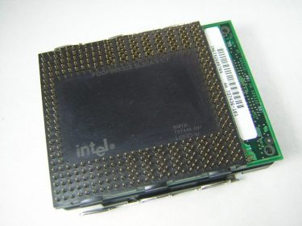
    </a>
    
<b>▲ Intel Pentium II OverDrive (背面)</b>

### Mobile Intel Pentium II

Pentium II 同样有推出行动版本，主要分为 Tonga 与 Dixon 两代，其中 Tonga 基本上也是 Deschutes 的衍伸型 (编号仍然是 80523)，发布于 1998 年 04 月 02 日。

    <a href="../images/blogs/computer_lecture/Pentium_II_Mobile_Tonga_b.jpg">
        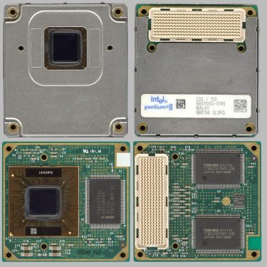
    </a>
    
<b>▲ Mobile Intel Pentium II (Tonga) 长得真的很特别</b>

Tonga 的 L2 快取仍然是放置于处理器核心外，以处理器主频的一半速度运行，大小则为 512 KB，频率从 233 MHz 起跳至 300 MHz，FSB 则是 66 MHz，当时使用的电压略低于 Deschutes，是较为接近现今处理器使用的 1.6 V ~ 1.7 V。

之后在 1999 年 01 月 25 日，Intel 推出了最后一款 Pentium II 核心，也就是行动版本的 Dixon 核心，基于 0.25 微米或 0.18 微米制造工艺，运行电压最低可以来到 1.55 V，频率则介于 266 MHz 至 400 MHz。

    <a href="../images/blogs/computer_lecture/Pentium_II_Mobile_Dixon_b.jpg">
        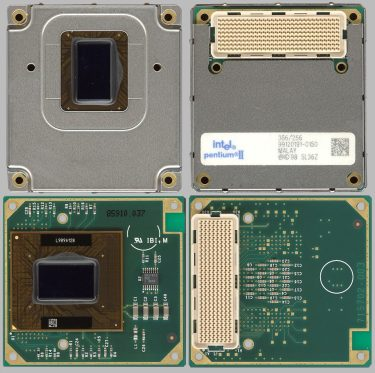
    </a>
    
<b>▲ Mobile Intel Pentium II (Dixon) 可以发现快取芯片不见了</b>

Dixon 核心当时为了与 Tonga 作出区隔，因此型号命名上都加上了「PE」的字尾，意思是 Performance Enhanced，主要与 Tonga 的差异在于快取的部分，Dixon 的快取与 Mendocino 一样改采整合到核心中的作法 (因此晶体管多达 2740 万个)，但大小则减为 256 KB。

## AMD K6-2 (又名 K6 3D MMX)

    <a href="../images/blogs/computer_lecture/AMD-K6-2.png">
        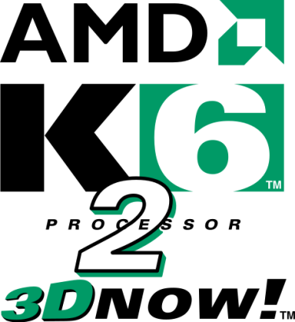
    </a>
    
<b></b>

在 K6 Model 7 推出之后不久，1998 年 05 月 28 日，AMD 就推出了基于第二世代 K6 架构的 K6-2 系列处理器以迎战始终相当昂贵的 Intel Pentium II。

K6-2 最大的特点是新增了 3D Now! 指令集，是全世界第一款引入单指令多数据式的浮点运算 (SIMD) 功能的处理器，大幅提升了 K6-2 的 3D 处理能力，而 Intel 则是要等到 Pentium III 上提供的 SSE 指令集才具有这个特性，不过 K6-2 仍然没有与处理器本体整合的 L2 快取，同时透过 Super Socket 7 对现有  Socket 7 平台的强化，让 K6-2 的 FSB 得以提升到 100 MHz，却又不至于影响主板生产成本太多。

    <a href="../images/blogs/computer_lecture/K6-2_die_shot.jpg">
        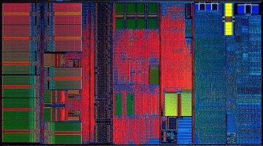
    </a>
    
<b>▲ AMD K6-2 die shot</b>

低廉的价格加上与 Pentium II 相当接近的性能，让 K6-2 与 Celeron 两款入门市场处理器大为流行，整体而言，K6-2 获得了巨大的成功 (相对于过去的产品而言)，K6-2 为 AMD 累积了一定的资本，让 AMD 得以继续存活并发展下一代的 K7 架构，不过 K6-2 的荣光并没有持续太久，超频潜力优异的 Celeron 始终居于不败，再加上 K6-2 缺乏整合的 L2 快取，导致市占率提升终于还是面临了瓶颈。

### 前期产品：Chomper (26050)

 - 发布时间：1998 年 05 月 28 日
 - 运行频率：233 MHz ~ 350 MHz
 - FSB 频率：66 MHz ~ 100 MHz
 - L1 快取大小：64 KB (数据与指令快取各 32 KB)
 - 支持插槽：Super Socket 7
 - 电压需求：2.2 V
 - 晶体管数：930 万枚
 - 制造工艺：0.25 微米 (µm)
 - 指令集：x86-32 + MMX, 3D Now!

    <a href="../images/blogs/computer_lecture/AMD_K6-2_Chomper.jpg">
        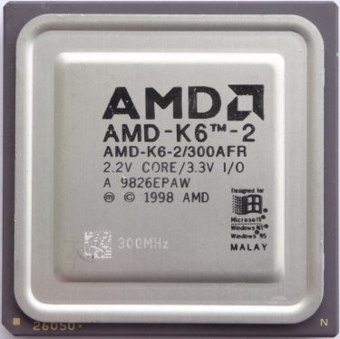
    </a>
    
<b>▲ AMD K6-2 (Chomper)</b>

### 后期产品：Chomper Extended (CXT, 26351)

 - 发布时间：1998 年 12 月 16 日
 - 运行频率：266 MHz ~ 550 MHz
 - FSB 频率：66 MHz ~ 100 MHz
 - L1 快取大小：64 KB (数据与指令快取各 32 KB)
 - 支持插槽：Super Socket 7
 - 电压需求：2.0 V ~ 2.2 V
 - 晶体管数：930 万枚
 - 制造工艺：0.25 微米 (µm)
 - 指令集：x86-32 + MMX, 3D Now!

    <a href="../images/blogs/computer_lecture/AMD_K6-2_Chomper-XT.jpg">
        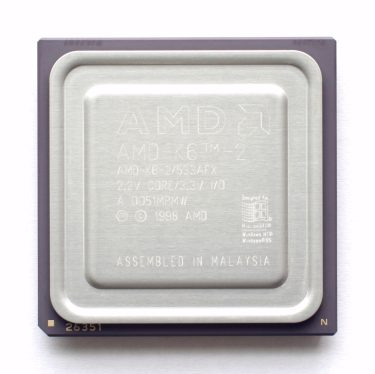
    </a>
    
<b>▲ AMD K6-2 (Chomper Extended)</b>

Chomper Extended 核心与 Chomper 之间差距并不明显，主要是频率的拉高与部分线路的优化，让内存与 CPU 之间的沟通速度有所提升而已，其余不论是制程或是指令集与设计几乎都没有差异。

(未完待续)

<a href="computer_lecture_7.html" class="btn btn-primary">上一篇</a> 
<a href="{{site.feedback_link}}" class="btn btn-primary"><i class="fa fa-comment-o"></i> 匿名提问</a>

---------


