本节将继续延续上一节的内容，要介绍的有 Intel 的 Pentium III 家族、AMD 的 K6-III 与 Athlon 家族三大系列 (嗯，我自己也知道，如果要把 Pentium 4 放在这篇字数绝对会破万 XD)。

由于篇幅有限，从本篇开始馆长基本上不会提行动版的部分，除非是非常具有代表性或自成一线的产品 (例如 Pentium M)。

# 中古时代后期－个人计算机即将迈入成熟的时代 (下)

## K6 家族的尾声：AMD K6-III

    <a href="../images/blogs/computer_lecture/AMD-K6-III.png">
        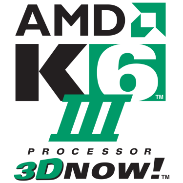
    </a>
    
<b></b>

延续过去 K6 与 K6-2 的发展，AMD 在 1999 年 02 月 22 日发布了 K6 微架构的第三次大幅改版，命名为 K6-III (故意改成 III 而不叫 K6-3 大概是要跟 Pentium III 扯关系吧？尽管官方似乎是说改名是为了凸显 K6-III 相较于前作有飞跃性的成长……其实运算核心的部份根本没有改变)

    <a href="../images/blogs/computer_lecture/K6-3-dieshot.jpg">
        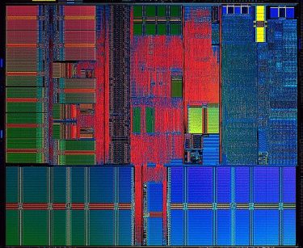
    </a>
    
<b>▲ AMD K6-III die shot</b>

整体而言其实 K6-III 的设计差异大概可以这样解释：「整合了 L2 快取的 K6-2」，虽然用说的很简单，但其实这做起来可困难了，对于生产技术落后于 Intel 的 AMD 来说，硬是要在 0.25 微米制程的 K6-III 中塞入 256 KB 的全速 L2 快取的结局就是生产成本的大幅拉高，良率狂跌与不断的延期 (其实本来预期是 1998 年底就要出了，这导致 K6-III 在市场上的生命周期被压得很短)，因此在 K6-III 上 AMD 赔了不少钱。

### 第一场频率战争

其实在同样频率的状况下，K6-III 的表现是很不错的，可以赢过同频率的 Pentium II 与早期的 Pentium III，不过由于管线深度浅 (相对于 P6 的管线深度而言，K6 家族的管线深度只有 6 阶，也就是只有一半左右)，虽然效率良好却没办法拉高运行频率，直到最后 K6-III 都没能超过 550 MHz。

***按：初期的 Pentium III 与 Pentium II 几乎是一样的东西，就算加入了 SSE，在当时也没表现在效能提升上。***

K6-III 曾经短暂推出过 500 MHz 的型号，不过很快就因为发现有烧毁主板的风险而召回了，而当时 AMD 心里也有底，K7 架构的 Athlon 即将猛虎出闸，因此也就决定不再继续尝试发展高频率的 K6-III。

因为以上种种原因，加上生产成本高昂， K6-III 在市场上只出现了很短的一段时间，除了初期有在桌面计算机上使用外，后来就改为只用于笔记本电脑，几乎可说是「短命的代表」。

### 第一代产品：Sharptooth (K6-III, K6-3D+)

 - 发布时间：1999 年 02 月 22 日
 - 运行频率：400 MHz、450 MHz
 - FSB 频率：66 / 100 MHz、100 MHz
 - L1 快取大小：64 KB (数据与指令快取各 32 KB)
 - L2 快取大小： 256 KB (全速 On-die)
 - 支持插槽：Super Socket 7
 - 电压需求：2.2 V、2.4 V
 - 晶体管数：2140 万枚
 - 制造工艺：0.25 微米 (µm)
 - 指令集：x86-32 + MMX, 3D Now!

    <a href="../images/blogs/computer_lecture/amd_k63.jpg">
        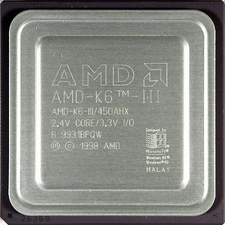
    </a>
    
<b>▲ AMD K6-III (Sharptooth)</b>

K6-III 真的很少见，就算是在网络上其实馆长也有印象当年就很难找得到，当时的品牌计算机大致上就是 K6-2 之后就跳级 Athlon 与 Pentium III 了。

在 Athlon 上市之后基本上 K6-III 注定将成为弃子，由于在目标市场中已经毫无竞争力，加上生产成本却比 K6-2 高很多，直逼 Athlon 的等级，因此 AMD 就开始逐步降低 K6-III 的产量了。

而在效能大幅提升的 Pentium III Coppermine 推出之后，由于制程转换导致 Intel 一时之间无法出货满足庞大的市场需求，因此有一部分需求便转向 AMD Athlon，使得 Athlon 一瞬之间大卖供不应求，于是 AMD 就将 K6-III 的生产彻底停止了 (好把产线空出来给当时公司的新金鸡母－Athlon)。

### K6-III-P

 - 发布时间：1999 年 05 月 31 日
 - 运行频率：350 MHz ~ 475 MHz
 - FSB 频率：66 MHz ~ 100 MHz
 - L1 快取大小：64 KB (数据与指令快取各 32 KB)
 - L2 快取大小： 256 KB (全速 On-die)
 - 支持插槽：Super Socket 7
 - 电压需求：2.0 V ~ 2.2 V
 - 晶体管数：2140 万枚
 - 制造工艺：0.25 微米 (µm)
 - 指令集：x86-32 + MMX, 3D Now!

    <a href="../images/blogs/computer_lecture/K6-3P.jpg">
        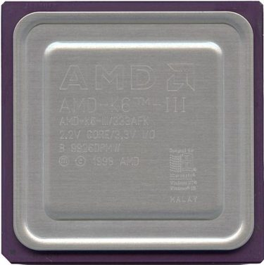
    </a>
    
<b>▲ AMD K6-III-P</b>

虽然说是行动版，不过其实与 K6-III (Sharptooth) 没甚么差别，只是电压低了些，顺带一提 K6-III 全家族以当时的标准来说，发热量是「让人惊讶的高」，关于命名中的「P」，官方说法是 Performance 的意思。

### K6-2+

 - 发布时间：2000 年 04 月 18 日
 - 运行频率：450 MHz ~ 570 MHz
 - FSB 频率：95 MHz ~ 100 MHz
 - L1 快取大小：64 KB (数据与指令快取各 32 KB)
 - L2 快取大小： 128 KB (全速 On-die)
 - 支持插槽：Super Socket 7
 - 电压需求：2.0 V
 - 晶体管数：2140 万枚
 - 制造工艺：0.18 微米 (µm)
 - 指令集：x86-32 + MMX, 3D Now!

    <a href="../images/blogs/computer_lecture/amd_k62plus.jpg">
        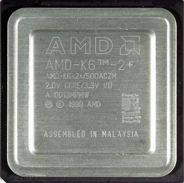
    </a>
    
<b>▲ AMD K6-2+</b>

随着时间过去，Intel 产能起来以后，供不应求的状况就解除了，此时 AMD 则将空出来的产线拿来生产制造工艺提升至 0.18 微米的 AMD K6-III，同时加入了 PowerNow! 节电技术 (为了更适合用于笔记本电脑)，并配合良率问题将 L2 快取大小减半之后命名为 K6-2+ 推出。

### K6-III+

 - 发布时间：2000 年 04 月 18 日
 - 运行频率：400 MHz ~ 550 MHz
 - FSB 频率：95 MHz ~ 100 MHz
 - L1 快取大小：64 KB (数据与指令快取各 32 KB)
 - L2 快取大小： 256 KB (全速 On-die)
 - 支持插槽：Super Socket 7
 - 电压需求：2.0 V (低电压版为 1.6 V ~ 1.8 V)
 - 晶体管数：2140 万枚
 - 制造工艺：0.18 微米 (µm)
 - 指令集：x86-32 + MMX, 3D Now!

    <a href="../images/blogs/computer_lecture/K6-III.jpg">
        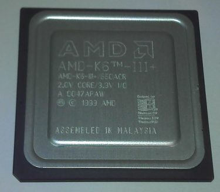
    </a>
    
<b>▲ AMD K6-III+</b>

K6-III+ 基本上与 K6-II+ 几乎完全相同，唯一的差异是 K6-III+ 的快取为未经缩减的 256 KB。

由于 AMD 当时将宣传完全砸在新的 Athlon 上，对 K6-III 家族采取冷处理的方针，因此除了爱好者与业界之外几乎很少人知道有 K6-III 这系列的存在，更别提后来制程升级后重出江湖的事情，虽然 K6-III+ 与 K6-2+ 在市场划分上都是给笔记本电脑使用，但也有一些 K6-2、K6-III 被拿到 DIY 与桌面计算机市场上贩卖，不过由于宣传很少导致知名度很低，许多人选择买上一代的 K6-2，而不太会去买价格其实差不多的 K6-2+。

## AMD 最风光的时代：AMD Athlon

在经过 K6-III 的失败之后，AMD 并没有因此慢下脚步，在 1999 年 06 月 23 日发布了基于全新 K7 架构的 Athlon 处理器家族，中文命名则为「速龙」，从此展开了 AMD 公司历史上最辉煌的一段时光。

    <a href="../images/blogs/computer_lecture/AMD_Athlon_Processor_Logo.png">
        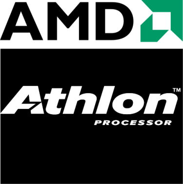
    </a>

### 「贵人相助」推了 AMD 很大一把

Athlon 的开发过程中 AMD 可说是获得了许多「贵人」相助，当时 AMD 与 Motorola 的合作 (Motorola 与 AMD 合作发展 Copper Interconnect 制程) 使其能在 Intel 之前一年将 0.18 微米制造工艺的技术运用在晶圆生产上，这也连带使得 AMD 有机会让 Athlon 成为全球第一个达到 1 GHz 的处理器。

    

    

除此之外当时正巧 Compaq 收购了 DEC 却将 DEC 手上几乎已经快完成的 Alpha 处理器计划给砍掉，让 AMD 得以将几乎整个 DEC 半导体团队挖到自己公司来，而这支团队与原本从 NexGen 收购来的 K6 团队结合之后，就成了 K7 架构的研发团队。

### 还没开始，就已经接近完成

有了 K6 架构与几近于完成的 Alpha 架构为基础，让 AMD 得以很快的完成 K7 架构并将其推出到市场上抢得先机，同时 Alpha EV6 架构与 DDR 技术更让 Athlon 得以在只有 100 Mhz 外频的情况下，达到比 Intel 用于 Pentium III 的 GTL+ 总线更高的带宽。

### 管线深度提升，带动频率提升

由于 K6 架构中只有 5 阶管线，这造成频率提升上很大的困难，这也是导致 K6-III 失败的主要原因之一，因此 Athlon 毫不意外的拥有更深的管线深度 ( 10 阶管线)，因此在 Athlon 上我们可以看到很明显的频率提升，不过由于管线加深，在分支预测命中率上的要求也会更高，而 Athlon 确实做到了。

### 浮点运算性能大幅强化

Athlon 的浮点性能相比过去的 K6 架构而言有几乎可以称为是巨大的提升，一改过去 K6 架构为人诟病浮点运算性能不佳的缺点，Athlon 在超长管线与新的浮点运算单元设计的帮助下，甚至能够轻松赢过 Intel 的 P6 架构与 Pentium III。

同时 AMD 又在 Athlon 上新增了增强版的 3D Now! 指令集 (Enhanced 3D Now!)，包含了新的 DSP 指令与一些 Intel 在 SSE 中引入，用于增强 MMX 的指令。

### 天时、地利、人和三者并进

除了 Athlon 在当时稳坐全世界最快的 x86 处理器之名外 (直到 Pentium 4 之前，Athlon 稳坐这一地位颇长一段时间)，当时 Intel 很大程度受到自己在制程发展上的瓶颈与产能、良率方面提升的困难所制肘，如同前面 K6-III 段落说过的，当时 Intel 长期的缺货造就了 Athlon 极为庞大的需求，甚至让 AMD 决定提前结束 K6-III 的生产。

### 第一代产品：Argon (K7)

 - 发布时间：1999 年 06 月 23 日
 - 运行频率：500 MHz ~ 700 MHz
 - FSB 频率：100 MHz (DDR 双倍带宽)
 - L1 快取大小：128 KB (数据与指令快取各 64 KB)
 - L2 快取大小： 512 KB (半速)
 - 支持插槽：Slot A (卡匣外型)
 - 电压需求：1.6 V
 - 晶体管数：2200 万枚
 - 制造工艺：0.25 微米 (µm)
 - 指令集：x86-32 + MMX, Enhanced 3D Now!

    <a href="../images/blogs/computer_lecture/argon-top.jpg">
        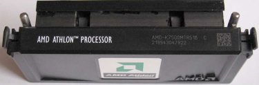
    </a>
    
<b>▲ AMD Athlon (Argon) 上方视图</b>

第一代 Athlon 使用了与 Pentium II、Pentium III 初期产品相当类似的卡匣外型，但 Athlon 所使用的 Slot A 与 Intel 的 Slot 1 并不兼容，同时 Athlon 的 L1 快取大小可说是相当惊人 (即使是从今天的角度来看也是如此)，来到了 128 KB 之多。

    <a href="../images/blogs/computer_lecture/argon-front.jpg">
        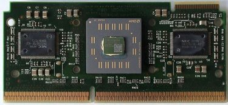
    </a>
    
<b>▲ AMD Athlon (Argon) 正面，拆除保护壳后</b>

而不同于 K6-2 架构中快取与内存共享总线的设计，尽管 Athlon 初期产品的 L2 快取仍未整合至核心中 (与 Pentium II 类似，快取芯片放在 CPU 电路板的两侧)，但却使用两条不同的总线，因此内存与快取都能享有更大的带宽而不需要彼此分享。

    <a href="../images/blogs/computer_lecture/AMD_Athlon_(Argon)_Die_shot.jpg">
        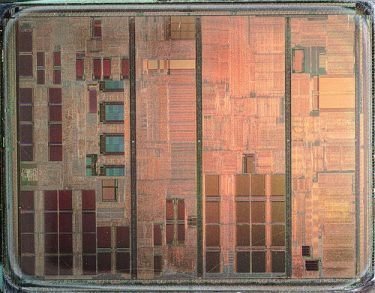
    </a>
    
<b>▲ AMD Athlon (Argon) Die shot</b>

### 第 1.5 代产品：Pluto (K75)

 - 发布时间：1999 年 11 月 29 日
 - 运行频率：550 MHz ~ 1000 MHz
 - FSB 频率：100 MHz (DDR 双倍带宽)
 - L1 快取大小：128 KB (数据与指令快取各 64 KB)
 - L2 快取大小： 512 KB (根据频率不同，以频率的 50% ~ 33% 运行)
 - 支持插槽：Slot A (卡匣外型)
 - 电压需求：1.6 V ~ 1.8 V
 - 晶体管数：2200 万枚
 - 制造工艺：0.18 微米 (µm)
 - 指令集：x86-32 + MMX, Enhanced 3D Now!

    <a href="../images/blogs/computer_lecture/K75.jpg">
        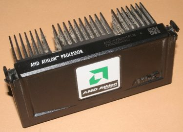
    </a>
    
<b>▲ AMD Athlon (Pluto)</b>

Pluto 基本上就是 Argon 的制程提升版本，除了频率可以拉得更高之外，没有太多特别的地方，值得注意的是，AMD 在此时终于突破了 1 GHz 大关，成为全世界第一颗达到 1 GHz 预设频率的 x86 处理器，比 Intel 还早。

### 第 2 代产品：Thunderbird

 - 发布时间：2000 年 06 月 05 日
 - 运行频率：600 MHz ~ 1400 MHz
 - FSB 频率：100 MHz ~ 133 MHz (DDR 双倍带宽)
 - L1 快取大小：128 KB (数据与指令快取各 64 KB)
 - L2 快取大小： 256 KB (全速，On-die)
 - 支持插槽：Socket A ( 462 针脚 FPGA 封装)
 - 电压需求：1.7 V ~ 1.75 V
 - 晶体管数：2200 万枚
 - 制造工艺：0.18 微米 (µm)
 - 指令集：x86-32 + MMX, Enhanced 3D Now!

    <a href="../images/blogs/computer_lecture/tbird1100.jpg">
        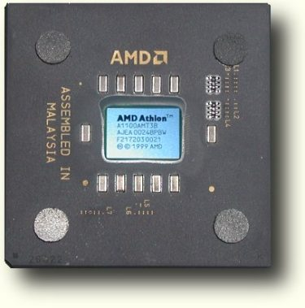
    </a>
    
<b>▲ AMD Athlon (Thunderbird)</b>

Thunderbird 可说是 Athlon 的一次标志性的大改版，Thunderbird 舍弃 Slot A 设计，改采大家熟悉的 PGA 封装，同时将 L2 快取减半至 256 KB 但直接整合入 CPU 核心中，使得 L2 快取得以使用与 CPU 主频相同的速度执行，同时快取的访问机制也整个重新设计过，因此性能上又比 Pluto 高出一截，强劲的效能使得 Thunderbird 成为 AMD 有史以来最成功的处理器产品。

    <a href="../images/blogs/computer_lecture/AMD_Duron.jpg">
        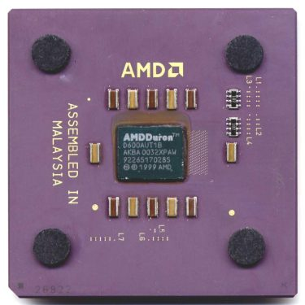
    </a>
    
<b>▲ AMD Duron (Spitfire)</b>

同时此时 AMD 也针对 Intel Celeron 主攻的低价市场，推出了 Duron 产品线，第一代的 Duron (代号为 Spitfire) 实际上就是 Thunderbird 的简化版，L2 快取大小减为 1/4 (也就是 64 KB)，频率则介于 600 MHz ~ 950 MHz。

## 被 Athlon 甩到颜面无光：Intel Pentium III

Intel 在 1999 年 02 月 26 日释出了 Pentium III，做为 Pentium II 的后继基本上在初期 Pentium III 并没有甚么明显的变动，主要是以前代为基础加上了为因应 AMD 的 3D Now! 而出现的 SSE 指令集 (曾经被称为 MMX2 与 KNI, Katmai New Instruction)。

    <a href="../images/blogs/computer_lecture/Pentium_3_logo-1.jpg">
        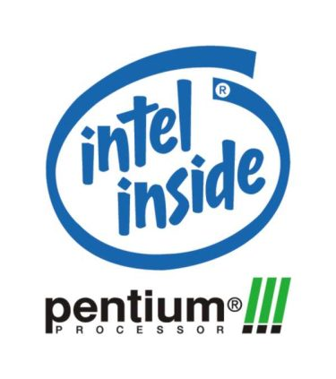
    </a>

而目前仍为人所记得的 Pentium III 特性，反而是当时引起争议的 PSN 功能 (Processor Serial Number)，其实也不算很特别的功能，就是在每颗 Pentium III 中刻录该颗处理器的序号而已，不过在隐私上引起了疑虑。

## 第一代：Katmai (80525)

 - 发布时间：1999 年 02 月 26 日
 - 运行频率：450 MHz ~ 600 MHz
 - FSB 频率：100 MHz ~ 133 MHz
 - TDP：25.3 W ~ 34.5 W
 - L1 快取大小：32 KB (数据与指令快取各 16 KB)
 - L2 快取大小：512 KB (半速，off-die)
 - 支持插槽：Slot 1 (卡匣外型)
 - 电压需求：2.0 V (600 MHz 型号为 2.05 V)
 - 晶体管数：950 万枚
 - 制造工艺：0.25 微米 (µm)
 - 指令集：x86-32 + MMX, SSE

    <a href="../images/blogs/computer_lecture/Katmai.jpg">
        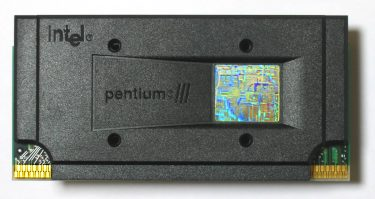
    </a>
    
<b>▲ Intel Pentium III (Katmai)</b>

Katmai 是以 Pentium II 的 Deschutes 核心为基础发展出来的，主要差异在于新增 SSE 指令集与针对 L1 快取控制器的强化，因此性能上比 Deschutes 来说是有所提升的 (但幅度不大)，但受制于 0.25 微米工艺，Katmai 的晶体管数量提升因此受到了不小限制，于是 Intel 在 Katmai 中设计 SSE 时使用了重复使用现有的 64-bit 来实现 SSE 的 128-bit 指令架构，这与 SSE 原始的设计概念有所矛盾，于是当时想针对 SSE 优化的软件面临了两难：到底要依照 Katmai 的折衷设计优化还是要为了未来使用完整 SSE 设计的处理器优化？

    <a href="../images/blogs/computer_lecture/Intel_Pentium_III_Katmai.jpg">
        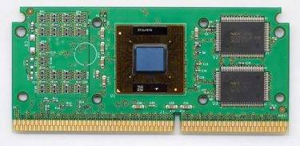
    </a>
    
<b>▲ Intel Pentium III (Katmai) 正面，中为 CPU 核心，右二为快取芯片。</b>

Katmai 产品线中型号标示有「B」后缀的型号表示 FSB 的频率为 133 MHz。

    <a href="../images/blogs/computer_lecture/TANNER.jpg">
        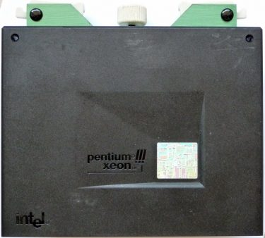
    </a>
    
<b>▲ Intel Pentium III Xeon (Tanner)</b>

而 Xeon 版本的 Katmai 则被命名为 Tanner，基本上关系类似于过去的 Pentium II 与 Pentium II Xeon，主要是快取加大与加速之后的版本，使用 Slot 2 规格，同时随着芯片组与主板的不同，至多可以同时安装四颗 Tanner。

    <a href="../images/blogs/computer_lecture/Pentium_III-die.jpg">
        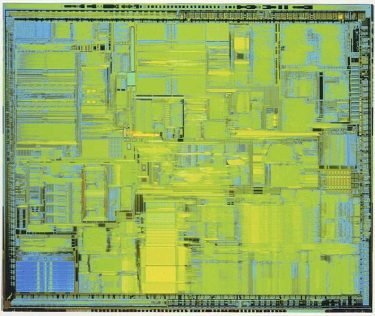
    </a>
    
<b>▲ Intel Pentium III Xeon (Tanner) Die shot</b>

### 第二代：Coppermine (80526)

 - 发布时间：1999 年 10 月 25 日
 - 运行频率：500 MHz ~ 1133 MHz
 - FSB 频率：100 MHz ~ 133 MHz
 - TDP：13.2 W ~ 33.0 W
 - L1 快取大小：32 KB (数据与指令快取各 16 KB)
 - L2 快取大小：256 KB (全速，on-die)
 - 支持插槽：Socket 370 / Slot 1 (卡匣外型)
 - 电压需求：1.6 V ~ 1.75 V
 - 晶体管数：2800 万枚
 - 制造工艺：0.18 微米 (µm)
 - 指令集：x86-32 + MMX, SSE

    <a href="../images/blogs/computer_lecture/Intel_Pentium_III_Coppermine.jpg">
        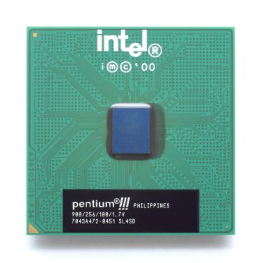
    </a>
    
<b>▲ Intel Pentium III (Coppermine) Socket 370 封装</b>

Coppermine 核心是系列中第一个真正具备绝大多数 Pentium III 特性的版本，同时也是 Intel 针对 AMD 阵营的旗舰产品－Athlon 的响应。

    <a href="../images/blogs/computer_lecture/intel_pentium3.jpg">
        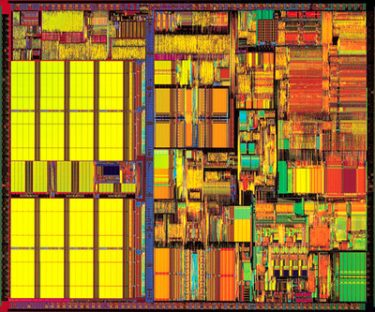
    </a>
    
<b>▲ Intel Pentium III (Coppermine) Die shot</b>

Katmai 与 Pentium II 中受人诟病的管线延迟，在 Coppermine 大幅调整设计之后有了很大的改善 (同时管线深度也由 Pentium Pro 的 14 阶降至 10 阶)，极端状况下可以提高 30% 的性能，同时受益于制程的提升，Intel 在 Coppermine 时期也开始采用将全速的 256 KB L2 快取整合入处理器核心的做法，因此晶体管数大幅倍增到 2,800 万。

    <a href="../images/blogs/computer_lecture/p3-733_big.jpg">
        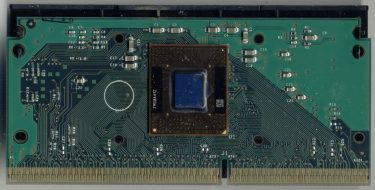
    </a>
    
<b>▲ Slot 1 版本的 Coppermine，可以很明显发现快取芯片不见了</b>

同时 Coppermine 也是 Intel 第一个预设频率突破 1 GHz 的产品，在 2000 年更推出了 1.13 GHz 的版本，但初期有严重的产品不稳定问题因此在上市之后不久就召回，直到 2001 年才重新推出改良后的 D0 步进版本。

    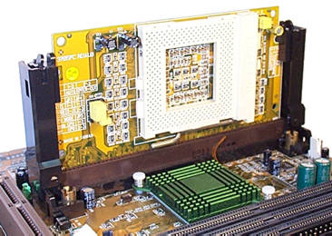
    
<b>▲ Slot 1 转 Socket 370 用转卡</b>

由于部分型号与 Katmai 重迭，因此部分型号后面新增了「E」后缀以表示为 Coppermine 核心产品，而标示有「B」后缀的型号仍表示 FSB 的频率为 133 MHz，因此有部分型号被标注为「EB」。

基于与 Celeron Mendocino 相同的理由，随着快取被整合入核心芯片当中，Intel 决定放弃 Slot 1 插槽，回归使用 Socket 370 封装 (但无法直接与 Celeron Mendocino 的主板混用，需要转接器)。

    
    
<b>▲ Intel Celeron (Coppermine-128)</b>

至于 Celeron 版本的 Coppermine 则命名为 Coppermine-128，此系列经常被称为「Celeron II」或「Celeron 2」，实际上就是将 L2 快取大小减半之后的 Coppermine，而在 2001 年 800 MHz 版本的 Coppermine-128 上市之前，Coppermine-128 的 FSB 频率只有 66 MHz，但对效能的影响不大。

    <a href="../images/blogs/computer_lecture/Pentium_III_Xeon_Cascades_b.jpg">
        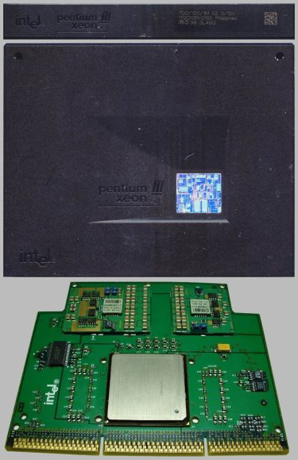
    </a>
    
<b>▲ Intel Pentium III Xeon (Cascades)</b>

Xeon 版本的 Coppermine 则被命名为 Cascades，主要差异为快取大小 (最大可达 2 MB) 与沿用 Slot 2 插槽设计，其中 700 MHz 与 900 MHz 型号能支持四处理器配置，其余则是至多双处理器配置。

### 第 2.5 代：Coppermine-T (80533)

 - 发布时间：2001 年 06 月
 - 运行频率：800 MHz ~ 1133 MHz
 - FSB 频率：133 MHz
 - TDP：29.0 W ~ 38.2 W
 - L1 快取大小：32 KB (数据与指令快取各 16 KB)
 - L2 快取大小：256 KB (全速，on-die)
 - 支持插槽：Socket 370 (FC-PGA2)
 - 电压需求：1.75 V
 - 晶体管数：2800 万枚
 - 制造工艺：0.18 微米 (µm)
 - 指令集：x86-32 + MMX, SSE

Coppermine-T 是 Coppermine 与 Tualatin 之间交界时期的过渡产品，基本上与 Coppermine 没有不同，唯一差别是封装方式改为 FC-PGA2 (最直接的特征是 FC-PGA2 封装处理器正面有覆盖一片金属均热片，因此无法直接看到处理器芯片本体。

    <a href="../images/blogs/computer_lecture/Coppermine-t.jpg">
        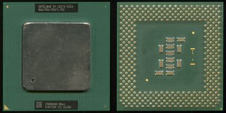
    </a>
    
<b>▲ Coppermine-T，从外型上可以很容易发现与 Coppermine 的不同。</b>

在 Coppermine-T 以前的 Pentium III 处理器则是使用 FC-PGA 封装，值得注意的是，尽管都是 Socket 370，但 FC-PGA 与 FC-PGA2 的主板并不能混用，若要将 Coppermine-T 用于以往的 Socket 370 主板，则会需要额外购买转接器，但支持 FC-PGA2 的主板则是可以安装 FC-PGA 封装之 Coppermine 的。

### 第 3 代：Tualatin (80530)

 - 发布时间：2001 年 07 月
 - 运行频率：1000 MHz ~ 1400 MHz
 - FSB 频率：133 MHz
 - TDP：29.1 W ~ 32.2 W
 - L1 快取大小：32 KB (数据与指令快取各 16 KB)
 - L2 快取大小：256 KB / 512 KB (全速，on-die)
 - 支持插槽：Socket 370 (FC-PGA2)
 - 电压需求：1.475 V ~ 1.5 V
 - 晶体管数：2800 万枚
 - 制造工艺：0.13 微米 (µm)
 - 指令集：x86-32 + MMX, SSE

    <a href="../images/blogs/computer_lecture/Intel_Pentium_III_Tualatin.jpg">
        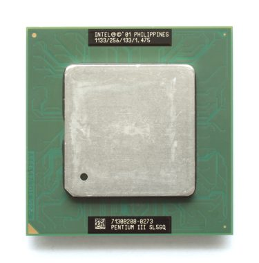
    </a>
    
<b>▲ Intel Pentium III (Tualatin)</b>

Tualatin 是 Pentium III 的最后一次更新，一般被认为只是 Intel 用来试验 0.13 微米制程的产品而已，毕竟当时 Pentium 4  (发布于 2000 年) 早已占有大部分的市场，而与过去的 Pentium III 不同，Tualatin 不包含先前曾引起争议的 PSN (处理器序号) 功能。

    <a href="../images/blogs/computer_lecture/tualatin_die.jpg">
        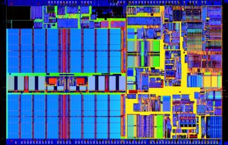
    </a>
    
<b>▲ Intel Pentium III-S (Tualatin-512) Die shot，可以看到左半部 512 KB 的 L2 快取占去大量空间</b>

其实 Tualatin 的频率还有相当大的发展空间，不过 Intel 担心会打到自家的 Pentium 4，因此并未发行高于 1.4 GHz 的 Tualatin，而同时间完成的 Tualatin-512 具有 512 KB 大小的 L2 快取，同样为了避免上打 Pentium 4，因此被额外赋予了同时可以支持 ECC 内存与双处理器配置的能力与相对高昂的价格，作为针对服务器市场的产品发布。销售时则被命名为 Pentium III-S。

    <a href="../images/blogs/computer_lecture/Intel-Pentium-III-S.jpg">
        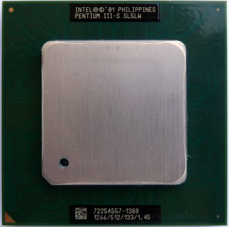
    </a>
    
<b>▲ 外观差异其实不明显，但可以看到上面有 Pentium III-S 字样。</b>

对应 Tualatin 的 Celeron 核心代号则为 Tualatin-256，有些人会称其为「Celeron-S」或 Tualeron。特性上几乎与具备 256 KB L2 快取的 Tualatin 相同，但 L2 快取的部分采用延迟较大的版本已降低成本，不过这却为 Tualatin-256 带来了十分良好的超频潜能。

    <a href="../images/blogs/computer_lecture/Tualeron_1200.jpg">
        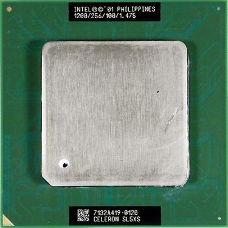
    </a>
    
<b>▲ Intel Celeron (Tualatin-256)</b>

呼，终于介绍完中古时代了，下一篇开始就是近代前期，预计会先介绍 Pentium 4、Pentium D 等 Netburst 家族。

(未完待续)

<a href="computer_lecture_8.html" class="btn btn-primary">上一篇</a> 
<a href="{{site.feedback_link}}" class="btn btn-primary"><i class="fa fa-comment-o"></i> 匿名提问</a>

---------


