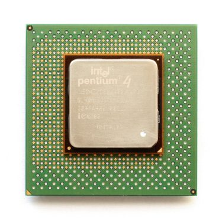

在经过四节的中古时代 CPU 发展史之后，从现在开始站长将进入近代的 CPU 介绍，从这篇开始出现的处理器应该就是目前绝大多数人都听过的产品了，不过由于有几款处理器架构的发展历史特别曲折离奇，衍伸型特别繁多，加上站长希望能够使用「略古详今」的方式来解说历代的处理器架构，因此近代前期的部分站长打算采用一篇一架构的方式介绍，本篇谈的是 Intel 的 Netburst (P68) 架构，至于 AMD 的 K8 架构则会是下一篇的主题。

# 近代前期 (上) Intel Netburst 架构

Netburst 架构的开发代号为 P68，是 Intel 开发用于接替 P6 架构的全新 x86 架构设计，首款基于 Netburst 架构的处理器核心为 2000 年发布的 Willamette，最后一款产品则是 2006 年的 Presler，从开始到结束生产前后绵延八年，算是 Intel 长寿的架构之一，开发的耗时也算是 x86 系列处理器中相当长的，陪伴了 Intel 走过一段大起与大落的历史。

## 超深管线技术 (Hyper-Pipeline)

超高的管线深度几乎可以说是 Netburst 架构最鲜明的特色，前代产品 Pentium III 仅有 10 级管线设计，而在 Netburst 的第一代产品 Willamette 核心上，管线深度一举突破来到了两倍 (20 级管线设计)，而在 Netburst 架构下出现过的最深管线设计则是 Prescott 与 Cedar Mill 所使用的 31 级管线，同时为了避免管线深度增加之后导致的分支命中率下降与分支未命中 (Missing) 时造成的延迟，因此 Netburst 架构中也针对分支预测进行了特别的强化，不过后来证实这些强化终究没办法抵销管线深度过深带来的缺点。

超深管线设计也是导致 Pentium 4 的频率可以增加地如此迅速地主要原因，不过后来在实作上情况并不如 Intel 原先预期的顺利。

## 走火入魔的频率战争

从 Pentium III 的中晚期开始 (或许更早)，Intel 就有意使用宣传的方式来「教育」消费者，使消费者认为频率较高的处理器「理应」表现得比较好、性能比较强，这个情况在进入 Pentium 4 时期的时候变得更加明显，x86 架构处理器发展史上，Netburst 架构时代是处理器运行频率年增率最高的时期，到中期 Intel 几乎已经进入走火入魔的情况，这篇报导就是一个例子，当时的 Intel 信誓旦旦地认为在「一年之内」，Intel 可以将当时运行于 2.4 GHz 的 Pentium 4 (Northwood) 处理器改良为 10 GHz 的 Prescott，至于结局如何就是大家都知道的那样了。

## 快速执行引擎 (Rapid Execution Engine)

在 Netburst 架构中，处理器内的算术逻辑单元 (ALU) 会以处理器主频的两倍频率运行，这个技术被命名为 Rapid Execution Engine，目的是缓解 Netburst 架构低落的 IPC (Instructions per cycle, 每周期可执行命令数) 带来的问题，但 REE 并没有办法在任何情况都能抵销 Netburst 架构低落的 IPC，有时候在执行某些指令时，甚至反而会因 REE 设计而拖慢运行效率。

## 执行追踪快取 (Execution Trace Cache)

在 Netburst 架构中，Intel 在 L1 快取新增了执行追踪快取这项功能，ETC 会将指令译码之后的 micro-OPs 依照其预测的执行路径暂存于快取中，而当处理器在执行其他指令时，如果 ETC 内已经有译码过的结果，就不必重复进行 Fetch 与 Decode 的操作，且当指令被 CPU 从快取中读取时，就直接可得到正确的执行顺序，从而提升效率。

## 由失败走向成功，又从成功坠入失败：Pentium 4 家族

    

Netburst 家族的起头与代表自然是曾经叱咤风云将近 5 个年头的 Pentium 4 与其衍伸系列 (Xeon 与 Celeron)，大致上可分为四个时期。

### 第 1 代产品：Willamette (80528、80531)

 - 发布时间：2000 年 11 月 20 日
 - 运行频率：1.3 GHz ~ 2.0 GHz
 - FSB 频率：100 MHz (QDR 四倍带宽)
 - TDP：48.9 W ~ 75.3 W
 - L1 快取大小：12 KB ETC + 8 KB 资料快取
 - L2 快取大小：256 KB (全速，on-die)
 - 支持插槽：Socket 423 (80528) / Socket 478 (80531)
 - 电压需求：1.56 V ~ 1.70 V
 - 晶体管数：4200 万枚
 - 制造工艺：0.18 微米 (µm)
 - 芯片本体面积：217 mm2
 - 指令集：x86-32 + MMX, SSE, SSE2

    
    
<b>▲ Intel Pentium 4 (Willamette) 正面</b>

Willamette 是第一代的 Pentium 4 核心，基本上是一款相当失败的产品。失败的主要原因有二，第一是 Willamette 并不算是成熟的产品，性能上表现在初期产品明显不如预期，甚至在 1.5 GHz ~ 1.6 GHz 时还打不赢自家的 Pentium III，更别提当时已经超越 Pentium III 的 AMD Athlon，整体而言让许多人大失所望 (因为 Pentium 4 的 CPI 比 Pentium III 还要差，直到 Pentium 4 的运行频率拉高到 1.7 GHz 以上才足以与 Pentium III 相抗衡，若要与 Thunderbird 抗衡则至少需要 2.0 GHz 以上)。

    
    
<b>▲ Intel Pentium 4 (Willamette) 背面</b>

除了性能不佳之外，Willamette 在初期仅允许搭配价格相当高昂的 Rambus RDRAM 内存使用，而不能使用相对而言便宜但较慢的 SDRAM，因此在市场上并没有被广泛接受，这个情况直到推出 Intel 845 Chipset 提供 SDRAM 支持之后，Pentium 4 的销量才开始飙涨。

    
    
<b>▲ Intel Pentium 4 (Willamette) Die shot</b>

在 2001 年 08 月 27 日，Intel 发布使用 Socket 478 新封装方式的 Pentium 4 (Willamette)，一般而言认为 Socket 478 是为了第二代产品  (Northwood) 准备的。

    
    
<b>▲ Socket 478 与 Socket 423 比较</b>

同时在 Willamette 上也可以发现 TDP 的数值开始往上飙升，最高已经来到了 75 瓦以上，而对应 Willamette 核心的 Celeron 低价产品则为 Willamette-128，主要差异为 L2 快取容量减半，与 Pentium 4 Willamette 的性能差异颇大，Willamette-128 在测试中的表现甚至不及上一代的 Celeron (Tualatin-256)。

    

同时此时 Intel 也将 Xeon 产品线从 Pentium 品牌中独立出来，从此自成一个系列，与 Willamette 对应的 Xeon 产品代号为 Forster 与 Forster-MP，前者快取只有 256 KB，远不及于上一代 Cascades 的 2 MB，因此在市场上并未获得青睐。后者则比 Forster 再额外新增一个 2 MB 大小的 L3 快取与引入 Hyper-Threading 技术，但 Forster 与 Forster-MP 使用的是 Socket 603 而非 Socket 423。

### 第 2 代产品：Northwood (80534)

 - 发布时间：2002 年 01 月 07 日
 - 运行频率：1.6 GHz ~ 3.4 GHz
 - FSB 频率：100, 133, 200 MHz (QDR 四倍带宽，400 ~ 800)
 - TDP：38 W ~ 89 W
 - L1 快取大小：12 KB ETC + 8 KB 资料快取
 - L2 快取大小：512 KB (全速，on-die)
 - 支持插槽：Socket 478
 - 晶体管数：5500 万枚
 - 制造工艺：0.13 微米 (µm)
 - 芯片本体面积：131 mm2、146 mm2
 - 指令集：x86-32 + MMX, SSE, SSE2

    
    
<b>▲ Intel Pentium 4 (Northwood) Die shot</b>

Northwood 是 Pentium 4 家族中最成功的一代，也是 Pentium 4 红遍大街小巷的时期，大致上 Northwood 与 Willamette 后期产品的差异并不算太大，主要是制程上的提升 (0.18 微米升级至 0.13 微米) 与快取容量加倍，整体而言 Northwood 的生存年代颇长，衍身型也相当多，本次制程提升对 Pentium 4 来说效果十分显著，让频率的上涨空间增大了非常多也暂时缓解了温度的不断飙升。

    
    
<b>▲ Willamette 与 Northwood 的芯片本体大小比较</b>

Northwood 主要可依照 FSB 的速度来分为三期：初期使用与 Willamette 相同的 FSB (400 MT/s)，后来在 2002 年五月推出 FSB 提高到 133 MHz (533 MT/s)  的型号，并在 2002 年 11 月推出的 3.06 GHz 型号上首次在消费性 Pentium 4 处理器中加入 Hyper-Threading 功能，而后期则始于 2003 年 04 月 14 日 Intel 宣布推出一系列的 Pentium 4 HT 处理器，此系列全面支持 Hyper-Threading，绝大多数型号另将 FSB 提升到 200 MHz (800 MT/s)。

    

对应 Northwood 核心的 Xeon 产品代号则为 Prestonia，全系列支持 Hyper-Threading，部分型号使用 Socket 604，其余则沿用上代的 Socket 603。表现比起前代与 Athlon MP 来说大有成长，同时受益于配合芯片组的强化，扩充能力又比 Pentium III Xeon 与 Athlon MP 好上许多，因此在市场上获得了相当的成功。

    
    
<b>▲ Intel Xeon (Prestonia)</b>

 

Prestonia 后来则在 2003 年 03 月被 Gallatin 取代，Gallatin 的主要改进为新增了 1 MB ~ 2 MB 的 L3 快取，MP 版本则支持四处理器配置并将快取加大到 4 MB，全系列均采用 Socket 604。

Socket 604 主板可以向下兼容 Socket 603 的处理器，但 Socket 603 主板则不能使用 Socket 604 处理器。

    
    
<b>▲ Intel Celeron (Northwood-128)</b>

对应 Northwood 核心的 Celeron 则是 Northwood-128，基本上是快取缩小为 128 KB，并将 FSB 限定为 400 MHz (QDR，实际外频为 100 MHz) 的  Northwood。与同代的 Pentium 4 性能差距比起以往来说拉得更大 (主要是 Northwood 的性能变强，而 Northwood-128 却没有明显成长)。

    

在 2003 年 11 月 03 日， Intel 将 Xeon 系列的 Gallatin-2M 核心移植到 LGA775 与 Socket 478 平台上，以 Pentium 4 Extreme Edition 之名销售 (TDP 92.1 W ~ 110.7 W)，高昂的售价与不明显的效能提升，基本上并不成功，被戏称为「Extreme Expensive」，不过这却同时也是 Intel 开始将消费性市场从原本的性能级与入门级再次切割成玩家与极致、一般性能、入门三大阶级的开始，这样的画分在今天仍然可以看得到，可以说是现今 HEDT 平台规划的前身。

### 第 3 代产品：Prescott (80546, 80547)

 - 发布时间：2004 年 02 月 01 日
 - 运行频率：2.4 GHz ~ 3.8 GHz
 - FSB 频率：133, 200 MHz (QDR 四倍带宽，533 ~ 800)
 - TDP：89 W ~ 115 W
 - L1 快取大小：12 KB ETC + 16 KB 资料快取
 - L2 快取大小：1024 KB (全速，on-die)
 - 支持插槽：Socket 478 (80546) / LGA775 (80547)
 - 晶体管数：1 亿 2500 万枚 / 1 亿 6900 万枚 (Prescott-2M)
 - 制造工艺：90 奈米 (nm)
 - 芯片本体面积：112 mm2 / 135 mm2
 - 指令集：x86-64 (部分型号) + MMX, SSE, SSE2, SSE3

Prescott，或许更多人更熟悉其拥有的「喷火龙」这一称号，是 Netburst 王朝崩毁的开始，也是 Intel 当时对频率无量提升的幻想破灭之时。

随着 Northwood 的频率提升，运行温度与 TDP 渐渐再次达到瓶颈，又因为 Intel 自己也相当清楚，当年 Northwood 的巨大成功很大程度上是来自于制程提升与快取的增加，于是当时 Intel 就认为只要继续提升制程与增加管线深度，就能再继续拉高频率，达到 10 GHz 的目标「并不遥远」(毕竟 Northwood 本质上几乎就是快取加大与制程提升的 Willamette，而 Northwood 最后的频率是 Willamette 的 1.7 倍)。

于是我们在 Prescott 核心上我们见识到了在处理器设计上实行「大舰巨炮主义」会是甚么情况。Prescott 对管线深度再次进行提升，直接将管线加到 31 阶，并将 L2 快取再次翻倍来到 1 MB (于是 Prescott 的晶体管数终于破亿了)，同时搭配制程进入 90 奈米工艺，Intel 期盼在 Northwood 上发生的效果再次出现于 Prescott 上，不过显然美好的事情并没有再次发生。

    
    
<b>▲ Intel Pentium 4 (Prescott) Die shot</b>

后来 Prescott 的成品，不仅没有提供多大的频率提升空间 (最后只到 3.80 GHz 就止步了)，甚至同频率下的运行温度比起 Northwood 来得高出许多，性能却在许多测试项目中反而不及 Northwood，完全朝着 Intel 希望的反方向前进了 XD

    
    
<b>▲ ATX 与 BTX 主板的比较，BTX 的排列很特别吧？之后站长会再介绍。</b>

而在 Prescott 产品上市后一段时间，其实 Intel 还作了很多种不同的努力来试图解决 Prescott 的高温问题，例如越来越厚，越来越豪华的原厂散热器、BTX 主板规格 (基本上是彻底的失败) 以及后来由 Socket 478 转往 LGA775 规格 (结果没想到处理器本体的温度居然不降反增，最后整体温度下降的原因则几乎纯粹来自于风扇规格与插槽结构的提升)。

    
    
<b>▲ LGA775 插槽，触点在主板上。</b>

不过 Prescott 引入了不少新特性，这也是相当值得关注的地方，例如 x86-64 的支持 (EM64T)、NX bit (数据执行防止保护技术)、SSE3 指令集与虚拟化技术 (VT-x，仅 600 系列极少数型号支持)。

    
    
<b>▲ LGA775 封装的 Pentium 4 正面</b>

同时 Prescott 系列也是第一批产品命名上开始使用「型号」取代「频率」者，以往的 Intel x86 处理器通常都以 3.40E GHz 这样的格式命名，不过由于 ABCDE 等后缀实在太难记忆，或许又因为 Intel 想淡化频率在市场上的意义 (2000 – 2003 年这四年内已经让不少人养成了选择频率高的处理器就对了的习惯)，因此创造了三位数的型号命名方法，Prescott 被划分为 500 系列。

    
    
<b>▲ LGA775 封装的 Pentium 4 背面，不再有针脚，而是 775 个金属点。</b>

后来 Intel 又在 2005 年推出了 L2 快取增加到 2MB 的 Prescott-2M 核心，划分为 Pentium 4 600 系列，全系列标配 EM64T、EIST 与 NX bit，但本次加倍的快取并没有带来明显的性能提升，另有一款 3.73 GHz，FSB 266 MHz (1066 MT/s) 的产品被命名为 Pentium 4 Extreme Edition 以 999 美金的价格贩卖。

    
    
<b>▲ Intel Pentium 4 (Prescott-2M) Die shot</b>

而对应 Prescott 的 Xeon 版本则是 Nocona，推出于 2004 年 06 月 02 日，全系列支持 EM64T 并配备 1 MB L2 快取，但当时表现仍比 AMD 的 Opteron 还要差，后来在 2005 年 02 月 14 日 Intel 推出小幅改进的 Irwindale，对比 Nocona 而言主要的差异仅有快取增加到 2 MB 与自动降频节能技术。

    
    
<b>▲ Intel Xeon (Nocona)</b>

至于 Xeon MP 则是有 Cranford 与 Potomac 两种，这两种核心基本上架构上相同，后者则是额外内嵌了 8 MB 的 L3 快取，定位较 Cranford 高。

对应 Prescott 的 Celeron 核心是 Prescott-256，上市时以新的标志与名称出现，被命名为 Celeron D，由于快取家被提升到了 256 KB，外频也被拉高到 133 MHz，因此此代的 Celeron 性能是有提升的。

### 胎死腹中的 Tejas 与 Jayhawk

原先在 Roadmap 上要接替 Prescott 的产品是 Tejas 这款核心，在 Prescott 开发完成之前就已经开始研发，但由于最后计划被终止因此并没有太多详情。

就目前我们所知道的，Tejas 是比 Prescott 更加极端的设计，具有比 Prescott 更深的管线深度、更大的快取、更快的 FSB (1200 MT/s)，同时被 Intel 赋予 7 GHz 频率的期望，而随着「大舰巨炮主义」发挥到极致的同时，与 Prescott 相似的缺点也就显得更加鲜明，频率几乎没有办法向上提升，甚至有传言大幅提高的温度使 Tejas 的样品在实际测试时极为容易烧毁，几乎没办法使用。

除此之外 Tejas 还据称包含了第二世代的 Hyper-Threading，原先的一对二设计改为一对四 (一个实体核心具有四个逻辑核心)，同时 L1 快取也配合有所增加。不过这项技术从来没有被证实过，也没有出现在其他 Intel x86 处理器上。

LGA775 的别名又称为 Socket T，当初就是为了 Tejas 而设计的。而 Xeon 版本的 Tejas 代号则为 Jayhawk，对应的 LGA771 的别名自然就是 Socket J 了。

    
    
<b>▲ Tejas 散热器样品</b>

当时也有厂商作出 Tejas 散热器的样品，其模样十分夸张，几乎已是玩家用的等级，当时甚至还有 Tejas 可能需要随附水冷套件的消息出现。

### 第 4 代产品：Cedar Mill (80552)

 - 发布时间：2006 年 01 月 05 日
 - 运行频率：3.0 GHz ~ 3.6 GHz
 - FSB 频率：133, 200 MHz (QDR 四倍带宽，533 ~ 800)
 - TDP：86 W、65 W (D0 步进)
 - L1 快取大小：12 KB ETC + 16 KB 资料快取
 - L2 快取大小：2 MB (全速，on-die)
 - 支持插槽：LGA775
 - 晶体管数：1 亿 8800 万枚
 - 制造工艺：65 奈米 (nm)
 - 芯片本体面积：81 mm2
 - 指令集：x86-64 + MMX, SSE, SSE2, SSE3

Cedar Mill 是 Pentium 4 的最后一次改版，某种程度上应该与 Pentium III 的 Tualatin 核心相似，是用于试验 65 奈米制程的产物。基于这款核心的产品并不多见，基本上与 Prescott-2M 相同，仅为 Prescott-2M 的制程改进版，耗电量与发热量略有改善，而 2006 下半年推出的 D0 步进则更进一步的压低 TDP 来到 65 W，但全系列的 Cedar Mill 核心都不支持 VT-d 技术。

    
    
<b>▲ Intel Pentium 4 (Cedar Mill) Die shot</b>

此代比较受到关注的反而是其 Celeron 衍伸型 Cedar Mill-512，由于快取再次加倍因此性能上又比 Prescott-256 来得更好。

## 近乎疯狂的尝试：Pentium D 家族

Pentium D 是 Intel 的第一款消费性双核心 x86 处理器，同样基于 Netburst 架构，这意味着什么呢？第一代的 Pentium D 基本上就是把两颗 Prescott-1M 放在同一片芯片上的结果。

    

如同我们已经知道的，Prescott 素有喷火龙的称号，那两颗放在一起岂不是成了超级喷火龙？此时期 Intel 的双核心处理器由于是由两个单核心处理器直接拼凑组合而成，因此被戏称为假双核、胶水双核。

### 第 1 代产品：Smithfield (80551)

 - 发布时间：2005 年 05 月 01 日
 - 运行频率：2.66 GHz ~ 3.2 GHz
 - FSB 频率：133, 200 MHz (QDR 四倍带宽，533 ~ 800)
 - TDP：95 W、130 W
 - L1 快取大小：12 KB ETC x2 + 16 KB 资料快取 x2
 - L2 快取大小：1 MB x 2 (全速，on-die)
 - 支持插槽：LGA775
 - 晶体管数：2 亿 2800 万枚
 - 制造工艺：90 奈米 (nm)
 - 芯片本体面积：206 mm2
 - 指令集：x86-64 + MMX, SSE, SSE2, SSE3

    
    
<b>▲ 移除 IHS 的 Pentium D (Smithfield)，可以看到核心是封装在一起的</b>

第一代的 Pentium D (Smithfield)，型号识别为 800 系列，基本上就是两枚 Prescott-1M 核心组合而成的产物，但不支持虚拟化技术，其中有一个型号被标示为 Pentium Extreme Edition 推出，为唯一支持 Hyper-Threading 的版本，而其中仅 TDP 为 135 W 的 830 与 840 支持 EIST。

    
    
<b>▲ Smithfield Die shot</b>

### 第 2 代产品：Presler (80553)

 - 发布时间：2006 年 01 月 16 日
 - 运行频率：2.8 GHz ~ 3.73 GHz
 - FSB 频率：200, 266 MHz (QDR 四倍带宽，800 ~ 1066)
 - TDP：95 W、130 W
 - L1 快取大小：12 KB ETC x2 + 16 KB 资料快取 x2
 - L2 快取大小：2 MB x 2 (全速，on-die)
 - 支持插槽：LGA775
 - 晶体管数：3 亿 6200 万枚
 - 制造工艺：65 奈米 (nm)
 - 芯片本体面积：162 mm2
 - 指令集：x86-64 + MMX, SSE, SSE2, SSE3

    
    
<b>▲ 移除 IHS 之后的 Presler</b>

第二代的 Pentium D (Presler)，型号识别则为 900 系列，基本上就是两枚 Cedar Mill 核心组合而成的产物，绝大多数型号都支持虚拟化技术，其中有二个型号被标示为 Pentium Extreme Edition 955 与 965 推出，为唯二支持 Hyper-Threading 的版本。

    

值得注意的是，Presler 的两个核心并没有像 Smithfield 那样封装在一起。

## 结语

不过处理器产业一直以来就是三十年河东，三十年河西的了，这段期间 Intel 的失败与 AMD 的辉煌，在现在的今日又完全倒了过来，在近代中期的历史中就能看到 Intel Core 架构的大反攻与后来 AMD 推土机架构家族的失败，只能说电子产业真的无时无刻都要战战兢兢，可能这些大厂随便一个小小的错误决定就是几亿损失的下场。

(未完待续)

<a href="computer_lecture_9.html" class="btn btn-primary">上一篇</a> 
<a href="{{site.feedback_link}}" class="btn btn-primary"><i class="fa fa-comment-o"></i> 匿名提问</a>

---------


