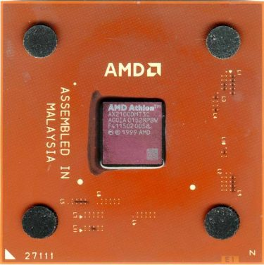
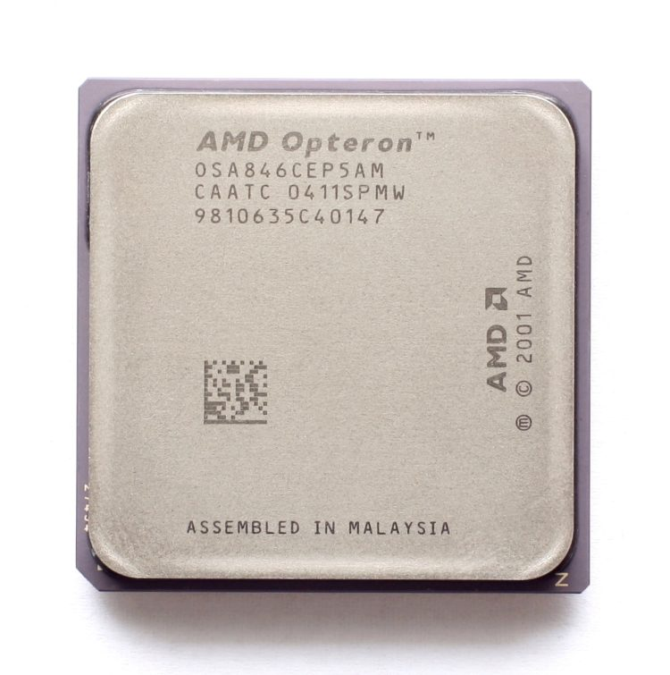

上篇讲 Intel 的 Netburst 架构时代 (2000 ~ 2006)，本篇自然就是讲 Intel 永远的 (同时也是现在唯一的) x86 处理器对手 AMD 同时期的历史啰。

## AMD K7.5 架构：Athlon XP/MP
Athlon XP 其实在 CPU 发展史上并不特别，其实就只是 K7 架构第三代之后的产品，因为搭上 2001 年 Windows XP 上市的热潮因此 AMD 特别将其 K7 架构处理器的新改版命名为 Athlon XP。

    

### K7 架构第 3 代产品：Palomino

    
    
<b>▲ AMD Athlon XP 2100+ (Palomino)</b>

 - 发布时间：2001 年 10 月 09 日
 - 运行频率：1333 MHz ~ 1733 MHz
 - FSB 频率：133 MHz (DDR 双倍带宽)
 - L1 缓存大小：128 KB (数据与指令缓存各 64 KB)
 - L2 缓存大小： 256 KB (全速，On-die)
 - 支持插槽：Socket A ( 462 针脚 FPGA 封装)
 - 电压需求：1.5 V ~ 1.75 V
 - 晶体管数：3720 万枚
 - 制造工艺：0.18 微米 (µm)
 - 指令集：x86-32 + MMX, 3D Now! Professional, SSE

从 Palomino 开始 Athlon 产品线被一分为三：

 - Athlon XP

面向一般桌面计算机用途，XP 则具有 eXtended Performance 与 Windows XP 两个涵义，是三大产品线中最晚推出者。

 - Athlon MP

面向服务器与多处理器工作站用途，可以支持同时安装多个处理器 (MP 是 Multi Processor 的意思)。

 - Mobile Athlon 4

面向笔记本电脑用途 (这命名摆明是故意要冲 Mobile Pentium 4 而来 XD)
Palomino 比较鲜明的特色是作为 Athlon XP 家族的开端，AMD 从此恢复采用以 PR 值来命名 CPU 阶级的方式 ( 1500+ 意指能与 Pentium 4 1.5 GHz 披敌，此代产品由 1500+ 起跳，最高至 2100+)，除此之外还完整纳入了原先只见于 Intel Pentium III 处理器的 SSE 指令集，原有的 3D Now! 指令集也再次获得升级 (3D Now! Professional)，并对核心架构进行了一定程度的改进，增加并强化 TLB (Translation Lookaside Buffer) 缓存器与加入了新设计的硬件预取 (Prefetch) 机制。

    
    
<b>▲ AMD Athlon MP 1500+ (Palomino)</b>

除此之外 Athlon MP 与 Mobile Athlon 4 两大产品线的成军也标志着 AMD 正式大举进军原先只属于 Intel 天下的服务器市场与行动运算市场 (以往也有以这些市场为目标的产品，但都只是附属于一般桌面计算机用途系列之下)。

关于 Palomino 站长还记得有两件蛮有趣的事情，其一是 Palomino 是 AMD 首次在旗下的处理器产品中纳入热量管理机制 (Thermal Protection)，号称能够保证处理器在散热器失效时不会烧毁，然后 Tom’s Hardware 就把 Palomino 抓来做实验拍影片了，结局是非常不给面子的整个 die 融化冒烟 XD (相对之下 Pentium III 在过热时的反应是直接当机，Pentium 4 则是降频变慢，但把散热器装回去之后重开机都能维持正常使用)。

其二则是铅笔超频大法，Socket A 封装的 Athlon 家族处理器的特色之一就是正面有许多金属触点，当时被发现只需要使用铅笔或其他导电材料将特定的触点连接导通，就能改变 Athlon XP 的运行频率。

### K7 架构第 4 代产品：Thoroughbred

    
    
<b>▲ AMD Athlon XP 2400+ (Thoroughbred)</b>

 - 发布时间：2002 年 06 月 10 日
 - 运行频率：1400 MHz ~ 2250 MHz
 - FSB 频率：133 MHz、166 MHz (DDR 双倍带宽)
 - L1 缓存大小：128 KB (数据与指令缓存各 64 KB)
 - L2 缓存大小： 256 KB (全速，On-die)
 - 支持插槽：Socket A ( 462 针脚 FPGA 封装)
 - 电压需求：1.5 V ~ 1.65 V
 - 晶体管数：3720 万枚
 - 制造工艺：0.13 微米 (µm)
 - 指令集：x86-32 + MMX, 3D Now! Professional, SSE

    
    
<b>▲ AMD Athlon XP (Thoroughbred) Die shot</b>

在 Palomino 推出将近一年之后 AMD 推出了制程升级版本，命名为 Thoroughbred，使用 130 纳米制造工艺，依照推出现后可分为两个版本，第一版基本上只是 Palomino 的制程微缩版本，没有甚么明显的改变。

    

不过在第一版推出之后，很快大家便发现 Thoroughbred 的温度与频率表现并没有如同预期般得益于制程升级而有明显提升，因此前期版本的 Thoroughbred 频率并没有办法提高太多，之后的后期版本 Thoroughbred 则从材质与设计下手进行升级 (例如将原有的八层结构新增一层金属结构改为九层以解决一些电子效应上的瓶颈之类的，要知道同时期的 Pentium 4 只用了六层，Prescott 也只用了七层，九层结构算是超级复杂的设计了)，以求将频率与 FSB 频率继续提高。

    

除此之外从此代开始 AMD 推出了 Sempron 产品线来取代原有的 Duron 系列，用于与 Intel 的 Celeron 系列抗衡。

### K7 架构第 5 代产品：Barton

    
    
<b>▲ AMD Athlon XP 3000+ (Barton)</b>

 - 发布时间：2003 年 02 月 10 日
 - 运行频率：1833 MHz ~ 2333 MHz
 - FSB 频率：166 MHz、200 MHz (DDR 双倍带宽)
 - L1 缓存大小：128 KB (数据与指令缓存各 64 KB)
 - L2 缓存大小： 512 KB (全速，On-die)
 - 支持插槽：Socket A ( 462 针脚 FPGA 封装)
 - 电压需求： 1.65 V
 - 晶体管数：5430 万枚
 - 制造工艺：0.13 微米 (µm)
 - 指令集：x86-32 + MMX, 3D Now! Professional, SSE

Barton 基本上就是 L2 缓存大小加倍的后期版本 Thoroughbred，由于 L2 缓存的增加因此在 PR 值标示上也比 Thoroughbred 标得更高，Barton 由于其超频潜力，在 DIY 界中当时可说是一代传奇。

    

在同年九月 AMD 又推出了将 Barton 多出来的 L2 缓存屏蔽的核心版本，代号取 Thoroughbred 与 Barton 的融合，命名为 Thorton。

## AMD K8 架构

    

K7 时代晚期 AMD 几乎陷于劣势，但处理器的世界真的是三十年河东，三十年河西，在 K8 架构上你可以看到很多后来被大量运用于 Intel 处理器上的技术与做法被 AMD 先做出来，可说是在技术上 AMD 领先 Intel 最多的时期。

### AMD64 架构
实际上现今你我所使用的 64 位系统就是 AMD64 架构，如同过去文章所谈过的，Intel 原先所打的算盘是发展全新的 IA-64 架构来取代现有的 x86，成为真正的 64 位系统，但造成的兼容性问题与导入成本高昂最终使得 IA-64 架构完全无法在服务器领域以外的地方有所斩获，而 AMD 选择的方式则是与 Intel 大相径庭，AMD 决定继续延伸 x86 的架构，将 x86 的架构拓展到 64 位系统，增强现有的 x86 处理器的内存寻址能力并维持与过去 x86 处理器的兼容性。

而在 AMD64 获得市场上的成功之后，Intel 也在自家的处理器纳入了几乎相同的技术，并命名为 EM64T。

### 整合内存控制器

在以往的计算机基础架构中，核心芯片是由中央处理器、北桥与南桥三颗芯片组成，而后二者也因此得到「芯片组」的名称，而在 AMD K8 架构中，AMD 为了提高内存带宽吞吐量，将内存控制器从北桥芯片中移出，直接整合到处理器中。

    
    
<b>▲ 传统的个人计算机架构，以 Intel X48 为例</b>

在内存控制器被整合到处理器中之后，内存直接与处理器连接，可以不用经过北桥芯片，在主板上的物理距离瞬间减少到 1/3 左右，对带宽与传输的稳定性来说都是有益处的，也因此时至今日基本上你所能买到的 x86 处理器都已经整合了内存控制器。

    
    
<b>▲ AMD K8 的系统架构图</b>

 

同时为了应付更高的带宽需求，从 K8 架构开始，AMD 使用 HyperTransport 来连接北桥芯片与处理器，取代了过去惯用的 EV6 DDR 总线。

### 多核心设计

AMD K8 架构进入双核心世代的时间也比 Intel 早，当 AMD 推出第一代 Athlon 64 X2 的时候，Intel 内部还正被 Tejas 计划搞得焦头烂额，高频率的泡沫正在破裂。最后在 Athlon 64 X2 发布的时间点附近，Intel 只端出了直接硬着头皮将两颗 Prescott 兜在一块的 Pentium D 应战，当时「真双核」与「胶水双核」的争论可是甚嚣尘上呢。

    
    
<b>▲ 被戏称是胶水双核心的 Pentium D</b>

### 前期产品：基于 130 纳米制造工艺

第一个基于 K8 架构的 AMD 处理器代号为 SledgeHammer，发布于 2003 年 09 月 23 日，属于较高阶的 Athlon 64 FX 产品线，具备 1MB 的全速 L2 缓存与 800 MHz 的 HyperTransport 总线，同时也纳入了 SSE2 的支持，只能搭配 Registered 内存使用，采用 Socket 940 脚位。

    

之后在同年的十二月，AMD 将 K8 架构拓展到一般级别平台上，推出了 ClawHammer 与 Newcastle 两款内核，主要加入了更快的 HyperTransport 总线 (1000 MHz)，同时不再要求必须搭配 Registered 内存，采用 Socket 939 脚位，至于 Newcastle 则是将 ClawHammer 内建的 L2 缓存容量减半而来，但 Newcastele 除了一般的 Socket 939 之外，还提供了 Socket 754 的型号 (仅限 HyperTransport 800 MHz)。

    

之后 ClawHammer 则是在 2004 年 06 月被推展到 Athlon 64 FX 高阶产品在线。

### 中期产品：基于 90 纳米制造工艺

之后在 2005 年 05 月，AMD 终于推出了旗下的双核心处理器产品线 Athlon 64 X2，代号分别为 Manchester 与 Toledo，均为 90 纳米制造工艺下的产品，同样使用 1000 MHz 的 HyperTransport 总线与 Socket 939 脚位，这两款核心主要的差异为 L2 缓存大小的不同与加入 SSE3 指令集，后来此二种核心也有因其中一个运算核心无法正常运行而打下来作为 Athlon 64 单核心处理贩卖。

    

之后的 Winchester、Venice、San Diego、Orleans 大致上都是相似的核心，主要差异可能仅有缓存大小不同，因此就不再赘述。

### 后期产品：基于 65 纳米制造工艺

    

在进入 65 纳米制造工艺之后，AMD 将旗下绝大多数 CPU 产品线换上新的 Logo，但由于没有太多突出的新特性，因此在此就不再赘述了。 (例如 Brisbane 等)

(未完待续)

<a href="computer_lecture_10.html" class="btn btn-primary">上一篇</a> 
<a href="computer_lecture_12.html" class="btn btn-primary">下一篇</a> 
<a href="{{site.feedback_link}}" class="btn btn-primary"><i class="fa fa-comment-o"></i> 匿名提问</a>

---------


