由于篇幅过长，因此馆长在完稿之后决定将 Intel Core 架构的前世今生分成两篇，这篇是上篇，主要谈 Core 架构再次统一 Intel x86 处理器产品线前与 Netburst 末期之间的历史。

## Intel Pentium M

要谈 2006 年之后的 x86 CPU 发展，就不得不谈 Pentium M 这款特别的处理器，以往 Intel 与 AMD 并没有特别重视笔记本电脑上的 CPU 设计，为了节省研发成本，通常笔记本电脑上使用的行动版处理器就只是同架构桌面计算机 CPU 降频、降压之后的版本 (LV 版本，Low Voltage)，因此在过去好多篇的 CPU 历史中馆长并没有特别着墨于行动版处理器上。

### Pentium 4-M 的失败

    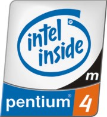

原先在 Pentium 4 这一世代中，Intel 也是循往例推出了同样以 Netburst 架构为基础的 Mobile Pentium 4 (Pentium 4-M)，但是很快大家就发现问题了，那就是追求频率最大化优先于 IPC 的 Netburst 并不适合用于对于温度与耗电量有相当大限制的行动运算环境中，将 Pentium 4 降压、降频之后的表现非常不理想，温度比 Pentium III-M 高很多，性能上却没有甚么长进，也没办法用于轻薄笔电之中 (本应对应 Pentium III-M 中的 ULV 版本，到了 Pentium 4-M 时代抑或是性能过差或是根本做不出来)。

    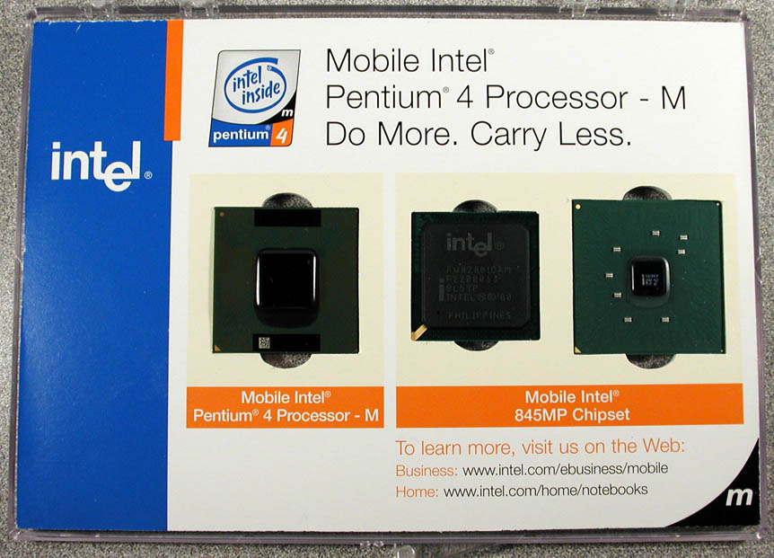

而后来由于 Pentium 4-M 近乎凄惨的性能 (而且还很贵)，有许多笔记本电脑厂商在旗下的高阶笔电型号 (今天你所见到众多电竞游戏系列的前身) 上干脆直接选用桌面计算机版本的 Pentium 4，造就了不少介于桌面计算机与笔记本电脑之间的四不像出来，至于其他产品线其实 Pentium 4-M 也没能完全取代前代的 Pentium III-M。

**Mobile Intel Pentium 4-M (Northwood) 80532**

 - 发布时间：2002 年 04 月 23 日
 - 运行频率：1400 MHz ~ 3200 MHz
 - FSB 频率：400 MT/s、533 MT/s
 - L2 缓存大小： 512 KB (全速，On-die)
 - 支持插槽：Socket 478 ( 478 针脚 FPGA 封装)
 - 电压需求：1.2 V ~ 1.55 V
 - 晶体管数：5500 万枚
 - 制造工艺：0.13 微米 (µm)
 - 功能：x86-32 + MMX, SSE, SSE2, IST, 部分型号支持 HT

**Mobile Intel Pentium 4-M (Prescott) 80546**

 - 发布时间：2004 年 06 月 01 日
 - 运行频率：2800 MHz ~ 3466 MHz
 - FSB 频率：533 MT/s
 - L2 缓存大小： 1 MB (全速，On-die)
 - 支持插槽：Socket 478 ( 478 针脚 FPGA 封装)
 - 电压需求：1.25 V ~ 1.4 V
 - 晶体管数：1 亿 2500 万枚
 - 制造工艺：90 纳米 (nm)
 - 功能：x86-32 + MMX, SSE, SSE2, IST, HT

### 救援投手 Pentium M

    

由于 Intel Pentium 4-M 的失败，Intel 旗下的以色列海法团队 (这团队之后大家还会看到很多次，其辉煌的历史纪录甚至有些人认为只要是海法团队负责的那一代 Intel CPU 就特别有选购的价值) 便开始进行开发后继产品的计划。

以色列海法团队在馆长个人眼中是一个「很敢做对的事」的团队，尽管 Intel 公司当时的主流是 Netbrust 架构，Pentium III 以前使用的 P6 架构早已被认为是「历史产物」，但海法团队认为 Netburst 根本就不适合用于对散热与电压有很大限制的笔记本电脑中，在 Intel Pentium 4-M 的后继产品中选择了海法团队相对而言更熟悉 (海法团队曾经负责同样以 P6 架构为基础的 Timna 处理器，后被取消) 的 P6 架构做为发展的基础，如此「以退为进」的做法，最后得到的产物就是 Pentium M。

    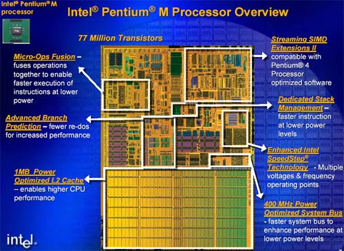

「将 Netburst 与 P6 加起来除以二」或许可以贴切的描述 Pentium M 的基础架构，第一代 Pentium M 架构在 Intel 规划上称之为 Banias Micro Architecture (在绝大多数 Intel 文件中不会提到此架构与 P6 老架构之间的关联，因为那很像开倒车跟自打脸 XD)，并不单纯只是 Pentium III 架构的复辟，其实 Banias 中融入了不少 Netburst 架构的特色，像是 SSE2 指令集、对分支预测进行强化都是可以在 Netburst 架构上见到的发展方向。

    <a href="../images/blogs/computer_lecture/banias_cpu.jpg">
        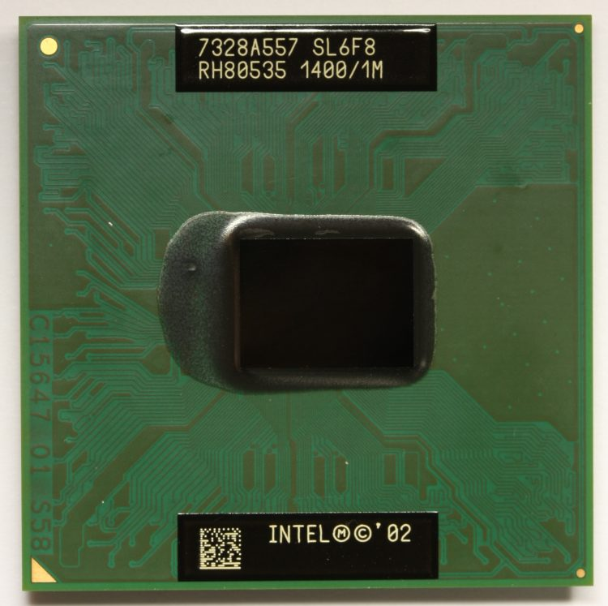
    </a>
    
<b>▲ Intel Pentium M (Banias)</b>

**Intel Pentium M (Banias) 80535**

 - 发布时间：2003 年 03 月 12 日
 - 运行频率 (标准电压)：1300 MHz ~ 1800 MHz
 - 运行频率 (低电压)：1100 MHz ~ 1300 MHz
 - 运行频率 (超低电压)：900 MHz ~ 1100 MHz
 - FSB 频率：400 MT/s
 - L1 缓存大小：32 KB 指令缓存、32 KB 数据缓存
 - L2 缓存大小：1 MB (全速，On-die)
 - 支持插槽：Socket 479 ( 478 针脚 FPGA / BGA 封装)
 - 电压需求 (标准电压)：0.956 V ~ 1.484 V
 - 电压需求 (低电压)：0.956 V ~ 1.180 V
 - 电压需求 (超低电压)：0.844 V ~ 1.004 V
 - 晶体管数：7700 万枚
 - 制造工艺：130 纳米 (nm)
 - 功能：x86-32 + MMX, SSE, SSE2, EIST

### 好一个营销手法：Intel Centrino 行动运算技术

    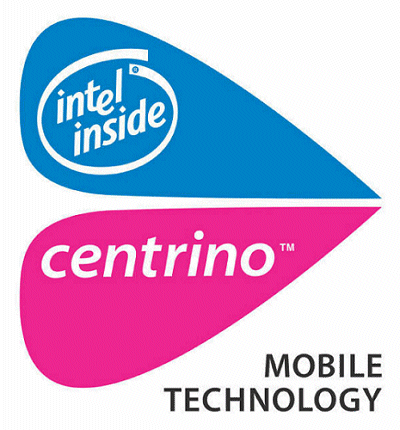

不过 Pentium M 虽然解决了 Intel 在行动版处理器上的问题，却在营销上带来了另一个问题，由于 Netburst 架构已经对消费者灌输了「高频率就是高性能」的观念，但基于改良版 P6 架构的 Pentium M 在频率上几乎都不及 Pentium 4-M，却有着较好的性能，这时候 Intel 若要说服消费者选择新的 Pentium M 岂不是自打脸了吗？其实按照 Intel 官方的说法，Intel 是从此时开始「不再一味追求性能的提升，而是更加强调效能的提升，效能只得是能耗与性能的比值」。

    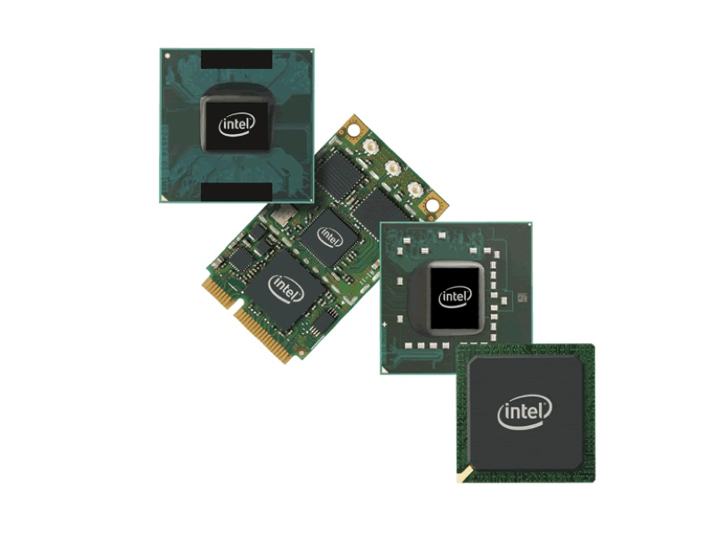

于是为了避免被质疑自打脸，Intel 决定在宣传上淡化 Pentium M 的角色，在宣传上发展了 Centrino 行动运算技术这一套标语政策，再辅以铺天盖地的广告宣传 (当时在台湾连 FM 电台都听得到)，让消费者的焦点从处理器上转移到是否具备 Centrino 标章上。

    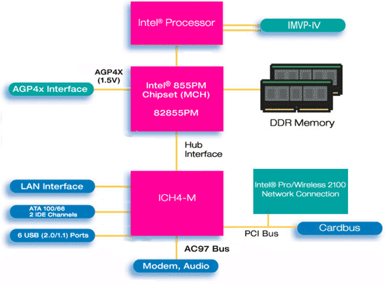

说了这么多，到底 Centrino 到底是什么呢？其实 Centrino 就是 Pentium M 处理器 + Intel 芯片组 + Intel 无线网络卡三位一体的组合搭配，用 Centrino 当宣传让消费者到店里指名购买基于 Centrino 技术的笔记本电脑，不仅可以拉抬 Pentium M 的销售，还连带让自家的无线网络卡销量暴冲，这样的营销策略够聪明吧？所以其实有不少人不认识 Pentium M，却知道 Centrino 这品牌。

 - 第一代 Centrino (Carmel 平台)
    - Intel Pentium M (Banias) 130nm
    - Intel 855M 芯片组
    - Intel PRO/Wireless 2100BG 无线网络卡

 - 第二代 Centrino (Sonoma 平台)
    - Intel Pentium M (Dothan) 90nm
    - Intel 915M 芯片组
    - Intel PRO/Wireless 2915ABG 无线网络卡

### 不再使用频率来命名处理器等级

当今的 Intel 在命名处理器的时候不再使用频率来区分，而是以特殊的处理器编号来命名，例如 i7-5960X，这样的作法其实是从 Pentium M 的第二代产品 Dothan 开始的，同样是为了避免消费者质疑为什么新款处理器的频率比以前还要低而做的做法，从此 Intel 对消费者的「教育」方式转为数字越大的就越高级。

    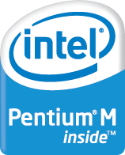

Dothan 基本上就是 Banias 的制程升级版本，从 130 纳米制造工艺升级为 90 纳米制造工艺，FSB 则从 400 MT/s 提升到 533 MT/s 并加入执行禁止位 (NX bit) 技术。

    <a href="../images/blogs/computer_lecture/Pentium_M_Dothan.jpg">
        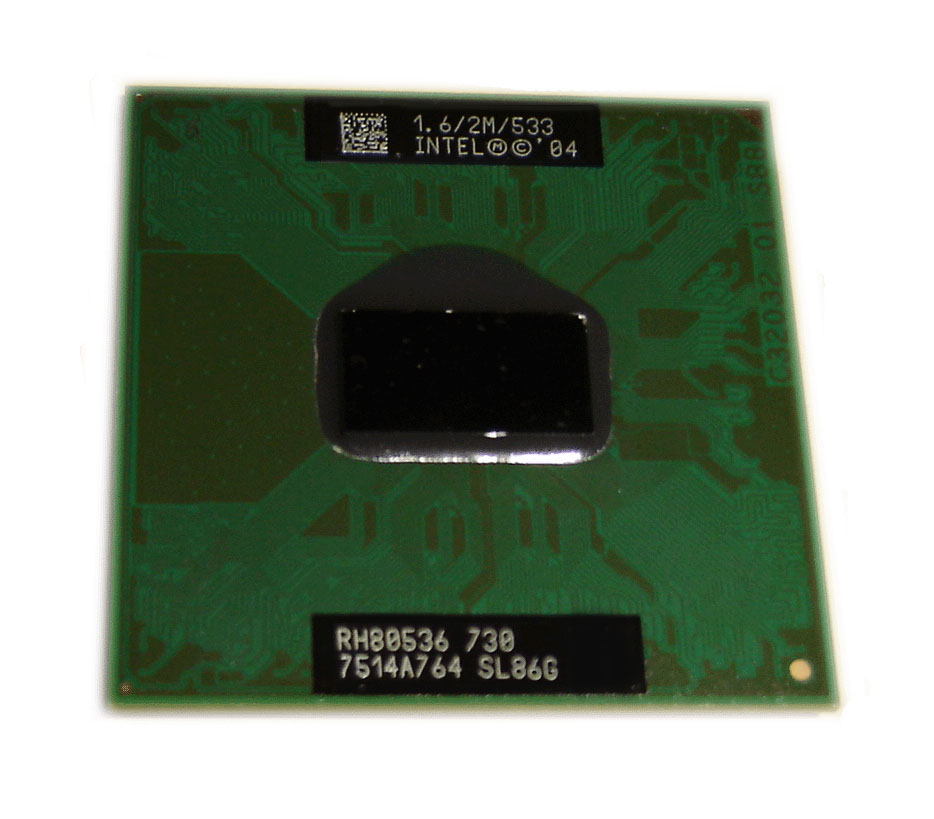
    </a>
    
<b>▲ Intel Pentium M (Dothan)</b>

    <a href="../images/blogs/computer_lecture/dothan-die-shot.jpg">
        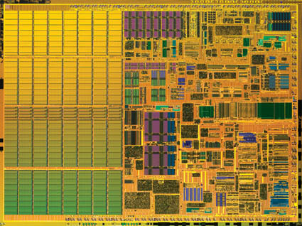
    </a>
    
<b>▲ Dothan 的 die shot</b>

**Intel Pentium M 700 系列 (Dothan) 80536**

 - 发布时间：2004 年 06 月 23 日
 - 运行频率 (标准电压)：1400 MHz ~ 2277 MHz
 - 运行频率 (低电压)：1400 MHz ~ 1600 MHz
 - 运行频率 (超低电压)：1000 MHz ~ 1300 MHz
 - FSB 频率：400 MT/s、533 MT/s
 - L1 缓存大小：32 KB 指令缓存、32 KB 数据缓存
 - L2 缓存大小：2 MB (全速，On-die)
 - 支持插槽：Socket 479 ( 478 针脚 FPGA / BGA 封装)
 - 电压需求 (标准电压)：0.988 V ~ 1.404 V
 - 电压需求 (低电压)：0.988 V ~ 1.116 V
 - 电压需求 (超低电压)：0.812 V ~ 0.956 V
 - 晶体管数：1 亿 4000 万枚
 - 制造工艺：90 纳米 (nm)
 - 功能：x86-32 + MMX, SSE, SSE2, EIST, NX

### Netburst 殒落，Intel 首次被 AMD 打到趴在地上

很快的 Netburst 终于面临穷途末路，在发展 Prescott 的过程中 Intel 就隐隐约约发现频率是不可能永无止尽的提升下去的，后来的 Tejas 计划也就这么胎死腹中，这段期间应该是 Intel 历史上最灰头土脸的一段，除了 Intel 确定 Prescott 的频率将在 3.8 GHz 止步外，当年度几乎所有 Intel 的主要产品改版通通延期，时任 Intel CEO 的 Craig Barrett 甚至为了 4 GHz 处理器计划的取消与失信于客户而下跪道歉。

    

同时这也是 Intel 第一次被 AMD 打趴在地上，AMD 的 K8 架构获得了巨大的成功，相较之下 Intel 可说是节节败退，IA-64 失败，x86 架构的 64 位延伸被 AMD 发展成功、第一颗原生双核心的位置也被 AMD 抢下，Intel 同时期只端出了被戏称为胶水双核心的 Pentium D。

之后 Intel 在 2005 年宣布将在 2006 年推出 Core 架构取代 Netburst。

### Pentium M 架构的双核心版本：Yonah

    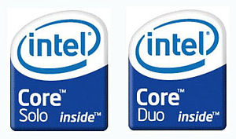

不过 Intel 总不能就这样趴在地上不起来了，Intel 后来在 2006 年 01 月将行动版处理器产品线提升到双核心，也就是开发代号为 Yonah 的 Intel Core 产品线，双核心版本称为 Intel Core Duo，单核心版本则称为 Intel Core Solo，Yonah 是原生双核心设计，单核心版本的 Core Solo 为屏蔽掉一个核心的 Core Duo。

    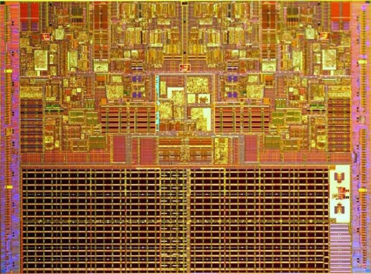

Yonah 整体来说仍是基于 Pentium M 架构进行改良后的产物，新增了 SSE3 指令集，此代产品没有整合 EM64T，因此仍是纯 32 位 x86 处理器，但此时 Intel 内部正在刮起一场风暴，同时也正在酝酿之后的帝国复兴计划。

    

Yonah 同时也对应到第三代的 Centrino 平台，代号为 Napa，除了 Yonah 处理器之外还包含了 Intel Pro/Wireless 3945ABG 与 945M 芯片组。

**Intel Core (Yonah) 80538/80539**

 - 发布时间：2006 年 01 月 06 日
 - 运行频率 (标准电压单核心)：1400 MHz ~ 2277 MHz
 - 运行频率 (低电压单核心)：1400 MHz ~ 1600 MHz
 - 运行频率 (标准电压双核心)：1600 MHz ~ 2333 MHz
 - 运行频率 (低电压双核心)：1500 MHz ~ 1833 MHz
 - 运行频率 (超低电压双核心)：1200 MHz ~ 1073 MHz
 - FSB 频率：533 MT/s、667 MT/s
 - L1 缓存大小：2 x 32 KB 指令缓存、2 x 32 KB 数据缓存
 - L2 缓存大小：2 MB (全速，On-die，8-way)
 - 支持插槽：Socket M ( 478 针脚 FPGA / BGA 封装)
 - 晶体管数：1 亿 5100 万枚
 - 制造工艺：65 纳米 (nm)
 - 功能：x86-32 + MMX, SSE, SSE2, EIST, NX, 型号非 50 结尾者支持 VT-x

(未完待续)

<a href="computer_lecture_11.html" class="btn btn-primary">上一篇</a> 
<a href="{{site.feedback_link}}" class="btn btn-primary"><i class="fa fa-comment-o"></i> 匿名提问</a>

---------


