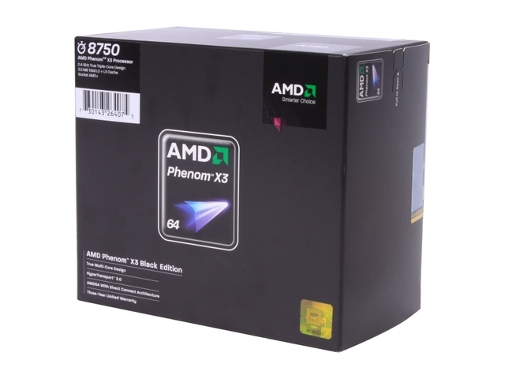

本篇要谈的是 AMD 的 K10 架构，算是 K8 架构的后继产品，开发过程中曾经短暂被称为 K8L，在上市之后则被命名为 AMD 10 处理器家族。

## K10？那 K9 去哪里了？

这应该是当时很多人都有的疑惑吧，毕竟 AMD 一路走来正好是 K5、K6、K6-2、K7、K8，大家也就很理所当然地认为 K8 的下一代应该是 K9 了，确实一开始 AMD 的原生双核心 64 位 x86 架构处理器一开始是以 K9 为开发代号进行，原定在 2006 年前后发布，同时也在初期的电路架构完工之后出现在官方的投影片上过，不过最终 K9 的开发计划被取消，有说法表示原因是因为 K9 的英文谐音 canine 有狗类的意涵，因此被舍弃。

后来 K9 架构宣布过的许多特色在后来的 K10 架构 (曾短暂被命名为 K8L 架构) 上出现，同时也预示了接下来十年内 AMD 由盛转衰与 Intel 的重返王位 (其实说起来蛮讽刺的，几乎可以说 K10 跟后来的推土机是 AMD 版的 Netburst，AMD 也曾经传过要让 K9 冲上 10GHz 的消息)。

### K9 架构主要特色

AMD 曾经在财务分析师日 (Analyst Day) 上宣布「下一代的 AMD 处理器架构」(当时还是 K9) 会有这些特色：

 - 为大规模并行运作需求而设计的线程架构
 - 芯片级别的多线程 (多核心设计)
 - 更高的扩展能力 (多 CPU 架构)
 - 10 GHz 的运作频率
 - 大幅提升超纯量与乱序执行的性能
 - 大型高速缓存
 - 强化的分支与内存预测
 - 虚拟化、安全性功能
 - 动态与静态电源管理能力
 - 媒体或向量演算指令扩充
 - 某种程度上来说其实还蛮像 Intel 当年对 Netburst 做得美梦的，不知道当时的 AMD 是不是挖角了 Intel 的高层？

## 品牌策略异动

从 K10 开始 AMD 在 Athlon 品牌上面新增了更高阶的 Phenom 产品线作为消费性市场的旗舰产品，这个做法跟 Intel 把 Core 做为比 Pentium 高阶的产品线发布相当类似，也因此从 K10 开始，以 Athlon 64 X2 为名推出的处理器实际上仅为中低阶定位。

## K10 架构特色

AMD 在 K10 架构处理器在前期引入了基于硅锗绝缘 (SGOL) 技术的 65 纳米 SOI (Silicon On Insulator, 将硅晶体管结构覆盖在绝缘体层上的设计) 制造工艺，SOI 制造工艺由 IBM 发明，主要获得 AMD、Motorola、德州仪器、威胜 VIA 与 NEC 等公司的采用 (说起来这几家公司好像刚好最近几年状况都不是太好……)，Intel 则并未采用这样的技术。

后期 (2008 年) 则引入了同样由 IBM 发展的 45 纳米 Ultra-LKMG SOI 制造工艺，并对架构进行了额外的优化，提升效能幅度相当明显因此有些媒体会将后期产品另外命名为 K10.5。

除此之外 K10 世代的 AMD 处理器主要使用原生四核心设计，不同于 Intel Core 使用的原生双核心、拼装式四核心设计，但也因此带来了电路复杂度过高的问题。

    

从 K8 开始采用的 HyperTransport 点对点总线架构也升级至 3.0 版本，以与 2.0 及 1.0 版本维持兼容的基础下将数据吞吐量增加到 5.2 GT/s，前期 K10 产品仅支持 DDR2 内存，后期产品则同时对 DDR2 与 DDR3 内存提供支持能力 (同时整合两种内存控制器)，且不论是消费性产品线或是服务器级产品都能支持 ECC 内存，其中企业级产品还额外新增了对 Fully Buffered 内存的支持。

    

至于插槽的部分在 AMD 阵营可说是错综复杂，K10 架构前期采用 Socket AM2+ 插槽 (图左)，与前代 K8 处理器架构晚期产品使用的 Socket AM2 维持双向的兼容性，而 2009 年后的晚期产品则升级到 Socket AM3 插槽 (图右) 以提供 DDR3 内存的支持能力 (要注意的是 AM3 的兼容性仅有单向，即 AM3 处理器可以安装在 AM2+ 的主板上搭配 DDR2 内存使用，但 AM3 主板是不能安装 AM2 或 AM2+ 处理器的)。

    

缓存方面的设计则分为三层，L1 容量每个核心都足足有 128 KB (其中 64 KB 为数据缓存，64 KB 为指令缓存)，当执行 Prefetch (预取) 的时候数据可以直接被拉进 L1，而未必得一路从 L3 进入 L2，再从 L2 进到 L1，至于 L2 则每核心有 512 KB 至 1 MB 的大小，L3 则仅在中高阶产品在线出现，由各核心共享，最大可以来到 12 MB。

值得注意的是 K10 架构中的 L3 缓存运作频率是以 HyperTransport 的频率为准，因此「并不是以处理器全速运作」，测试上可以得知 K10 架构的 L3 缓存只比内存快一些，主要优于内存的部分是延迟方面。

## 真的 Flex Memory

相较于 Intel 的设计，AMD 在 K10 架构中实作双通道的方式是直接在处理器里面做两组 64 位宽度的内存控制器，因此除了一般的 Ganged Mode 之外，当两组内存信道的内存时序或容量不同调时，两组内存控制器是可以拆开来工作的，也就是从原本的 128 位模式转为 64 位 + 64 位模式 (Unganged Mode)，仍然是双信道，因此弹性会比 Intel 的 Flex Memory 技术来得大上许多 (实际上 Unganged Mode 的性能也比传统设计来得好 (因为通道变细之后单一周期下数据塞满整条宽度的机率增加，也就是带宽利用率变高了，这项技术被命名为 AMD Memory Optimizer Technology)。

    

## 指令集扩充与 SSE4 之乱

如同先前在「计算机达人养成计划 2-3：鸟瞰历代处理器指令集」介绍过的，在这个时期 AMD 开始跟 Intel 玩「抢名字」这种很无聊的小把戏，故意抢先把 SSE4 这名字占了起来，在 AMD K10 当中新增了「4 条指令」，但实际上最后根本没人支持，大家都跑去使用 Intel 的 SSE4.1 与 SSE4.2 了，所以最后 AMD 也不得不放弃 SSE4A 这东西。

比起 SSE4A 这种为抢名子而特别创造的东西来说，K10 真正的指令集强化在于被称为 SSE128 的技术，SSE128 将原本只有 64bit 的命令执行能力扩充到与 Intel 同级的 128bit，前后端相关的输入输出通道也都配合增加一倍的带宽，因此不用像以前那样遇到 128bit 指令时得拆成两个指令做，这在多媒体性能上是会有所提升的。

## 运算核心本身则没有太大改变

或许是受制于研发成本或时程上的因素吧，虽然围绕着运算核心的部分几乎都得到相当大幅度的改变了，但运算核心本身则几乎就单纯是 K8 架构的沿用，单一周期能译码的指令数仅有 3 个，乱序执行能力方面最高仅能占存 72 个指令 (相对而言 Core 2 则是 96 个)，执行单元的数量也不及 Core 2。

    

## 性能不如人意，规格漂亮也难以力往狂澜

这大概是 K10 标志着 AMD 由盛转衰最主要的原因吧？受制于原生四核心设计过于庞杂的电路与制程，再加上 AMD 在 K10 上市之前在各种公开场合上宣传 K10 的性能提升程度相当明显导致人们对其有相当高的期待，最终上市之后 K10 架构处理器前期产品的性能可说是让人相当失望，没有因为「原生四核心设计」而压过对手 Intel 的拼装四核心设计也就算了，甚至在许多测试项目上还不及 Intel 的竞争产品。

    

不过后来凭着压低价格推出「三核心处理器」Phenom X3 系列来迎战 Intel 的双核心产品线 (基本上三核心在测试中还是打得赢双核心的)，因此在低价市场仍然可以占有一席之地，某种程度上来说这个时期的 AMD 有渐渐退缩回到早期称霸低阶市场但在高阶市场只能彻底被击垮状态的趋势。

    

至于股价表现方面嘛，当时的 AMD 市值一度跌到比当年并购 ATi 的聘金还低的程度，各大媒体争相洗脸 AMD 当时的 CEO (有报导标题直接写：AMD 是时候放弃了吧。(或是该把 CEO 炒了？) 这样的标题)。

## Bug、Bug 与 Bug

时至今日，人们对 K10 架构处理器最深刻的记忆大概只剩下当时 AMD 连续出了好几个包吧？其中最有名的应该是 TLB (转译后备缓冲区) Bug，TLB 通常位于 CPU 缓存与运算核心之间或是 CPU 缓存与内存之间，用于改进内存虚拟位置与实体位置间转译的性能，而且在 AMD 架构下扮演了相当重要的角色。

    

不幸的是第一批 K10 架构产品的 TLB 有很大的问题，而且是发生在硬件电路设计上，没办法透过 BIOS 做简单修正，后来 AMD 针对这批处理器的做法是直接让 BIOS 把处理器的一部分 TLB 功能停用掉，这连带导致 K10 本已不如人意的性能更加雪上加霜，处理器有 bug 的消息广为人知之后也很大程度的影响销售，这个问题也导致 AMD 没办法快速将 K10 的运作频率提升到效能需求水平以上。

直到 2008 年中，AMD 才成功修复了 TLB bug，并将修复后的产品型号增加 50 以做出区隔，而除了 TLB bug 以外还有 Cold bug (没听过 CPU 会怕冷的吧？) 等问题，不过影响层面并不那么广因此就比较还好一些。

## APU 与 HSA

    

APU (Accelerated Processing Unit，加速处理器) 是 AMD 在 2011 年提出的单芯片系统 (SoC) 方案，将 CPU 核心、内存控制器、显示核心、PCI-E 控制器、北桥、UVD 单元等功能全部整合到单一晶面上，是 AMD Fusion 计划 (公布于 2006 年) 的成果，而第一代的 HSA (异质系统架构) 中的桌面与标准笔记本电脑版本 Liano 中包含的处理器核心就是基于 K10 架构的产物。

(未完待续)

<a href="computer_lecture_13.html" class="btn btn-primary">上一篇</a> 
<a href="{{site.feedback_link}}" class="btn btn-primary"><i class="fa fa-comment-o"></i> 匿名提问</a>

---------


