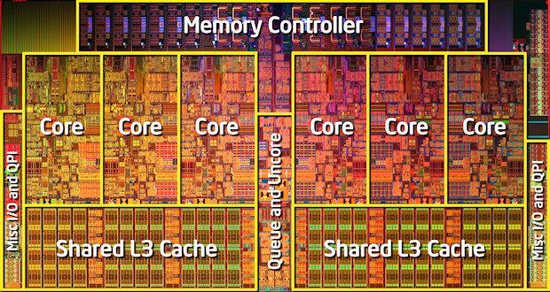
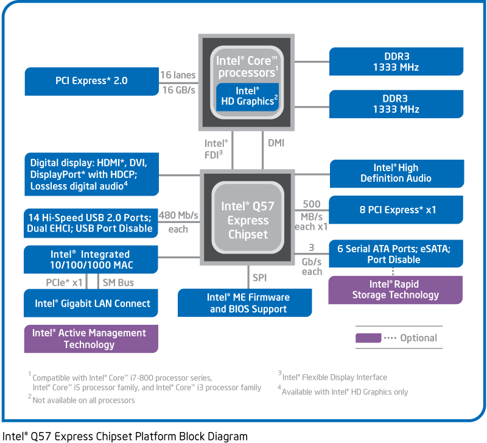

接下来今天要谈的是 Intel Nehalem 架构，或许 Nehalem 这个名字并不是那么为人所知，但如果说他是第一代 Core i7 处理器的话相信大家就认识他了，这个架构在近十年内的 Intel x86 处理器演进中占有几乎与 Core Microarchitecture 同等重要的地位，今天我们所见到的 Sandy Bridge、Ivy Bridge、Haswell、Broadwell 与最新的 Skylake 上有很多特色都奠基于此代。

    

题外话，Nehalem 是当年 Pentium 4 的主导研发团队－奥瑞冈州研发中心设计的，奥瑞冈州研发中心在当年 Netburst 失败，被本来属于旁支的以色列海法团队打到趴在地上之后已经忍很久了。

## 第二个 Tick-tock 循环

从 2006 年 Core 架构开始确立的两年一循环，单数年大改架构，双数年微缩制程的 Tick-tock 规律，在 2008 年正式迎来了第一个架构大改，也就是本篇要谈的 Nehalem，Nehalem 这个代号对 Intel 来说有很大的意义，因为它曾经被用于指称 Netburst 架构当年预想的理想结局－「10 GHz 版 Pentium 4」，当然最后这个计划如同你我所知道的，根本还没成形就胎死腹中，而同样的代号在几年后再次成为 Intel 核心产品的开发代号，想必背后是有相当的意涵存在的。

    

##  学走 AMD 的精髓
Nehalem 这一世代还蛮有趣的，基本上除了将一些当年 Netburst 拥有的技术特性移植到 Core 架构上之外，还有很大一部分是「模仿 AMD 的做法」，不过 Intel 抄归抄但最后效果却很好，AMD 架构的缺点则几乎都没有出现在 Intel Nehalem 上。

### 整合内存控制器 (IMC)，系统架构大翻新

以往的 Intel 系统架构大致上是长这样的 (以 X48 + Core 2 处理器为例)，其实传统的计算机架构也都是如此，中央由处理器、北桥芯片、南桥芯片组成，北桥负责带宽需求比较高的内存与显示适配器，带宽需求比较没那么高的接口设备则由南桥芯片负责 (详细的说明之后的章节会有)：

    

至于下面这张图则是 Nehalem 的系统基本架构图 (搭配的芯片组是 X58 与 ICH10)，从中你可以很明显的发现，**DDR3 内存除了从双信道改为三信道 (服务器级系统可以到四信道，消费性市场中低阶型号则维持双通道) 之外，最明显的差异就是改成跟处理器直接连接了，就像 AMD 的 K8 与 K10 架构那样，是的没错，Nehalem 学 AMD 把内存控制器整合到 CPU 里面了 (Integrated Memory Controller, IMC)。**

    

将内存控制器整合到处理器的好处自然是明显的，如同过去的章节也说过，在电路板上的实体距离其实对于传输速率是有很大影响的，因此内存插槽才会必定设计在处理器或北桥芯片旁边，高速缓存也从主板移到处理器芯片旁，后来更直接整合到处理器里面，这些改变的目的就是为了尽可能缩短之间的距离以加快传输效率。

    

不过也因为内存控制器被整合到 CPU 里面，所以 CPU 本体的针脚数突然增加不少 XD，脚位直接从原本的 775 暴涨到破千等级 (左起依序为 LGA1366、LGA1156、LGA775)。

### Intel QuickPath Interconnect (QPI)

基本上这东西与 AMD 早在 K8 就开始用于处理器与北桥之间的 HyperTransport 总线，同样是点对点、多用途的芯片互连架构，以 Intel 官方的说法是「跟 AMD 不约而同」的结果 (Intel 官方宣称在 2004 年就已经开始研究发展 QPI，而 Nehalem 是第一款实作 QPI 的产品)。

    

以往多 CPU 系统的设计都是如上图这样的作法，所有 CPU 都与北桥 (MCH) 链接，内存也直接链接到北桥上，但这样衍伸出来的问题是当处理器的性能越来越强大、数量越来越多的时候，MCH 的处理能力就会成为多处理器系统上很严重的性能瓶颈，而一开始厂商想到的方式是让 MCH 的通道数增加，但确有造成 MCH 成本提高、能够增加的数量有限的问题，所以采用直接连结的 QPI 或 HyperTransport 被发展来取代 FSB 可以说是必然的结果。

    

至于上图右侧则是四颗使用 QPI 链接彼此与北桥芯片的 Nehalem-EX 架构图，可以看出当组成四颗 CPU 的系统时，每颗 CPU 会需要具备 4 条 QPI 通道 (3 条用于互联，1 条用于连络北桥)，至于比较常见的双 CPU 配置 (上图左侧) 则需要 2 条 QPI 通道 (1 条用于互联，1 条用于连络北桥)。

    

而 QPI 这东西基本上可以用于很多地方，目前已知曾经实作于 Intel CPU 中的就有多 CPU 之间的彼此互联、CPU 中 Core (运算核心) 与 Uncore (核心以外的周边电路) 之间的沟通、CPU 与北桥之间的连结等，值得注意的是 Nehalem 架构的高阶款 (例如 Core i7 Bloomfield、Xeon 系列中高阶款等) 也是目前为止唯一在消费性市场产品上有使用到连外 QPI 通道的世代，之后 QPI 基本上不再用于 CPU 与芯片组之间的连接，基本上都只使用 DMI 总线作为处理器与北桥芯片链接的管道。

### 与 AMD K10 类似的缓存结构

以往 Core 架构是采双层缓存，L1 为核心各自独立，L2 则为全体运算核心共享，称之为 Intel Smart Cache，而进入 Nehalem 世代之后新的缓存阶层设计是三层，与 AMD K10 类似，L1 与 L2 都采核心各自独立，而 L3 则是全体核心共享缓存，且与 AMD K10 有类似的大型化 L3 缓存现象。

    

Nehalem 世代的处理器每个核心都具有 32 KB 的 L1 指令缓存、32 KB 的 L1 数据缓存、256 KB 的 L2 缓存 (延迟方面也因为 L2 缓存被搬进核心里面而比 Core 2 架构来得更低很多)，至于 L3 缓存至少 4 MB，最大则可以达到 30 MB。

## 模块化设计带来可扩展性，平台分流于此确立

    

还记得我在「计算机达人养成计划 2-13：近代中期 CPU 发展史 (二) Intel Core 架构」曾经提到过的「可扩展性」有两个层次吗？其中 Core 架构时期只做到第一层，也就是使用「复制」的方式来延展处理器的结构，例如将双核心的 Conroe 延展两份之后再经过少许修改就能造出四核心的 Kentsfield、把 Conroe 的 L2 缓存折半就变成低阶版本的 Allendale，这让 Intel 的开发时程缩短很多，同时也让消费者更能预测各等级 Intel 处理器的表现大概会落在哪边。

    

而进入 Nehalem 世代之后 Intel 在开发时采用的思维更加前进，使用「模块化」的方式来设计各个功能单位，在制成成品的时候就像堆积木一样可以瞬间造出好几个版本，Intel 在进行模块化的过程中将处理器区分成 Core 与 Uncore 两大部分，其中 Core 就是运算核心的部分 (除此之外还包含各自专属的 L1、L2 缓存)，根据产品规划的需要可以直接铺出需要数量的运算核心，至于 Uncore 则是处理器电路上除去运算核心以外的部分，例如 IMC 内存控制器、QPI 链接通道、共享 L3 缓存、HTT 电路等。

    

把各项规格设计成功能模块之后，要推出支持不同数量内存信道、支持不同种类的内存、提供不同数量的运算核心、不同大小的缓存、不同的 QPI 通道数都变得很容易，甚至要塞整合图形核心也简单许多，变成当架构完成之后基本上当年度的所有处理器开发就同步进入收尾阶段了 (而且因为这样从此再也没有原生核心与拼装核心的问题了，想要多少核心就能放多少个模块，不管几个都是原生核心)。

除此之外还有「平台划分」(**其实对消费者来说重点在于不同平台会使用不同脚位，主板就不能混用了**) 的概念也是从 Nehalem 开始确立的，消费性平台分为顶级玩家平台 (HEDT) 与一般及入门平台 (Mainstream)，前者即后来的 Core i7-900 系列，后者则涵盖 Core i7-800 系列与 Core i5 以降各系列的消费级处理器，之后 Xeon 家族也有类似的状态，入门系列使用与消费性一般平台相同的平台、中阶 (支持多处理器) 的系列则与 HEDT 共享平台，高阶则使用更强大、延展性更强的 EX 平台。

|  | 2009 | 2010 | 2011 | 2012 |
| ------ | ------ | ------ | ------ | ------ |
| 服务器平台－顶级 | X | Nehalem (Beckton) | Westmere-EX | Westmere-EX |
| 服务器平台－可延展 | Nehalem (Bloomfield) | Westmere | Westmere-EP | Sandy Bridge-EP |
| 消费性平台－旗舰 | Nehalem (Bloomfield) | Westmere | Westmere | Sandy Bridge-E |
| 服务器平台－入门 | Nehalem (Lynnfield) | Westmere  | Sandy Bridge | Ivy Bridge |
| 消费性平台－主流与入门 | Nehalem (Lynnfield) | Westmere | Sandy Bridge | Ivy Bridge |

之后则随着 Intel 控制推出时程，逐渐演化成表上可以发现的现象，逐渐区分成高中低三大类平台，EP / E 平台会比无印来得慢上一代，EX 则又会比 EP / E 慢上一代。

## 运算核心的强化

不同于 AMD K10 在运算核心的部分大幅沿用上代 K8 架构的设计，Nehalem 除了核心外部有许多重大变革之外，运算核心本身也获得了不少强化。

### SSE4 指令集补完

Intel 阵营这边的 SSE4 被拆成三大包，分别是 SSSE3、SSE4.1 与 Nehalem 新增的 SSE4.2，实际上 SSE4.2 只包含七条新的指令，并不算是很重大的变革。

    

### 宏融合与分支预测能力强化

还记得在介绍 Core 架构时我们提过的宏融合吗？Core 架构在 64 位模式下是不能进行宏融合的，然而到了 Nehalem 架构，Intel 终于补上对 64 位模式宏融合的支持，因此从 Nehalem 开始就不太会有 64 位表现比 32 位差的情形了，除此之外也新增了几种可以融合的指令。

    

除了宏融合之外，在 Nehalem 架构中分支预测方面的能力也获得了明显的强化，从原本的单层预测机制改为二层，纳入新的次级分支目标缓冲区 (Branch Target Buffer, BTB) 以提升数据库等以往没有办法良好适应分区预测机制的程序的执行效率。

### 超线程技术回归 Hyper-Threading

曾经被使用在 Netburst 架构中后期产品的 Hyper-Threading Technology (HTT)，在进入 Core 架构时期被舍弃 (可能是因为 Core 架构诞生在很有时间压力且兵荒马乱的时期吧)，但进入更为成熟的 Nehalem 技术之后，这项功能被加回来了。(不过也有可能是海法团队单纯不想放或不敢放就是了，毕竟 HTT 当初就奥瑞冈州团队搞出来的东西 XD)

    

其实在初期 Intel 很犹豫要不要继续使用 Hyper-Threading Technology 这一命名 (可能是不希望大家回想起 Pentium 4 后期的样子吧)，所以比较前期的 Nehalem 官方投影片都是使用 SMT (Simultaneous Multi-Threading) 来称呼这项功能，但由于 Netburst 与 Nehalem 中使用的 HTT 其实只是 SMT 的其中一种，与 Itanium 上所使用的实作方法不同，因此最后还是回头使用 HTT 这一名称。

受益于 Nehalem 更大的缓存、更强大的分支预测能力，Nehalem 上的 HTT 技术带来的效果中，缺点比过去 Netburst 时期更不显著，但优点却变得更加明显。

## 电源管理强化

从 Core 架构开始，计算机的发展就逐渐从一味追求性能上的具体提升，转而追求性能/能耗比例，也就是「效率」的最大化，在 Nehalem 的电源管理功能中主要有两项不同，第一项是 C-State 中的 C6 有些改变。

    

为了将处理器闲置时的耗能 (idle power) 降到最低，Nehalem 架构整合了称为 Power Gate 的电源开关机制，概念上有点像在 VCC (处理器供电) 到各个 Core 之间的电路各加上一个总开关，可以在「指定核心闲置的时候」将该核心的耗电量降到趋近于 0，因此 Nehalem 是有能力在没有用到的时候将特定运算核心完全关闭的。

    

另一项电源管理上的重大变革则是 Turbo Boost 技术，这个技术在今日的 Intel 处理器中几乎都有，因此大家应该很耳熟能详了，可以把他想象为 Enhanced Intel SpeedStep Technology (EIST) 的「逆向操作」，根据处理器的使用情形来「动态调整」CPU 核心的频率，特别是在遇到「未完善对多核心或多线程优化」的程序时，可以将用不到的处理器频率降低，集中电力供应将使用率较高的核心「自动超频」到更高的频率。

    

## 后继者：Westmere 架构 (32 纳米制造工艺)

    

在来年推出的 Westmere 架构基本上就是 Nehalem 的制程微缩版，将制造工艺由 45 纳米提升到 32 纳米，最大核心数提升到 10 个，除此之外架构本身的改进并不明显，主要是虚拟化技术 (纳入对实模式的支持与转换延迟降低) 与加密解密能力 (AES-NI 指令集，新增了 7 条与 AES 加解密有关的指令) 上的增强。

    

除此之外，在主流与入门的消费性平台上，Intel 开始将内建显示芯片从芯片组移到处理器的位置，但在 Westmere 世代中，内建显示芯片仍然是独立的一枚芯片 (基于 45 纳米制造工艺)，只是跟处理器芯片本体放在同一块 PCB 上，称为「Multi-Chip Package」 (MCP) 封装，而处理器芯片与内建显示芯片则使用 QPI 进行连接。

    

Westmere 在计算机历史上的意义比较接近于让 Nehalem 架构「飞入寻常百姓家」的角色，本身并没有带来太大的变革，但制程微缩带来的成本下降，加上生产 Nehalem 累积的经验，有效的将 Nehalem 架构推向中阶甚至入门市场，因此 Intel 并没有大规模将所有 HEDT 平台 (Core i7-900 系列) 的产品提升到 Westmere 架构 (仅有代号为 Gulftown 的六核心极致版处理器是 Westmere)。

值得注意的是中阶与入门市场使用的 Nehalem / Westmere 架构处理器的系统结构与 HEDT 平台以上等级的有很明显的不同：

    

在高阶平台的 X58 等芯片结构中，芯片组仍然是由南北桥两颗芯片所组成 (X58 与 ICH10)，而 X58 北桥芯片实质上已经只剩下 PCI Express 控制器的功能，并且使用 QPI 与处理器连结，而北桥与南桥之间则是使用 DMI 做连结。

而在中阶与入门平台的 5 Series Chipset 中，芯片组已经不再是芯片组，由于 PCI Express 控制器也被移入处理器中，因此实质上北桥已经没有存在意义，剩下的这颗芯片其实是「南桥」，被称为 PCH (Platform Controller Hub)，同时也因为南桥的带宽需求没有那么大，因此从此以后芯片组与处理器之间就不再使用 QPI 做连结了，而是使用特性上相当类似 PCI Express 的 DMI 接口。

简单来说，在中阶与入门平台的 5 Series Chipset 中你所看到的这条 DMI，其实是原先用来连接北桥与南桥的那条，并不是以前 CPU 与北桥之间链接的高速通道。

(未完待续)

<a href="computer_lecture_14.html" class="btn btn-primary">上一篇</a> 
<a href="{{site.feedback_link}}" class="btn btn-primary"><i class="fa fa-comment-o"></i> 匿名提问</a>

---------


