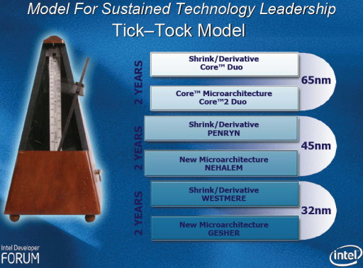

以目前的现状来说，本篇介绍的 Sandy Bridge 与下篇将讨论的 Ivy Bridge 应该是在现役计算机中普及率最高的两个世代吧？在经过 Nehalem 翻天覆地的大改革之后，从 Sandy Bridge 开始个人计算机处理器的发展有很明显趋于缓和的现象，接下来的 Ivy Bridge、Haswell、Broadwell、Skylake 其实都不会有太让人惊艳的提升或变革，但 Intel 在这几个世代中可说是一帆风顺、节节高升 (毕竟对手 AMD 的推土机就跟扶不起的阿斗一样啊)。

    

上为 Westmere 时期的 Logo，下为 SNB 与 IVB 时期的 Logo。

## 回到以色列海法的回合

Sandy Bridge (SNB) 架构其实原本的代号是 Gesher，如果你还记得先前曾经出现在 Core 架构介绍的这张 Roadmap 的话，上面就显示 Westmere 的下一世代是 Gesher，在希伯来语中就是桥梁的意思，同时也是当地的地名，后来改为 Sandy Bridge 据说是为了避免让人联想到以色列当地的政党 (已于 2007 年解散)。

    

从代号名称选自以色列地名来看就可以很明显发现这一世代的开发主导又从奥瑞冈州转回以色列海法，所以当初在开发过程中其实引发了不少人的期待。

## Sandy Bridge 微架构

如同在 Nehalem 架构介绍中提过的，从 Nehalem 开始 Intel 正式确立了将旗下 x86 处理器平台分成高中低三大平台，分别是代表顶级服务器，以延展性著称的 Expandable (EX)、用于中高阶服务器，主打高性能的 Efficient Performance (EP) 或面向 HEDT 玩家市场的 Extreme (E)、用于一般消费型平台或入门级服务器的主流平台，且从主流平台开始每上一级就落后一代。

    

Sandy Bridge 也不例外，所以在 2011 年我们迎来了以「第二代 Intel Core 处理器家族」与「Intel Xeon E3 家族」名义发布的 Sandy Bridge 架构处理器，在来年才得以见到「完整版」的 Sandy Bridge-E / Sandy Bridge-EP。

## 说大不大，说小不小的改进

如果以最后的性能成绩来评判的话，其实 Sandy Bridge 带来的改进并没有很明显 (远远不及 Netburst 到 Core 或 Core 到 Nehalem 那样)，但在架构上却有很多改变，其中有不少设计变更都持续被沿用至今日的 Broadwell 与 Skylake 上，并且在可预见的未来中会继续使用。

    

### 现代 Intel 处理器的基本结构确立

Sandy Bridge 之后基本上处理器设计的基本结构就没有再发生任何变化了，大致上是延续 Nehalem 市代 Clarkdale 的作法，将 PCI Express 控制器、内存控制器放到处理器内，因此北桥已无存在的意义，所以系统基本架构只剩下两颗芯片，南桥改称 Platform Controller Hub (PCH) 并继续称为芯片组。

    

但从 die shot 上可以很明显的看到，从 Sandy Bridge 开始整合显示核心也被放到处理器芯片中了，不同于 Clarkdale 还使用双芯片的 MCP 封装方式，这样的做法直到今日的 Skylake 仍然获得沿用，除此之外还有一项很大的不同，那就是模块的排列方式改变了，与下图的 Clarkdale die shot 对比就能很明显的看出不同。

    

新的排列方式我们可以看到两个趋势，首先是 L3 快取与核心正好是切齐的，这意味着 L3 快取的大小与带宽将与处理器核心数有关 (尽管 L3 快取是共享的)，此外也可以很明显的发现运算核心与快取以外的部分 (Uncore 电路) 有集中被收到旁边的趋势，这基本上是为了让延展性变得更好，让核心数量增加或减少的时候造成的空间浪费与重新配置需求降低 (所以双核心版本其实就只是宽度变窄，直接拿掉中间两组核心而已)。

    

将新旧两代的系统架构图排在一起就可以很明显看出其不同，在 Clarkdale 的时代处理器核心与内建显示核心两颗芯片 (MCP 封装) 之间是用 QPI 沟通的，进入 Sandy Bridge 之后就改为直接整合到单一芯片中。

### 前端电路再次进化

    

以处理器结构来说，Sandy Bridge 的主要进化是出现在前端的指令译码、分支预测的部分，SNB 架构处理器的前端增加了一个用于储存已译码指令 (microOPs) 的快取 (L0 快取)，可以在许多情况下不需要将已译码的指令重跑一次译码流程，从而获得一些性能提升，并且可以在不需要的时候将译码电路暂时关闭以节省能源，再辅以重新设计过的分支预测电路，在前端部分的性能因此有了一定幅度的提升。

    

具体的改进内容由于牵涉计算器组织的专业知识与需要相当大的篇幅，因此本篇暂时不谈，Intel 官方宣称新设计的分支预测电路可以提供两倍多的追踪目标、可以存放更多的历史数据以利进行更准确的分支预测。

    

至于后端的改变就不是那么明显了，主要大概就是新增了 AVX 指令集，将对操作数的支持拉高到 256-bit 吧。

### 环状内部联机与 System Agent

Sandy Bridge 本身最大的改变应该就属这项了，过去在 Nehalem / Westmere 架构时，Intel 是使用直接拉线将运算核心与 L3 快取连接在一起的方式实作，但这样的方式会造成增加核心数的时候有很大的麻烦，所以在 Sandy Bridge 中就使用一组环状的通道将各个核心的 L3 快取分块连结起来，每个核心都有一个资料节点，除此之外还有两个用于 I/O 与管控的节点 (N 核心处理器有 N+2 个节点)，这样的做法最早可以在 Nehalem-EX 上看到：

    

在采用 Sandy Bridge 架构的处理器上，环形内部联机可以带来每条联机高达 96 GB/s 的传输速度，而且因为速度是随联机数增长的，因此也就代表内部链接的性能会随着核心数增加而提升，例如四核心的 L3 快取数据传输率可以高达 384 GB/s，双核心版本则为减半。

    

环状联机由 4 个环组成 (依序为数据环、请求环、通知环与监听环)，全部都以核心电压与频率运作，值得注意的是 Sandy Bridge 上的节点配置与 Nehalem-EX 有点不同，虽然节点数量仍然是 N+2，但在 I/O 等电路已整合为 System Agent (包含 PCI Express 控制器、内存控制器、DMI 总线接口、电源管理单元、显示引擎，参见下图) 之后，额外的 2 个节点中有 1 个将是内建显示，所以，是的没错，Sandy Bridge 的内建显示是会用到处理器的 LLC 快取的。

    

System Agent 的部分运作频率与电压则会低于运算核心，整体而言 Sandy Bridge 的供电方式可分为「三大区域」，分别是 System Agent、运算核心与快取、内建显示，彼此间的供电与频率互不影响，其中 System Agent 的频率与电压是固定不可调整的，内建显示则使用独立的电源，因此可以直接被关闭而不影响其他部分。

    

### Sandy Bridge 其他改进

除了前面提过的之外还有这些改进出现在 Sandy Bridge 架构 (由于篇幅有限故不详述)：

 - 更强大的内建显示 (接近前代的两倍，不过仍然很弱)。
 - 新增第一代的 Quick Sync Video 技术，不过画质并不理想。
 - Turbo Boost 技术升级到 2.0 版本。
 - 脚位更换为 LGA1155 (Socket H2)，与 Nehalem / Westmere 主流平台使用的 LGA1156 (Socket H) 无法兼容，LGA1156 的产品寿命前后只有短短一年 (高阶 Nehalem、Nehalem-EP、Westmere-EP 则是使用 LGA1366，Nehalem-EX 使用 LGA1567)。

## 完全体：Sandy Bridge-E / Sandy Bridge-EP

从 Nehalem 开始 Intel 就确立了这种高阶平台比中低阶平台落后一代的节奏，所以实际上 Sandy Bridge 架构真正完全发挥是来年才推出的 Sandy Bridge-EP (服务器市场) 与 Sandy Bridge-E (高阶 HEDT 玩家市场)。

    

基本上 Sandy Bridge-E 与 Sandy Bridge-EP 是一样的东西，硬要说的话也可以说 Sandy Bridge-E 是从 Sandy Bridge-EP 直系分化而来，主要差异在于 SNB-E 会比较强调高频率、不锁倍频，但 SNB-EP 则会优先选择提升运算核心的数量，频率通常较低，原则上完全不能超频，最后前者以 Core i7 3800/3900 系列的名义推出，后者则是成为新设的 Xeon E5 家族。

## 最多可以高达 8 核心、4 信道内存、PCI-E 信道翻倍

Sandy Bridge-EP/E 据传两种 Layout，其中高配置 (HCC) 设计上是八个核心 (但 Sandy Bridge-E 最高仅有六核心的型号，似乎是八核心没办法撑到那么高频率，所以 Sandy Bridge-E 家族有两个核心是被屏蔽的)，至于低配置 (LCC) 则据闻是四核心配置，但无相关照片出现 (Core i7-3820 应该是用 LCC)。

    

从 die shot 上就可以发现，Sandy Bridge-E/EP 的内存控制器与 System Agent 面积大很多，实际上是用于额外两组内存信道 (SNB-E/EP 支持四信道 DDR3 内存) 与数量超越两倍的 PCI Express 通道 (高达 40 条，SNB 架构只有 16 条)，同时也可以发现 SNB-E/SNB-EP 是不包含内建显示核心的。

    

从上图中我们就可以很容易见识到改成环状总线对 CPU 模块化的帮助，四核心版本的 SNB-EP 就是直接把中间虚线框起来的部分拿掉的结果。

而既然功能性上 SNB 与 SNB-E/EP 数值差这么多，理所当然的脚位也不通 (基本上只要内存控制器不一样，大概都得换脚位)，Sandy Bridge-E/EP 使用的是 LGA2011，与 Sandy Bridge 使用的 LGA1155 相去甚远，大小差异可以看下图。

    

### 部分型号可支持多处理器配置、ECC 内存

虽然都是一样的 Layout 分化出来的，但是根据系列所属定位的不同而有些功能上的差异，还有要注意的是脚位分很多种，所以芯片组、主板的搭配需要特别留意。

| Sandy Bridge 分化	| 多处理器配置 | ECC 内存	| PCI-E 信道数	| 核心数 | 脚位 |
| ------ | ------ | ------ | ------ | ------ | ------ |
| E3-1200 系列 | 否 | 支持 | 16 | 至多 4 | LGA1155 |
| Core 家族 | 否 | 不支持 | 16 | 至多 4 | LGA1155 |
| i7-3000 系列 (E) | 否 | 不支持 | 40 | 至多 6 | LGA2011 |
| E5-4600 系列 (EP) | 至多 4 | 支持 | 40 | 至多 8 | LGA2011 |
| E5-2600 系列 (EP) | 至多 2 | 支持 | 40 | 至多 8 | LGA2011 |
| E5-2400 系列 (EN) | 至多 2 | 支持 | 24 | 至多 8 | LGA1356 |
| E5-1600 系列 (EP)	| 否 | 支持 | 40 | 至多 8 | LGA2011 |

虽然上表中有出现 Sandy Bridge-EN 这东西，不过由于只用于 E5-2400 服务器系列，销量也不是太好，所以我就不特别介绍了，但值得一提的是，Sandy Bridge-EX 最后被跳过了，所以 EX 平台是直接从 Westmere-EX (E7) 跳到 Ivy Bridge-EX (E7 v2)。

(未完待续)

<a href="computer_lecture_16.html" class="btn btn-primary">上一篇</a> 
<a href="{{site.feedback_link}}" class="btn btn-primary"><i class="fa fa-comment-o"></i> 匿名提问</a>

---------


