其实我本来是打算把 Sandy Bridge 跟 Ivy Bridge 放在同一篇写的，毕竟 Ivy Bridge 本质上是 Sandy Bridge 的制程改进版，架构主体原则上会是 Sandy Bridge 的延续，所以改进内容并不会那么多与明显，不过考虑到上篇篇幅已经达到 4,200 字，加上 Sandy Bridge 跳 Ivy Bridge 的改进内容又比上次 Nehalem 跳 Westmere 来得多，所以还是独立开篇了。 XD

    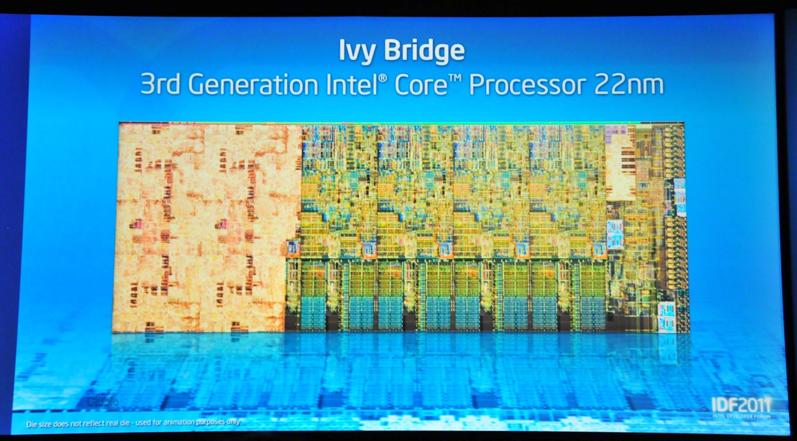

## Intel Ivy Bridge 架构

时序来到 2012 年，依照 Intel 奉行多年的 Tick-tock 二年一轮发展计划，又是轮到 Tick，也就是制程改进的一年，因此以第三代 Intel Core 处理器家族、Intel Xeon E3 v2 家族名义推出的 Ivy Bridge 架构处理器带来的主要特色无庸置疑，就是 22 纳米制造工艺首次投入 Intel x86 处理器使用，然而随着制程越来越接近硅原子的物理极限，制程提升已经不像以前那么简单，因此这次的 22 纳米制造工艺是有很多特色的。

    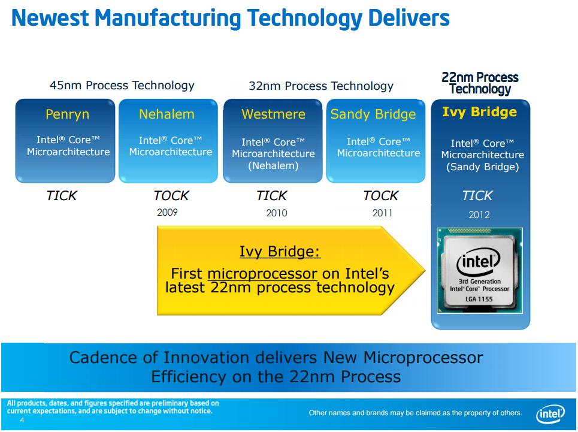

### 自 2003 年以来制程上的最大进展

大致上 Intel 近十年内的制程演化有三个技术是扮演最关键角色的，依序是在 2003 年导入 90 纳米制造工艺时引入的硅锗异质接面与应变硅技术 (首次用于 Intel Pentium 4 Prescott)、2007 年导入 45 纳米制造工艺时引入的 High-K 金属闸极技术 (首次用于 Intel Core Penryn)，接下来就是在 Ivy Bridge 世代 22 纳米制造工艺上引入的 3D 立体三闸极晶体管技术了。

    <a href="../images/blogs/computer_lecture/TSE8522.png">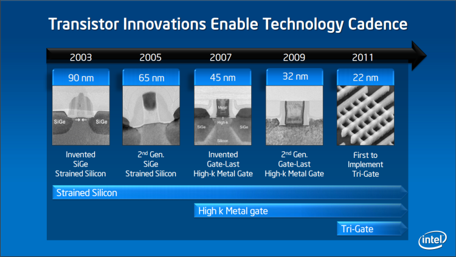</a>

下图左侧显示的就是 Sandy Bridge 或更早以前时期的晶体管，右图则是从 Ivy Bridge 开始采用的 3D 立体三闸极晶体管，我想从图上应该就可以很明白名称中的「3D 立体」是怎么回事了，主要的差异其实就是硅基底 (Silicon Substrate) 延伸穿出金属氧化物 (Oxide) 的那根有点像鱼鳍的东西 (其实跟最近很夯的 FinFET 有点像，FinFET 的名称由来有一说也是因为中间那根长得很像鱼鳍的关系)。

    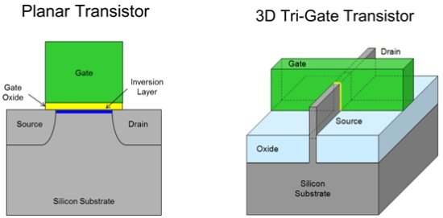

然后有一点蛮有趣的，中间的「鱼鳍」数量是可以根据产品的需求改变的，Intel 官方的投影片有些是画三根有些则只有一根。 XD

    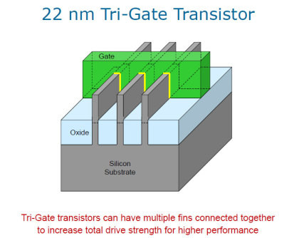

解释完 3D 是怎么回事之后接下来大家会好奇的大概就是听起来很好很强大的「三闸极」是怎么回事了吧？这边用英文原文的 Tri-Gate 会比较好理解，所谓的 Gate (闸极) 呢就是上面两张图中标黄色的位置，同时也是 Intel Tri-Gate 跟最近很红的 FinFET 在结构上比较不同的地方 (FinFET 是双闸极)。

    <a href="../images/blogs/computer_lecture/DSE1321.jpg">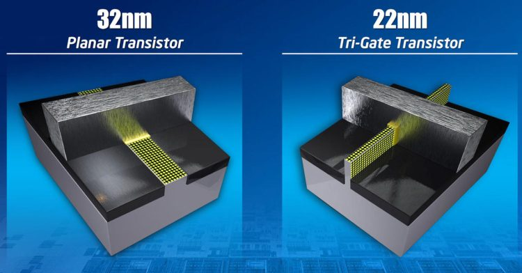</a>

所谓的三闸极其实就是突起的「鱼鳍」与周围接触的三个面都可以作为闸极使用的意思 (如果将鱼鳍的宽度做成宽高相等的话，就会有三个完全相同面积的闸极可用)，与左边的传统晶体管只有单一闸极就形成了对比。

    <a href="../images/blogs/computer_lecture/FSR6633.png">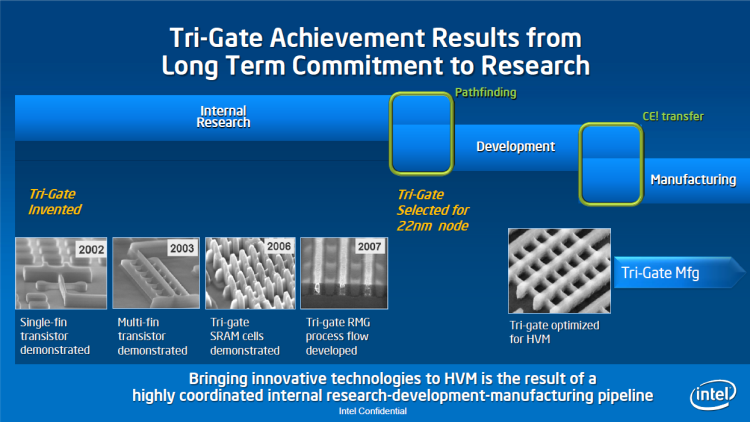</a>

从上面这张图中我们可以得知，其实 3D 立体三闸极晶体管在 Intel 公司内部已经研究了很长的一段时间，从发明到实际广泛应用于量产产品 (Ivy Bridge) 前后距离将近十年，由此可见 3D 立体三闸极晶体管是一项非常重要，且必须的技术，否则 Intel 不会耗费这么大的力气与如此多的资源来研发这项技术，由于这个系列文章的主题并不是物理，所以我不打算深入 (而且我也不会) 讨论其他制程的内容与做法，关于技术的说明就到此为止，接下来就回来谈这项技术的必要性与影响吧。

### 3D Tri-Gate 晶体管的好处与必要性？

说了那么多，到底为什么必须要发展 3D Tri-Gate 晶体管呢？其实是为了提升制程所必须，因为在制造工艺不断提升下，今日的芯片制造工艺已经来到 30nm 以下，随着越来越逼近现有材料的物理极限，提升制程的困难度也越来越高 (好比要从零分进步到 60 分很容易，但从 80 分进步到 90 分却很难)，所以新的材料与做法是继续提升制程的过程中不可或缺的。

    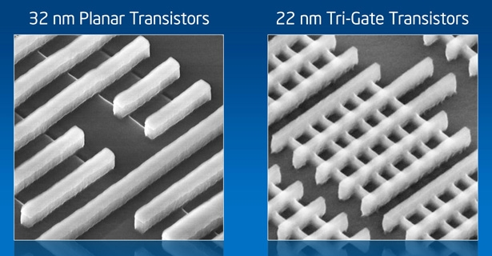
    
<b>(左为传统晶体管，右为 22nm 3D Tri-Gate 晶体管)</b>

一般来说晶体管的性能可分为三个指标，第一是切换速度 (半导体通路与断路间的切换速度，因为直接影响到处理器的最高频率，所以越快越好)，第二则是导电流 (当半导体处于通路状态时当然是导电流越高，越顺越好，导电流越大处理器就越省电)，第三则是断路时产生的漏电流 (越少越好，漏电流是芯片废热的主要来源之一，同时也是处理器闲置时的主要能耗来源)。

    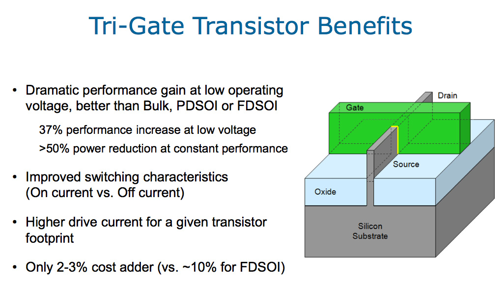

传统晶体管在微观尺度下有很多效应会导致其漏电流的增加，而且随着制造工艺的提升，尺度越来越小、单位面积的晶体管数量越来越多也连带使得漏电流效应变得更加明显，到了 30nm 以下制程，通道形成与漏电流、短通道效应的问题已经大到不可忽视，若是无法解决的话未来制程提升几乎就是不可能的难题。

而 Tri-Gate 设计就是为了解决一部分的通道形成问题，透过增加闸极的接触面积来减少形成通道造成漏电流的状况，再辅以 High-K 材料解决扩大闸极带来的新问题，从而使更小的制程成为可能，而且 Tri-Gate 由于是型态上的改变，因此晶圆厂几乎不需要改变材料，所以成本大概只会提高 3% 到 5% (远远低于制程提升带来的成本节省，光是面积下降一片晶圆可以多切出的芯片带来的成本降低就很多了，所以很有吸引力)，而上面这个影片就是 Intel 官方在介绍 3D 晶体管的好处，还蛮有趣的。

### 回到 Ivy Bridge 本身……

谈了那么多制程改进的部分，我想现在该回到 Ivy Bridge 处理器架构本身了，因为 Ivy Bridge 的时序是制程改进的一年，因此系统架构上不会有任何改变 (其实从名字都是 Bridge 也看得出来 XD)，同时脚位也会继续沿用 LGA1155。

    <a href="../images/blogs/computer_lecture/IVB2001.png">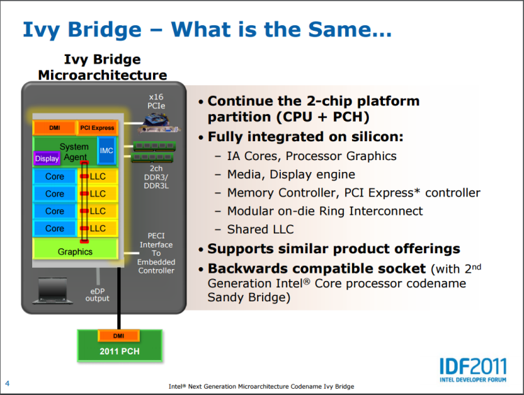</a>

新特色的部分呢，最明显的当然是前面花掉大半篇幅的制程改进，除此之外还有内建显示的强化 (从 Sandy Bridge 开始其实每代 Intel 架构的内建显示进化幅度都比处理器本身还要高……)，核心部分也有一些改良 (IPC 性能微幅提升)。

    <a href="../images/blogs/computer_lecture/IVB2002.png">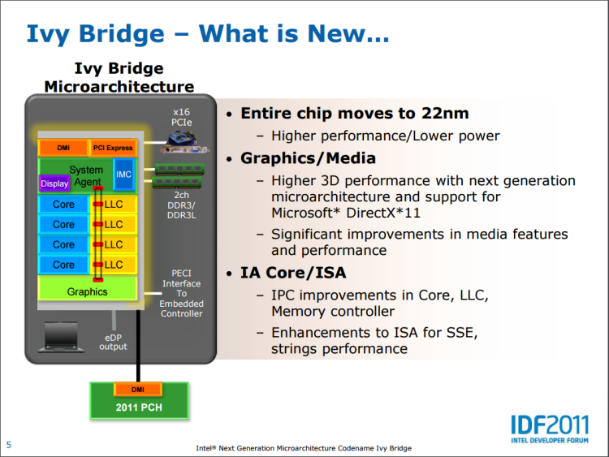</a>

至于新加入的东西也是有的，主要是关于超频能力、安全性与省电三个方面以及对 DDR3L 内存跟 PCI Express 3.0 信道的支持。

    <a href="../images/blogs/computer_lecture/IVB2003.png">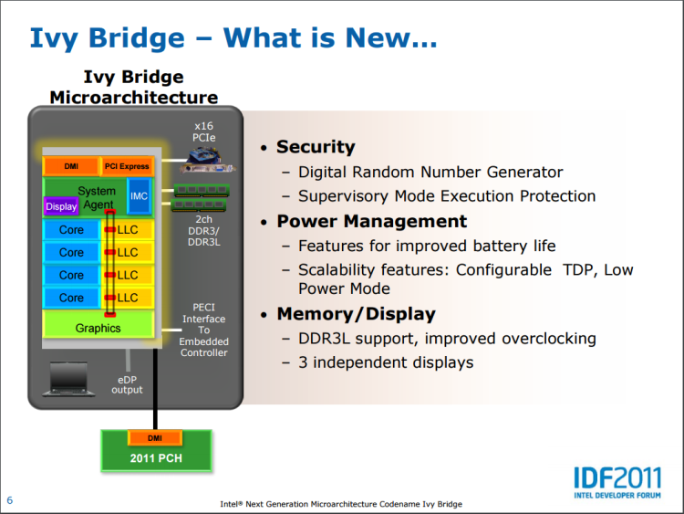</a>

### (账面上的) 超频能力提升

Ivy Bridge 关于超频能力方面带来了四点提升，分别是内存频率可以拉高到 DDR3 2800 (SNB 只支持到 DDR3 2133)，倍频上限拉高到 63 (SNB 只支持到 57，不过这不是问题因为平常根本达不到)、超频设定可以不必重新启动才生效、外频 (其实就除频比啦) 增加了 133 MHz 这一级 (SNB 只有 100 MHz 一种)。

    <a href="../images/blogs/computer_lecture/IVB2006.png">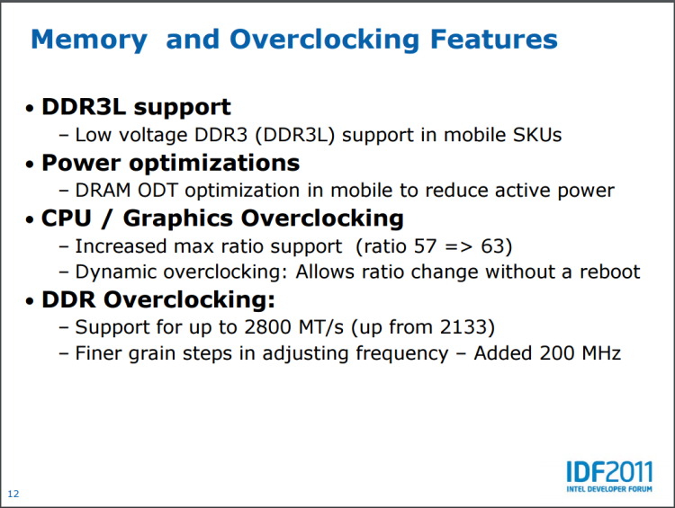</a>

不过呢，这些都只是账面规格的提升而已，实际上 Ivy Bridge 的超频能力并没有甚么大提升，甚至在超频使用的时候温度表现比 Sandy Bridge 来得差，这违反常理 (毕竟制程升级嘛，通常应该是预期温度下降与超频性变好的) 的现象基本上是由两个因素造成的。

其一是因为新制程带来芯片面积的大幅缩小，Ivy Bridge 的核心与 System Agent 面积几乎只有前代的 60% 上下，也因为这样所以单位面积的热量明显提高了许多，与 IHS (Integrated Heat Spreader) 的散热面积却变小了，散热效率也因此有所下降，不过后来的实验证实这不是主因。

其二则是 IHS 与处理器芯片本体之间的介质改变了，以往 Intel 是使用无助焊剂焊接 (fluxless solder) 的方式来将 IHS 与处理器芯片本体链接，而在 Ivy Bridge 中，或许是出于节省成本的考虑，改用普通的散热树脂 (Thermal Interface Materials, TIM) 取代，这对导热性能带来了很大的影响，所以「开盖」风潮其实从 Ivy Bridge 开始大行其道的。

### 针对安全性强化

Ivy Bridge 关于安全性方面的强化主要有两点，其中第一项是内建的硬件数字随机数生成器 (DRNG) 与因应其而设计的 RDRAND 指令，Intel 官方宣称这样的实作方式可以提供更高等级且更高效率的安全防护，不过同时却也在网络上引爆了正反论战，有些人认为将随机数生成器内建到处理器电路上时，可能会反而让有心人士得以透过扰乱甚至修改电路的方式来使「随机数变得不那么随机」，从而降低加密数据的安全性 (因为破解变简单了，但使用者却不知情)，某种程度上让人联想到当年 Pentium III 在处理器内建入专属序号时引发的争议。

    <a href="../images/blogs/computer_lecture/IVB2004.png">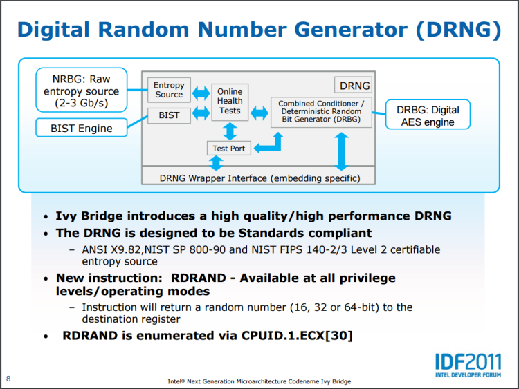</a>

另一项新的安全功能则是监督模式执行保护 (SMEP)，主要是用于防范越权攻击 (EoP)，避免不受信任的程序透过内存漏洞来尝试越权执行指令。

    <a href="../images/blogs/computer_lecture/IVB2005.png">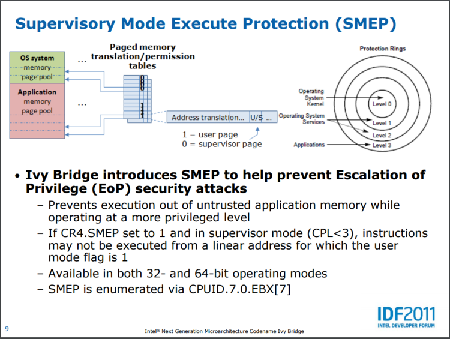</a>

### 节能方面的改进

从 Core 架构开始，节能就是 Intel 改进处理器架构时花很多力气考虑的议题，也是几乎每代新架构都会触及的地方，Ivy Bridge 与节能相关的改进其实还蛮多的，例如内存 I/O 在深层睡眠的时候可以被完全关闭、可调式 TDP、使 S3 模式更加节能的优化、System Agent 在低电压版处理器上可以使用更低的电压运作、运作时可以选择「比较而言效率最佳的核心」来执行指令等。

    <a href="../images/blogs/computer_lecture/IVB2007.png">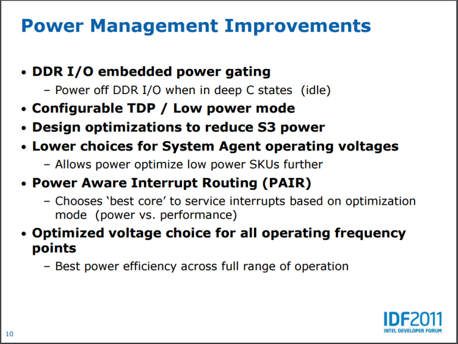</a>

不过呢其实我个人觉得 Ivy Bridge 绝大多数节能还是来自于新制程的帮助，毕竟 TDP 在制程升级之后的降幅其实还蛮大的 (桌面计算机四核心标准版从 95W 大降至 77W)。

## 其他 Ivy Bridge 家族成员

如同 Sandy Bridge 那样，其实没有任何标注的 Ivy Bridge 只是整个 IVB 家族中的小弟而已，晚一年推出的还有 IVB-E、IVB-EN、IVB-EP、IVB-EX 四个大哥呢，而且在 Ivy Bridge 世代中其实就性能上，IVB-EP 与 IVB-EX 的发展是比较明显的 (因为核心数爆升)。

由于一般人不太会接触到 Ivy Bridge-EN 与 Ivy Bridge-EX，所以本篇就不介绍了。

### Ivy Bridge-EP：面向中高阶服务器市场

Ivy Bridge-EP 在 Ivy Bridge 推出后的来年以 Intel Xeon E5 v2 家族的名义发布，是 Ivy Bridge 架构真实意义上的完整版本，与前代 Sandy Bridge-EP 共享相同的脚位与芯片组、主板。

    <a href="../images/blogs/computer_lecture/MEM6633.png">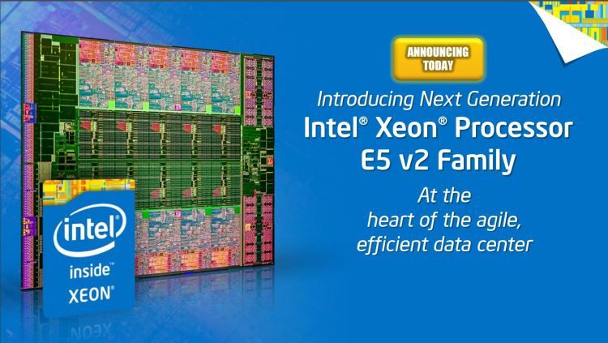</a>

Ivy Bridge-EP 有三种不同的 die 配置，分别是包含 6 个核心的 LCC、10 个核心的 MCC、12 个核心的 HCC (SNB-EP 最多只到八个核心)，其中 LCC 与 MCC 的配置大致相仿，但 HCC 就不同了，面相高性能计算 (HPC) 市场的 HCC 配置，包含了两组内存控制器，同时内部的环状总线也被分成两个环 (合计三套，比其他配置还要多出一套)，对降低延迟有帮助。

    <a href="../images/blogs/computer_lecture/IVP2011.png">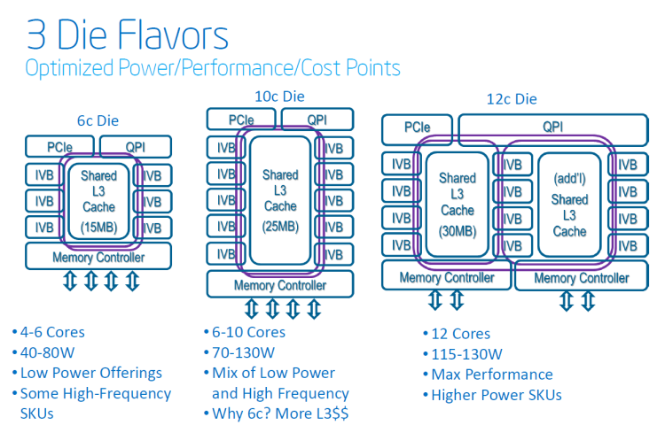</a>

值得注意的是六核心型号有一部分是 LCC，另一部分是 MCC，所以 Xeon E5 v2 系列有少数型号的 L3 高速缓存是跟核心数量对不起来的 (但由于追求尽可能利用硅晶圆上的面积，因此要求对齐的关系，其实缓存容量的上限还是跟实体产品上有多少组核心电路的构造成正相关)。

### Ivy Bridge-E：面向高阶游戏玩家 HEDT 市场

Ivy Bridge-E 与上代产品一样，基本上可以被视为 Ivy Bridge-EP 的特殊高频率型号，划分上属于第四代 Intel Core i7 处理器 (不过这代很尴尬，因为搭配的 X79 年事已高，所以呈现了低阶入门平台有支持 USB 3.0 与用不完的 SATA 6Gbps，超贵的 Ivy Bridge-E 却面临只有 USB 2.0 支持与原生 SATA 6Gbps 埠只有两个的窘境)

    <a href="../images/blogs/computer_lecture/IVE2011.jpg">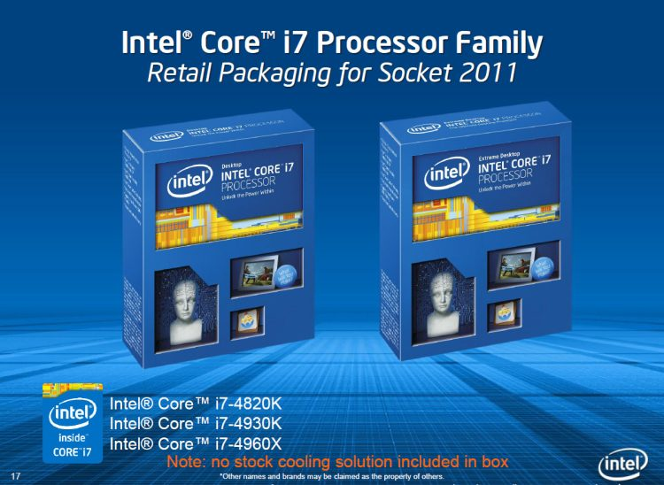</a>

Ivy Bridge-E 本质上与 Ivy Bridge-EP 几乎是一样的东西，继续沿用从 Sandy Bridge-E/EP 开始使用的 LGA2011 脚位，并且依然维持低阶四核心、高阶六核心的配置，并没有如当时大家预期的让八核心处理器「飞入寻常百姓家」。

    <a href="../images/blogs/computer_lecture/ISW9633.png">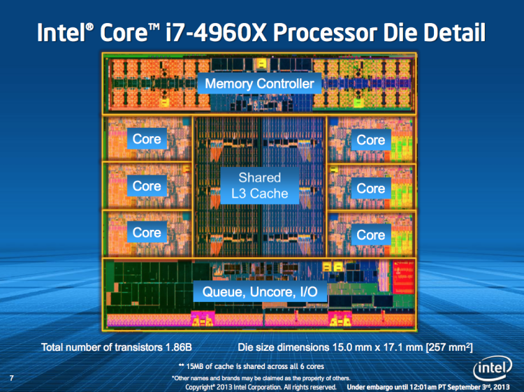</a>

比较值得注意的是，从上面这张 die shot 中可以看出，Ivy Bridge-E 的芯片本身就是由六个处理核心组成的 (其实就是 Ivy Bridge-EP 的 LCC 配置版本)，因此不像 Sandy Bridge-E 那样是由八核心处理器屏蔽两个核心而来，对降低成本与省电都有帮助 (当然主因是降低成本)，反而入门款的 4820K 则是由六核心屏蔽成四核心的型号。

(未完待续)

<a href="computer_lecture_17.html" class="btn btn-primary">上一篇</a> 
<a href="{{site.feedback_link}}" class="btn btn-primary"><i class="fa fa-comment-o"></i> 匿名提问</a>

---------


