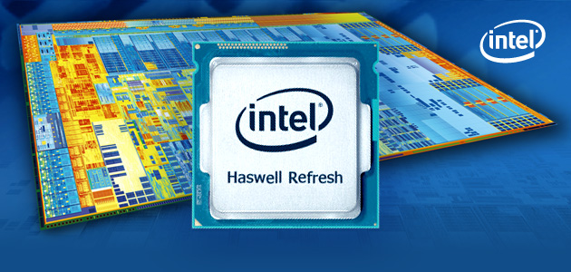
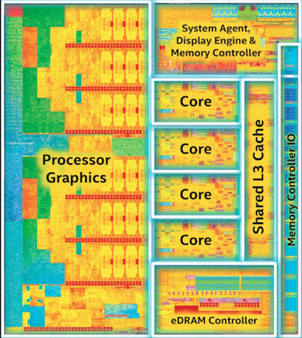

在介绍完 Ivy Bridge 之后，接下来这个世代也是目前许多人正在使用的 (毕竟因为中间的一些插曲，这跟目前最新款的处理器对大多数人来说其实只差一代而已，原因后述)，本篇要看的就是在 2013 年以「第四代 Intel Core 处理器家族」名义推出的 Intel Haswell 架构处理器。

    

## Intel Haswell 架构

2013 年在 Intel 奉行的 Tick-tock 时程上又轮到「Tock」的一年，也就是架构更新的一代，一般而言我们可以预期在「Tock 的一年」会出现比较大的变革，而「Tick 的一年」通常只会在制程上做文章，不过或许是制程提升越来越困难了吧？所以这样的规律其实从 Ivy Bridge 开始就乱了 (Ivy Bridge 对架构的改动程度其实跟 Haswell 差不了多少)，同时 Haswell 也是最后一代还称得上遵循 Tick-tock 时程规划的产品，之后基本上两年一轮已经变成不可能的理想。

    

虽然说时序轮到 Tock 的主题会是架构更新，但其实 Intel 往往在 Tock 也会对制程做一些改进，虽然不会改变纳米尺度，但会作一些可以提升良率或效率的改进，例如这次 Intel 就强调 Haswell 内部的金属连接层有 11 层 (IVB 只有九层)，可以提高性能，降低芯片的面积 (当然也就降低成本)、3D 立体三闸极晶体管也在此代更臻于成熟，此外，Haswell 世代的研发领导又再次从以色列海法团队转回奥瑞冈州团队。

### 性能改进困难，转往节能发展

    

从 Haswell 开始就可以很明显发现 Intel 对处理器运算核心本身的改进越来越少了 (或者说花了很多力气做的改进但实际上性能提升可能只有个位数个百分点)，由于性能提升越来越困难，接下来几代的 Intel 处理器架构有转往强化节能发展的趋势 (其实就是 Core 架构当年揭示的「由一味追求性能提升，转为追求效能比的提升」，虽然某种程度上只是性能已经很难拉上去的借口啦，不过确实结果论而言是这样)，因此节能是 Haswell 架构的一大重点 (其实从下面这张图放在架构介绍中很前面的地方就可以略知一二了)。

    

Haswell 在节能方面的设计思维是「尽可能扩大作业模式的范围」，也就是闲置时的耗电量要被压得更低 (连带的，在不需要的时候性能输出也更低)、满载时的性能要拉得更高 (连带的在满载运作时允许比以前耗用更多电力)，并且各模式之间切换的速度要更快，没有用到的电路应该尽可能被关闭或是提供低耗电模式。

    

除此之外还有一项特性是与 IVB、SNB 不同的，Haswell 处理器的环状总线、L3 缓存的运作频率是与处理器核心脱钩的 (为了避免内建显示要存取高速缓存时得顺便把处理器核心的频率拉上来，造成额外的耗电，所以 Haswell 处理器片上一共分成三个区域，各自拥有自己的运作频率，分别是缓存与内部联机、运算核心与内建显示)，并且在电源受限的时候，电源管理单元会进行动态分配。

### 核心架构上的改进 (真的不多)

Intel 在谈及 Haswell 核心架构改进时，显得比过去 IVB、SNB 都还要笼统许多，架构的部分与 Ivy Bridge 基本上是相同的，但再次针对分支预测进行提升，并优化了前端的性能 (更大的乱序执行结构、指令读取带宽，除此之外指令发射端口也从六个增加到八个)，L2 缓存的 TLB 也有增大，但是运算管线的「结构」就几乎没有任何改变了 (当然强化也是有啦，毕竟加了一个「很大组」的新指令集呢)。

    

除此之外 Haswell 的各类缓冲区基本上大小都有成长 (说起来在 SNB 时代 Intel 是没有特别提这个的，或许是 HSW 真的没有太多新特色吧？)

    

### AVX2 指令集

AVX2 指令集算是 Haswell 架构最主要的新特色之一，发布之前也曾经被称为 HSW-NI (Haswell New Instruction Set)，透过新增 60 条 256-bit 浮点 SIMD 指令与增加两组 FMA3 融合乘加单元 (Fused Multiply-Add，负责状似 ±(a×b)±c 的计算操作，值得注意的是不同于 AMD 主推的 FMA4 采用四运算符，Intel 阵营的 FMA3 是三运算符的) 来让每频率周期处理器核心可以处理的 FLOPs (浮点数操作) 提高到两倍 (SNB 时期是 16 个单精度、8 个双精度，HSW 直接拉高到 32 个单精度、16 个双精度)，并且将 AVX 拓展到整数向量上，能够支持 256-bit 的整数 SIMD (以往只支持到 128-bit)，适用范围变得更广。

    

下图显示的就是 Haswell 的运算单元架构图，可以看到新增的两个指令发射端口 (Port 6 用于分摊原本 Port 1 与 Port 2 的工作、Port 7 用于分摊原本 Port 2 与 Port 3 储存位置的任务) 以及新增的两组融合乘加单元。

    

### 悲剧的 TSX-NI 指令集

TSX-NI 指令集几乎可以说从头到尾就是个悲剧，首先因为名字太难翻译所以很少人记得 (事务性同步扩展指令集)、做的事情很难解释 (只能说他跟解决多线程、多核心之间的锁定、同步问题有关，透过硬件层面对这个问题进行改善，让软件工程师能够更容易解决或是降低这个问题带来的影响)、一般人没有感觉 (因为主要是跟软件工程师比较有关) 所以根本没多少人认识它。

    

没人认识与记得已经很悲剧了，但更悲剧的是这个指令集在 Haswell 架构处理器当中是有缺陷的，甚至 Broadwell 也无法幸免，Intel 官方透过更新微码禁用 TSX-NI 指令集来解决，结果最后有一部分人记得这东西的原因居然反而是因为 Intel 在 Haswell 中做坏了，够悲剧吧。 XD

    

其实我个人的感觉是 Intel 官方并不是真心想推这个指令集，因为这指令集需要依赖软件支持的成分很大，但在 Haswell 的 K 版不锁频处理器与高端 HEDT 市场的 Haswell-E 都是全线不支持的，面向服务器的 Haswell-EP 也有一堆型号不支持，后来 Intel 也很少再提起这个指令集，当能使用的人数少，它成为软件工程师采用方案的机率就很低，因为通常而言开发软件当然是希望越多人能够使用越好。

### 缓存架构不变，但性能改良

    

Haswell 的缓存阶层设计依然延续 SNB、IVB 那一套，但 Haswell 的缓存性能有很明显的增长，L1 数据缓存与 L2 缓存带宽纷纷加倍，使用 AIDA64 的高速缓存测试就可以很明显感受到数字上的增长，缓存速度提高当然对降低延迟与提高性能有很大的帮助，特别是在 AVX2 指令集纳入之后，为了处理变宽两倍的向量单元，对缓存带宽的需求也就更高了。

    

### 供电设计大改变，FIVR 设计

FIVR 的全名是 Fully Integrated Voltage Regulator，中文是整合式调压模块，顾名思义是用来调整电压用的，以往调压是主板上的电路负责的 (电源供应器输出的电压只有 5V、3.3V、12V 几种而已，到主板上会需要降压处理才能用于供给处理器上的不同部分)，传统设计的 IMVP (Intel Mobile Voltage Positioning) 架构 (下图左) 需要从主板上拉出 Core VR、图形 VR、PLL VR、I/O VR、System Agent VR、内存 VR 等六组不同的电压供给给处理器，也因为这样所以当时主板有段时间打过所谓的「相位大战」，各家高阶主板疯狂堆相位，有 16 相甚至 32 相者出现。

    

而 Haswell 的 FIVR 设计顾名思义就是把「调压」这件事情纳入处理器本身了，所以主板只需要供给处理器单一一种电压 (VccIn) 就可以，这样的做法有利有弊，而且各自都很鲜明，有利的地方是处理器直接控管电压调整，可以很大程度避免劣质主板或调压电路发生损坏的情形，而且由于距离与中间经过的关卡变少的缘故，效率「理论上」也得以提升，主板的电路也可以更加简化，处理器本身也可以「更全面的」主控供电状况，这对提高能耗效率是有帮助的，

但缺点也很显而易见，因为调压模块本来就是很会发热的东西，把这东西整合到本来散热问题就已经很大的处理器中带来的直接影响当然就是发热量的增加与散热上的困难，这样一来一往抵销后带来的节能效果还在不在其实很难讲，甚至有可能效率会比传统设计还要更糟，除此之外由于相位是主板厂商用来区分高低阶产品的重要项目之一，但采用 FIVR 设计之后主板设计太多相数的供电就变成完全只是浪费而已 (相数其实不是越高越好，太少会造成不稳定，但太多则会造成额外的耗能与零件的浪费并占去大量面积)。

### 电路布局没有甚么改变

从 Sandy Bridge 开始使用的电路排列方式到 Haswell 世代也依旧延续，但虽然排列没有变化，还是可以从中看到内建显示占据处理器芯片的比例越来越大这个趋势，也确实 Haswell 上面性能突破最多的地方并不是处理器本身，而是强化的内建显示，然后较大的内建显示单元正好把 IVB/SNB 上太大的 dead area 给用掉了一半。

    

### 脚位又换了、依然使用 TIM

既然 Haswell 是 Tick-tock 中的 Tock，脚位当然照例是与前代 IVB/SNB 不兼容的，Haswell 使用的是 LGA1150 (Socket H3) 插槽，并且需要搭配新的芯片组使用。

除此之外 Ivy Bridge 受到大家诟病的 TIM 散热介质 (树脂) 在 Haswell 中依然得到沿用，并没有因为被骂而改回使用无助焊剂焊接，因此 Haswell 时代开盖风潮依旧，但高阶的 Haswell-E/EP 则仍然使用无助焊剂焊接技术，因此 Intel 选用 TIM 是为了节省成本的意图很明显了。

## 权宜之计：Haswell Refresh

由于 Haswell 架构的下一世代，Broadwell 在制程改进时遇到很大的困难因此不断延迟，所以 Intel 就在 2014 年五月推出了代号为 Haswell Refresh 的更新版本。

    

Haswell Refresh 的型号命名方式与 Haswell 很接近，Core 家族的话是型号末码 +20，Xeon E3 系列的话则是型号数字部分末码 +1，从型号改变如此之小想必不难猜测其实没甚么改变吧？其实唯一的改变就是频率微幅上升而已。

    

基本上 Haswell Refresh 的出现与其意义完全就是市场策略而已，为了延续已经上市超过一年的 Haswell 的热度与动能，所以特别「重走一次发布流程」想带起话题，除此之外还特别把 K 版不锁频的 Haswell Refresh 处理器起了个 Devil’s Canyon 的代号跟搞了一个 Pentium 20 周年限定版 (G3258)。

    

Intel 官方是宣称 Devil’s Canyon 的两颗处理器的背面电容器有重新安排过，供电上效率与稳定度都会比较好，而且 IHS 里面的 TIM 导热材料也与其他型号不同 (但 TIM 仍然是 TIM 啊 XD)。

## Haswell-EP 与 Haswell-E 架构

一如过去几代的作法，Haswell 架构家族依然有后续的完整版 Haswell-EN/EP/E，同时也如同 Ivy Bridge 家族般推出了最高级的老大哥 Haswell-EX，但由于一般人是不太有机会碰到 Haswell-EX 与 Haswell-EN 的，所以本篇也就不打算谈了。

### Haswell-EP：面向中高阶服务器市场

Haswell-EP 在 Haswell 推出后的来年，也就是 2014 年才以 Intel Xeon E5 v3 家族的名义推出，最鲜明的特色主要有四个，依序是大增的核心数 (最多可以高达 18 核心)、大增的 L3 缓存 (最大可以来到 45 MB，与前代一样是跟处理器核心切齐的结果，所以核心数大涨缓存也就跟着大增了)、采用四信道 DDR4 内存 (根据型号不同支持的速度也不同，最高到 2133 MT/s)、更快的 QPI 联机 (根据型号不同，最高从前代的 8.0 GT/s 提高到 9.6 GT/s)。

    

而 Haswell-EP 也跟前代一样分成三种 Layout，但核心数量都大幅增加了，高配置 (HCC) 是 14 ~ 18 核心 (有两套四组环型总线与两组内存控制器)，中配置 (MCC) 是 10 ~ 12 核心 (有两套三组环型总线与两组内存控制器)，低配置 (LCC) 则是 4~8 核心 (仅有一套两组环型总线跟一组内存控制器)。

    

不过呢 Haswell-EP 最主要的升级同样不是出现在处理器本身，而其实是在于芯片组的部分，因为 C600 / X79 芯片组前后已经撑了将近三年了，在 Ivy Bridge E/EP 推出时，Haswell 也正好同步推出，当时就发生了高阶 HEDT 平台与中高阶服务器的扩充性竟然不如主流与入门平台的尴尬情况 (当时 C600/X79 原生只有两组 SATA 6Gbps，也不支持 USB 3.0)，而到了 Haswell-EP 搭配的 C610 / X99 芯片组才终于补上相关的扩充能力。

    

此外，Haswell-E/EP 跟 Haswell 一样，脚位也跟前代的 Ivy Bridge-E/EP 不同了，虽然仍然是 LGA2011，但底下的触点分布跟定义都完全不同了，新的脚位称为 LGA2011-3 (Socket R3)。

    
    
<b>(上图取自 Tom’s Hardware)</b>

### Haswell-E：面向高阶计算机玩家 HEDT 平台

依循前面订下的惯例，所以 Haswell-E 是以第五代 Core i7 处理器的名义推出，推出时间在 2014 年的九月初，但由于 Broadwell 难产，所以搞到最后第五代 Core 处理器家族反而是 HEDT 平台先出了 (第四代的 HEDT Ivy Bridge-E 推出于 2013 年九月，Haswell 则推出于 2013 年六月，至于 Broadwell 呢？2015 年的事情了)。

    

不知道是不是因为 Haswell 架构的性能提升不是很明显的关系，在介绍 Haswell 家族架构的时候 Intel 常常把自家的老产品拿出来鞭尸 XD，这张是把 Intel 旗下第一个挂 Extreme Edition (极致版) 的产品 P4EE 开始一路到现在的 Core i7 Extreme 做对比，号称这十年内性能足足提升了 40 倍之多。

    

Haswell-E 的标志意义其实在于这是 Intel 第一次将八核心处理器带入个人计算机市场，同时 HEDT 平台也不再有四核心的型号了，让 HEDT 平台与主流平台的性能差距拉开许多，不过呢，最低阶的 5820K 只有 28 条 PCI Express 3.0 通道，似乎是为了跟 5930K 拉开所以故意让 5820K 的性价比降低而做的设定 (不过结果好像反而造成 5930K 不好卖的反效果？因为如果不玩多显示适配器的话其实 PCI Express 通道 28 条也够用了，为了 0.1 GHz 花 1.75 倍价钱怎么想也不值得)。

    

从 Die Map 上也可以很明显看出 Haswell-E 其实就是 LCC 配置的 Haswell-EP。

    

## 制程改进版：Intel Broadwell 架构

    

Broadwell 架构基本上就是 Haswell 架构移植到 14 纳米工艺的版本，如同介绍 Ivy Bridge 时提过的，制程改进随着尺度越缩越小，难度也越来越提高，虽然 Ivy Bridge 的时候有很多新的制程技术，看似好像突破了许多困难，但实际上在 Broadwell 架构的时候 Intel 还是踢到铁板了。

    

由于推出的时候 (2015 年六月) 距离 Skylake 的发布只差一、两个月，因此 Broadwell 上市的型号很少 (且在台湾只有少数店家有进，官方规画只有五种)，以台湾而言能买到的 LGA1150 封装盒装版本只有 i7-5775C 跟 i5-5765C 两款而已，值得注意的是这两款居然配了 Iris Pro 内建显示，可说是前无古人，目前也未有来者。

    

从 Die map 上可以发现 Broadwell-C 的内建显示单元的大小实在太夸张了，比处理器本体还大了 XD。

### 第二代 3D 立体三闸极晶体管

    

14 纳米制程中所使用的晶体管也获得了升级，直观上的差异是「鱼鳍」的高度变高、密度也变得更密了，这样的改变能够提升性能与降低漏电流。

### 各类性能都有「微幅」提升

实际上 Broadwell 以 Haswell 作为基础，在蛮多方面都有性能上的提升 (像是分支预测也又升级了一番)，不过因为 Skylake 在不到两个月后就推出了，自然也就没甚么人关注，甚至在官方的 IDF 大会上其实也直接跳过 Broadwell 就介绍 Skylake 了，怎么说呢，毕竟有更快的东西，第二名就不会有人在意了吧？

(结束？)

<a href="computer_lecture_18.html" class="btn btn-primary">上一篇</a> 
<a href="{{site.feedback_link}}" class="btn btn-primary"><i class="fa fa-comment-o"></i> 匿名提问</a>

---------


