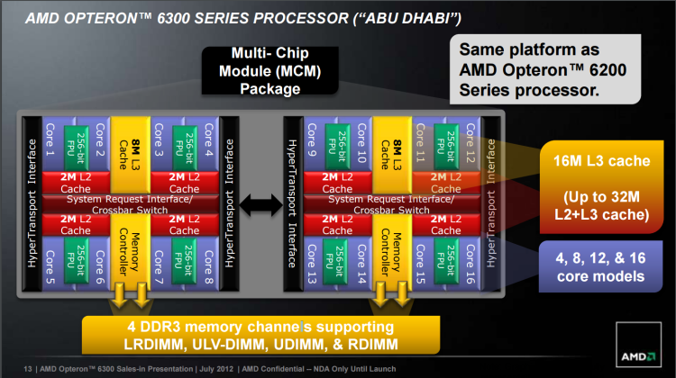
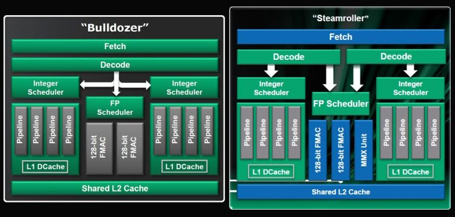

好的，终于来到现阶段最后一篇 AMD 阵营的 CPU 发展史了，AMD Bulldozer 架构在 2011 年推出，取代了先前使用的 K10 架构，目前是 AMD 旗下全 x86 计算机处理器产品线共享的基础架构 (照惯例本系列文章目前不谈 Atom 与 Bobcat 等用于低功耗系统或客制化芯片的旁支架构)，而 Bulldozer 架构前后有 Bulldozer (推土机)、Piledriver (打桩机)、Streamroller (压路机)、Excavator (挖土机) 四个世代，但由于系出同门，彼此之间差异也不是很明显，并且同属 15h 家族因此将在本篇中一并介绍完毕。

## AMD Bulldozer

最早 Bulldozer 架构的设计概念可以追溯到 2003 年就已经有初步的雏形，但当时的 AMD 最后选择发展 K8 架构，因此最终该雏形的研发计划被搁置，但在 K10 完成之后则被重启，成为接替 K10 架构地位的新世代架构设计，初代产品号称性能上能胜过自家上代的 Phenom II X6 1100T (六核心) 与 Core i7-950 (4C8T) 超过 50% 以上 (well, 时至今日看起来像笑话就是了)。

开发过程中历经无数次的跳票，最后在 2011 年 09 月 19 日发布首款产品，因此主要对手从 Westmere 变成了 2011 年 01 月就已经发布的 Sandy Bridge 与紧接着在 2012 年 02 月推出的 Ivy Bridge。

## 组成多线程的第三种方法……

通常来说处理器的多线程设计可以有两种做法，分别称为 SMT 与 CMP，前者的全名是 Simultaneous Multi-Threading，指得是不实质增加处理核心，透过增加一组前置单元电路的做法来让单一处理核心被视为「两个逻辑核心」，可以透过提高单一运算核心的利用率来提高性能 (因为绝大多数时候我们不会 100% 利用处理器的性能)，最成功的案例就是 Intel 的 Hyper-Threading Technology，概念上有点类似在高速公路上加盖第二个交流道。

    

后者的全名则是 Chip Multi-Processor，其实就是当今成为显学的多核心处理器，透过直接增加核心的方式来提高性能，概念上类似直接给高速公路增加一线道，在 Intel 世界来说，从 Nehalem 开始就是同时并用 CMP 与 SMT 的作法。

至于 AMD Bulldozer 的作法则是从 SMT 与 CMP 两种做法中截长补短的结果，号称能够同时享受 SMT 与 CMP 的优点，并且不像 CMP 需要那么大的芯片面积与那么多的晶体管数，也不像 SMT 在高负载状况下可能效能不增反减。

## 「运算模块」挑战传统的核心数概念

在讨论 Bulldozer 家族的时候一直以来都有一个问题很难解释，那就是「这颗 AMD 处理器到底是几核心的？」，本来这个问题应该是很简单的，我们认知上就是完整的运算单元与专属核心的缓存合并起来的单一模块就叫做「一个核心」(类似下图右者)，也就是传统的 SMT / CMP 设计。

    

但在 Bulldozer 上却不是这样，AMD 创造了一个名词「模块」来描述 Bulldozer 处理器上的运算单元，不同于以往我们认知的「一个运算核心由一组整数运算单元与一组浮点运算单元组成」，Bulldozer 核心 (上图左半边) 则是设计成每个模块有 2 组具有四条管线的整数运算单元 (各自独享 L1 数据缓存) 与 1 组浮点运算单元，而这三组运算单元共同使用属于这个模块的 L1 指令缓存与 L2 缓存，使用相同的 Fetch、Decode，这样的设计又被称为 CMT (Clustered Multi-Threading)，于是争论就由此产生了，在面对浮点运算的时候，一个 Bulldozer 模块实际上只能发挥类似单一核心 + HTT 的效果，但在面对整数运算 (AMD 认为日常情况下有 80% 的时间处理器都在做整数运算) 的时候却几乎可以被视为两个核心，那一个 Bulldozer 模块到底要算是单核心还是双核心呢？

    

AMD 官方的答案是，单一一个 Bulldozer 模块是双核心，只是这两个核心共享缓存与一组浮点运算单元，之所以不直接使用 CMP 设计是因为多核心会造成晶体管数的大幅增加 (耗电)、芯片面积的大幅上升 (成本)，在宣传四模块 Bulldozer 处理器的时候，AMD 是宣称其为「八核心处理器」，不过也因为这样所以在美国惹上了标示不实的官司。

不过值得注意的是 CMT 设计并不是第一次出现在处理器发展史中，早在 1996 年 DEC 就曾经在旗下的处理器上使用过类似的设计概念。

## 模块化设计

AMD 在 Bulldozer 中也效法 Intel Nehalem 导入了模块化设计，所以在设计服务器用、个人计算机用、笔记本电脑用的 Bulldozer 处理器时其实并不用耗费太多力气，同样大略可分为 Core 与 Uncore 两大部分，Core 就是前面提过的运算模块，Uncore 则包含共享的 L3 缓存与内存控制器、HyperTransport 信道。

    

不过说是这么说啦，但 Bulldozer 的弹性其实远低于 Intel 的 Nehalem，基本上最多只能塞四组运算模块而已，最高可达 16 核心 (8 模块) 的改良版 Bulldozer － Piledriver 就得做成两个 Die 的 MCM 封装了。

    

## 指令集大乱斗结束

Bulldozer 同时也标志着 AMD 与 Intel 之间的指令集大乱斗正式结束，并且由 Intel 取得胜利，AMD Bulldozer 中内建了同期绝大多数 Intel 处理器具备的指令集 (新增 SSE4.1、SSE4.2、AES-NI 与 AVX)，并且取消在 K10 架构中只为了抢占 SSE4 这名号的 SSE4.A 指令集。

    

除此之外 Bulldozer 还额外加入了 FMA4 (四操作数融合加法)、XOP 两种 AMD 专属的指令集，主要与向量矩阵有关，但却不支持 Intel 后来内建于处理器中的 FMA3 (三操作数融合加法，要等到 Piledriver 才支持)，很遗憾的是这些指令其实不怎么实用，在 Zen 中也将被拿掉。

    

## 系统架构大致上不变

Bulldozer 家族的系统架构基本上维持与 K10 时代相同，仍然维持南北桥两颗芯片的组成，内存控制器整合在处理器内，但 PCI Express 通道控制器仍然位于北桥芯片中，北桥与处理器之间也依旧使用 HyperTransport 连结但升级至 3.1 版本 (频率由 2.6 GHz 提升到 3.2 GHz，带宽可以从 5.2 GT/s 提高到 6.4 GT/s)。

    

## TurboCore

这功能基本上可以当成 AMD 版本的 Intel Turbo Boost，运作方式与原理几乎都如出一辙，判定升频档位的依据是采用负载率而非温度，且与 Intel 的 Turbo Boost 一样具有能在关闭部分核心的时候，将运作中核心的频率拉高到更高档位的能力。

    

## 近乎悲剧的性能表现

还记得本篇一开始我曾经提到 AMD 曾经宣称第一代 Bulldozer 在性能上能胜过自家上代的 Phenom II X6 1100T (六核心) 与 Core i7-950 (4C8T) 超过 50% 以上吗？

当年 AMD 在 Cebit 2011 大会的议程上也这么写道：「The U.S.-based CPU and chip maker AMD will present at CeBIT 2011 processors, which performance exceeds the current top models of the Phenom-II series by 50%」。

姑且不论在 Sandy Bridge 已经推出之后却只敢拿上一代的 Nehalem / Westmere 比较这件事情，其实 Bulldozer 最后成品的表现，尤其是单核同频率的性能，别说是要追上 Intel Nehalem 了，甚至连自家上代 K10 架构的尾声 Phenom II 都不如，在这个世代中 AMD 也正式被大家冠上「投影片制造业」的称号，毕竟写得一手好投影片最后产品却是如此不堪一击，确实挺难堪的。

至于当时 AMD 为 Bulldozer 的表现开脱的说法则是「Windows 7 没有办法发挥 CMT 新架构的实力，因为 CMT 架构实在太先进了」，不过后来即使微软为 Bulldozer 特别制作了两个修正程序 (KB2646060、KB2645594)，虽然可以针对 Bulldozer 改善 Windows 7 对线程的分配方式与 CPU 进入 C6 深层省电模式的频率，但也只能在某些项目带来不到 15% (且在某些情况下甚至会倒退) 的性能增长，表现仍然远不及竞争对手，在后来的 Windows 8 上面也没有甚么长进。

## AMD 高层承认 Bulldozer 是个巨大的失败

关于 Bulldozer 的成败其实已经差不多可以盖棺论定了，时任 AMD 服务器芯片事业群资深副总裁的 Andrew Feldman (同时也是原 SeaMicro 的 CEO，AMD 把 SeaMicro 买下来想发展微型服务器，结果彻底失败就算了，砸了这笔聘金之后差点连财务状况都毁了) 曾公开表示「推土机架构无疑是个巨大且难以止血的失败 (unmitigated failure)，我们是知道的」、「Bulldozer 的失败连带也让 AMD 在服务器市场错失许多机会」、「Bulldozer 的失败让 CEO 丢了工作、绝大多数的管理阶层丢了工作、研发技术副总裁也丢了工作，现在 AMD 有几乎全新的团队，我们都非常清楚这样的失败是绝对不被允许的。」

在 Bulldozer 失败之后 AMD 曾经试图半放弃 x86 处理器，全力发展代号称为 K12 的 ARM 服务器用处理器力图在低功耗服务器市场上有所斩获，不过很快的他们也发现 ARM 市场或许比他们想象得还要险恶很多，于是重心又转回 x86 处理器的 Zen，至于后来的故事，相信我们很快就会知道了。

## Bulldozer 后续改进版本

从 Bulldozer 开始 AMD 便采用「一年一改版」的方式推出 Bulldozer 的改进版本，并且早在 Bulldozer 发布当时就已经确立四个世代的代号，但由于结果论而言，最终 Bulldozer 架构获得了相当大的失败，因此 AMD 也已经确认 Bulldozer 架构将在四个世代出完之后宣告结束，下一世代的处理器将回归传统的 SMT / CMP 设计。

    

不过失败的 Bulldozer 自然后续改进版本也不会像 AMD 预设的那么顺利就是了，最后 2013 ~ 2014 年的 AMD 实际上是这样的：

    

### 第二代 Bulldozer：Piledriver

    

整体来说，推出于 2012 年的 Piledriver 主体架构与 Bulldozer 几乎是一样的，主要的差异在于 (下图中橘色部分) 在增加 IPC (Instructions per clock，每周期执行指令数) 与降低漏电流、拉高频率 (很有 Netburst 的既视感吧？同频单核心效能低落那就靠拉高频率来救回来)，分支预测有强化，并加入 Intel 主导的 FMA3 (三操作数融合加法)、AVX 进阶向量扩展指令集 与 AES-NI 加解密指令集的支持，把 L1 的 TLB (转译后备缓冲区) 大小加倍并加入硬件除法器，浮点数与整数的排程器 (Scheduler) 也有强化，L2 缓存跟数据预取机制有优化等。

    

至于制造工艺上则是延续过去 Bulldozer 使用的 32 纳米 HKMG SOI 制程，由格罗方德 (GlobalFoundries) 提供，回顾过去历史与近期，AMD 有很多次都是被 GlobalFoundries 拖住良率与上市时程，造成产品一再延期，GlobalFoundries 的前身其实就是 AMD 的制造部门，但在 2009 年独立，并且从 2011 年开始 AMD 已经不再持有任何 GlobalFoundries 的股权，但 AMD 与 GlobalFoundries 背后的大老板其实是同一人。

而在 Piledriver 推出当时有传言表示 Piledriver 将会是最后一代面向主流效能级的 AMD x86 处理器，之后 AMD 只会在 APU 产品线推出新品，当时有很多人跳出来驳斥，不过在三年之后的现在证实这是正确的，接下来要介绍的 Steamroller 与 Excavator 都只有 APU 型号，FX 产品线直到 2016 年的今天仍然是 Piledriver。

    

目前消费性市场中最高阶的 Piledriver 是 FX-9590，预设频率足足有 4.7 GHz，开了 Turbo Core 之后甚至可以来到 5.0 GHz，工作电压也是近五年来所看到的 x86 处理器中最高者，来到了 1.91 V，TDP 更是高达 220 W，由于功耗过高甚至还要特挑支持的主板，嗯？要说 Piledriver 是 AMD 的 Netburst 或许也不为过了吧。

不过呢，这样等级的频率，实测性能只落在 Intel Xeon E3-1231v3 与 Core i7-4790K 之间，刚上市的时候开价新台币 28,000 元 (现价约 8,000 元) ，价格、性能、耗电量全输，只能说这东西基本上只是出来给大家看笑话的而已吧？

不过说不定哪天 FX-9590 会以最耗电或最高频率之姿成为收藏家的目标，搞不好会涨价也说不定 XD

### 第三代 Bulldozer：Steamroller

原本排定要在 2013 年取代 Piledriver 的第三代改进版推土机架构 Steamroller，因为许多原因最后被延迟到 2014 年初，而且自始至终都指出现在 APU 产品在线。

    

Steamroller 的主要改进有两大方面，其中第一项是制造工艺上的改进，Steamroller 采用了格罗方得新开发的 28 纳米 HKMG SOI 制程，另一项则是架构上关于多线程之间「并行化」的强化，号称可以提升 14.5 % 的 IPC。

    

从下图的架构比较中可以看到，最明显的变化大概要属前端的指令获取与译码的部分，从 Steamroller 开始指令译码器改为两组，意味着单一模块内的两个整数运算核心不必再共享指令译码器了，这可以有效解决以往 Bulldozer 指令处理在译码阶段时塞车的问题，除此之外 Steamroller 还引入了早已在 Intel 阵营行之有年的 radix-8 除法器 (不过 Intel 早在 Core 的时代就又升级到 radix-16 除法器了)。

    

不过要注意的是，即使 Steamroller 已经再次针对同频单核心运算性能进行提升，仍然只有大约是 Phenom II K10 架构的九成。

### 第四代 Bulldozer：Excavator

Excavator 是第四代的 Bulldozer 架构改进版，同时也是目前已经规划的最后一款 Bulldozer 衍伸架构，由于仅在极少型号出现，加上大家比较关注未来将要扮演协助 AMD 绝地重生角色的 Zen，因此相关的数据并不是那么多，而且 Excavator 推出的型号很少，大半又以行动版为主，能见度又更低了，现在根本找不太到搭配 AMD 处理器的笔记本电脑。

    

基本上改进的脉络与过去几次改版相当相似，不外乎就是加大缓存 (本次扩充的是 L1 数据缓存)、加强分支预测的命中率与降低延迟 (这次将 BTB 的大小又增加了 25%)，加入新的指令级 (AVX2) 支持，换取大约 4~15% 的 IPC 成长，不过如同我们过往对 AMD 的认识，连 AMD 自家的欢乐投影片都只写 4 ~ 15%，可能成长应该还是很有限吧。

值得注意的是，后期的 Excavator 可以支持 DDR4 内存 (AM4 脚位)，而初期产品则仅能搭配 DDR3 使用 (FM2+ 脚位)。

(未完待续)

<a href="computer_lecture_15.html" class="btn btn-primary">上一篇</a> 
<a href="{{site.feedback_link}}" class="btn btn-primary"><i class="fa fa-comment-o"></i> 匿名提问</a>

---------


